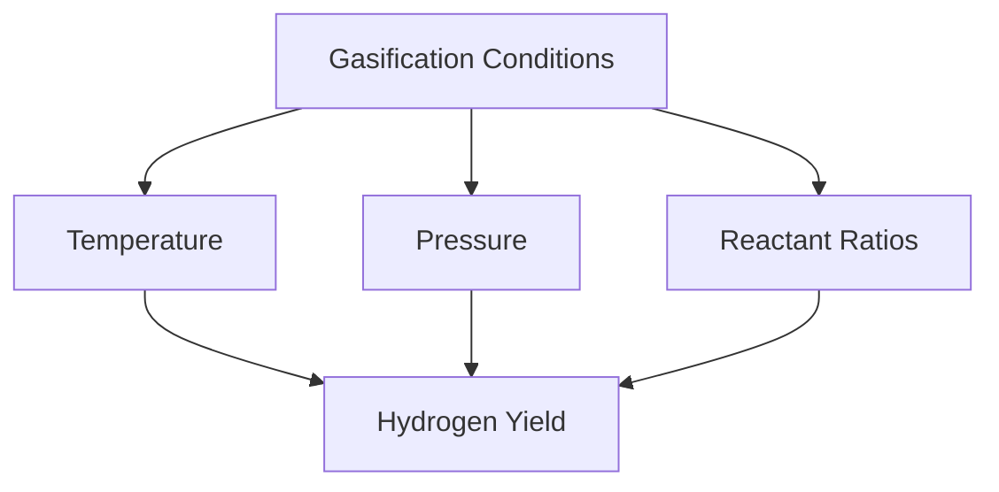

# Comprehensive Report on CO2 Gasification Hydrogen Yield

## Executive Summary
This report synthesizes findings from recent research on hydrogen production through CO2 gasification, focusing on experimental yields, optimization strategies, and the implications for the hydrogen market. The analysis reveals a growing interest in using supercritical CO2 to enhance hydrogen yields, alongside challenges related to scalability and economic viability. The report concludes with recommendations for best practices and areas for further investigation.

## Key Findings and Insights
- **Hydrogen Production Methods**: CO2 gasification is a thermochemical process that converts carbon-containing materials into hydrogen and other products, with supercritical CO2 showing promise for improved yields.
- **Yield Optimization**: Factors such as temperature, pressure, and reactant ratios significantly influence hydrogen yield, necessitating careful optimization of gasification conditions.
- **Sustainability Trends**: There is a notable shift towards using biomass and integrating carbon capture and storage (CCS) technologies to enhance sustainability in hydrogen production.

## Detailed Analysis with Supporting Evidence

### 1. Hydrogen Production Pathways
Hydrogen can be produced through various methods, including:
- Natural gas reforming
- Gasification of biomass or coal
- Electrolysis

The synthesis gas produced during gasification contains hydrogen and carbon monoxide, which can be further processed to extract hydrogen [1][4].

### 2. Impact of Supercritical CO2
Recent studies indicate that using supercritical CO2 in gasification processes may enhance hydrogen yields compared to traditional methods. This approach is gaining traction due to its potential to improve efficiency and reduce emissions [2][10].

### 3. Temperature Effects on Yield
Research shows that operational parameters, particularly temperature, play a crucial role in hydrogen yield during CO2 gasification. Higher temperatures generally lead to increased hydrogen production, but the optimal temperature range varies depending on the feedstock used [3][9].

### 4. Optimization Strategies
To maximize hydrogen yield, researchers recommend:
- Adjusting gasification conditions (temperature, pressure, reactant ratios)
- Exploring advanced methods such as supercritical CO2 gasification
- Integrating CCS technologies to mitigate carbon emissions [5][6].

### 5. Market/Industry Implications
The hydrogen market is poised for growth, driven by:
- Increasing demand for clean energy sources
- Government policies promoting hydrogen as a key component of energy transition strategies
- Technological advancements in gasification and CCS [8][11].

### 6. Best Practices and Recommendations
- **Research and Development**: Invest in R&D to explore the mechanisms of CO2 gasification and optimize conditions for various feedstocks.
- **Collaboration**: Foster partnerships between academia, industry, and government to accelerate the development of sustainable hydrogen production technologies.
- **Pilot Projects**: Implement pilot projects to test the scalability and economic viability of advanced gasification methods.

### 7. Challenges and Limitations
- **Economic Viability**: While hydrogen yields can be improved, the overall process may still face challenges related to cost and energy input.
- **Scalability**: The transition from laboratory-scale experiments to commercial-scale production remains a significant hurdle [7][10].

### 8. Next Steps or Areas for Further Investigation
- Investigate the long-term performance and economic feasibility of supercritical CO2 gasification.
- Explore the integration of hydrogen production with renewable energy sources to enhance sustainability.
- Conduct life cycle assessments to evaluate the environmental impact of various hydrogen production methods.

## Visual Data Representation
### Hydrogen Yield Optimization Factors

*Figure 1: Factors Influencing Hydrogen Yield in CO2 Gasification*

## References
1. [ScienceDirect Article on Hydrogen Production](https://www.sciencedirect.com/science/article/abs/pii/S294990892400164X)
2. [MDPI Article on CO2 Gasification](https://www.mdpi.com/2673-4117/6/1/12)
3. [ScienceDirect Article on Temperature Effects](https://www.sciencedirect.com/science/article/pii/S0360319924038096)
4. [ScienceDirect Article on Hydrogen Production Techniques](https://www.sciencedirect.com/science/article/pii/S0360319924048614)
5. [ScienceDirect Article on Optimization Strategies](https://www.sciencedirect.com/science/article/abs/pii/S001623612401812X)
6. [MDPI Article on Energy](https://www.mdpi.com/1996-1073/18/8/2025)
7. [ScienceDirect Article on Economic Viability](https://www.sciencedirect.com/science/article/pii/S2214157X25008998)
8. [Nature Article on Hydrogen Production](https://www.nature.com/articles/s43247-025-02452-5)
9. [Nature Article on Temperature Effects](https://www.nature.com/articles/s41598-024-76966-x)
10. [AFDC on Hydrogen Production](https://afdc.energy.gov/fuels/hydrogen-production)
11. [ScienceDirect Article on Biomass Gasification](https://www.sciencedirect.com/science/article/abs/pii/S019689042401152X)