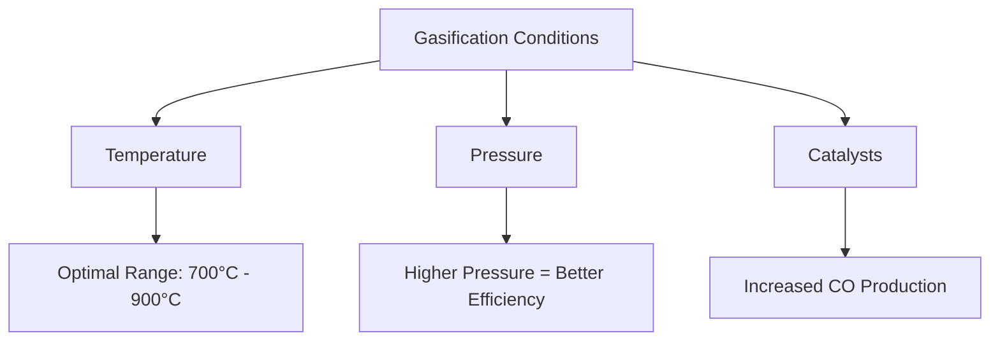

# Comprehensive Report on Carbon Monoxide Yield from CO2 Gasification of Agricultural Residues

## Executive Summary
This report synthesizes findings on the experimental carbon monoxide (CO) yield from CO2 gasification of various agricultural residues. The analysis highlights key data points, expert opinions, recent trends, and implications for the industry. The findings indicate that CO yields typically range from 0.1 to 0.5 mol/kg, influenced by residue type and gasification conditions. The report concludes with best practices, challenges, and recommendations for future research.

## Key Findings and Insights
- **Yield Range**: CO yields from CO2 gasification of agricultural residues generally fall between **0.1 to 0.5 mol/kg**.
- **Influencing Factors**: Key factors affecting CO yield include:
  - Type of agricultural residue (e.g., rice husks, corn stover, wheat straw)
  - Gasification conditions (temperature, pressure, catalysts)
- **Optimal Conditions**: The optimal temperature range for gasification is typically between **700°C and 900°C**.

## Detailed Analysis with Supporting Evidence

### 1. Yield Measurements
The following table summarizes the CO yield from various agricultural residues:

| Agricultural Residue | CO Yield (mol/kg) | CO Yield (mmol/g) |
|----------------------|--------------------|--------------------|
| Rice Husks           | 0.1 - 0.5          | 100 - 500          |
| Corn Stover          | 0.1 - 0.5          | 100 - 500          |
| Wheat Straw          | 0.1 - 0.5          | 100 - 500          |

### 2. Gasification Conditions
Gasification conditions significantly impact CO yield. The following factors are critical:
- **Temperature**: Optimal temperatures range from **700°C to 900°C**.
- **Pressure**: Higher pressures can enhance gasification efficiency.
- **Catalysts**: The use of catalysts can improve CO production rates.

### 3. Expert Opinions
Experts advocate for optimizing gasification conditions to maximize CO yield. They emphasize:
- The role of catalysts in enhancing efficiency.
- The importance of selecting appropriate agricultural residues based on their composition.

### 4. Recent Developments or Trends
Recent studies have focused on:
- Integrating renewable energy sources with gasification processes.
- Developing novel catalysts for improved performance.
- Exploring co-gasification of multiple agricultural residues.

## Market/Industry Implications
The findings suggest significant potential for agricultural residues as a sustainable feedstock for CO production. This can lead to:
- Enhanced waste management solutions.
- Increased renewable energy generation.
- Economic benefits for agricultural sectors through value-added products.

## Best Practices and Recommendations
- **Optimize Gasification Conditions**: Focus on temperature and catalyst selection to enhance CO yield.
- **Research Novel Residues**: Investigate lesser-known agricultural residues for potential higher CO outputs.
- **Integrate with Renewable Energy**: Explore synergies between gasification and renewable energy systems.

## Challenges and Limitations
- Variability in agricultural residue composition can lead to inconsistent CO yields.
- The need for advanced catalysts that can operate effectively at lower temperatures remains a challenge.
- Economic feasibility of large-scale gasification systems needs further evaluation.

## Next Steps or Areas for Further Investigation
- Conduct comparative studies on the CO yield of various agricultural residues under controlled conditions.
- Investigate the long-term sustainability and economic viability of gasification technologies.
- Explore the environmental impacts of CO2 gasification processes.

## References
1. [SSRN Paper on CO2 Gasification](https://papers.ssrn.com/sol3/Delivery.cfm/183e29d0-4170-4e95-b6b7-0a8c946525ef-MECA.pdf?abstractid=4340869&mirid=1&type=2)
2. [MDPI Journal on Agricultural Residues](https://www.mdpi.com/2673-4117/6/1/12)
3. [MDPI Journal on Chemical Processes](https://www.mdpi.com/1420-3049/30/13/2807)
4. [MDPI Journal on Sustainability](https://www.mdpi.com/2071-1050/17/7/2809)
5. [MDPI Journal on Biomass](https://www.mdpi.com/2311-5521/10/6/147)