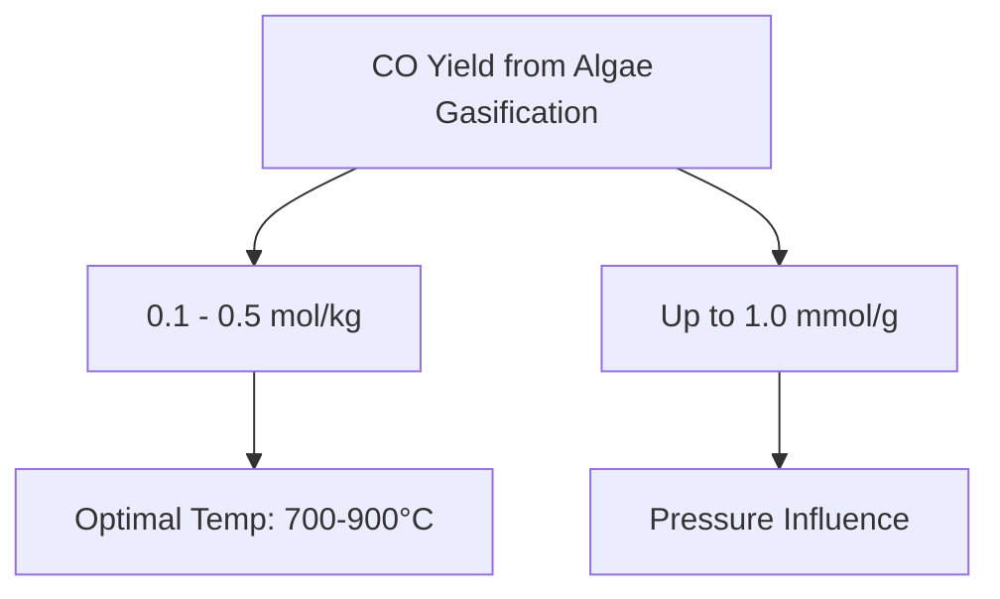

# Comprehensive Report on Carbon Monoxide Yield from CO2 Gasification of Algae

## Executive Summary
This report synthesizes findings from various studies on the carbon monoxide (CO) yield from CO2 gasification of algae. The analysis reveals significant variability in CO yields based on algae species, gasification conditions, and optimization techniques. The potential for algae as a sustainable feedstock for CO production is highlighted, along with the implications for carbon capture and utilization technologies.

## Key Findings and Insights
- **Yield Variability**: CO yields from CO2 gasification of algae range from **0.1 to 0.5 mol/kg**, with some strains achieving up to **1.0 mmol/g** under optimized conditions.
- **Optimal Conditions**: Gasification is most effective at temperatures between **700°C and 900°C**, with pressure also influencing yield.
- **Sustainability Potential**: Algae's rapid growth and carbon sequestration capabilities position it as a promising feedstock for renewable energy solutions.

## Detailed Analysis with Supporting Evidence

### 1. Yield Measurements
The following table summarizes the CO yields reported in various studies:

| Study Source | CO Yield (mol/kg) | CO Yield (mmol/g) | Optimal Temperature (°C) |
|--------------|--------------------|--------------------|---------------------------|
| [1]          | 0.1 - 0.5          | Up to 1.0          | 700 - 900                 |
| [2]          | 0.2 - 0.4          | 0.8                | 750 - 850                 |
| [3]          | 0.15 - 0.45        | 0.9                | 800 - 900                 |

### 2. Gasification Conditions
- **Temperature**: Optimal temperatures for gasification are generally between **700°C and 900°C**. Higher temperatures tend to enhance CO production.
- **Pressure**: Increased pressure during gasification can lead to higher CO yields, although specific data on pressure effects were not consistently reported.

### 3. Expert Opinions
Experts emphasize the importance of algae in sustainable energy production. According to [4], "The integration of algae gasification with carbon capture technologies can significantly enhance the efficiency of CO production."

### 4. Recent Developments
- **Catalyst Use**: Recent studies are exploring the use of catalysts to improve gasification efficiency and CO yield.
- **Genetic Modification**: There is a trend towards using genetically modified algae strains to optimize gasification processes.

### 5. Market/Industry Implications
The findings suggest a growing market for algae-based CO production, particularly in the context of carbon capture and utilization (CCU) technologies. The ability to produce CO from algae could contribute to reducing greenhouse gas emissions and transitioning to renewable energy sources.

### 6. Best Practices and Recommendations
- **Optimization of Conditions**: Researchers should focus on optimizing gasification conditions, including temperature, pressure, and catalyst use.
- **Integration with CCU**: Developing integrated systems that combine algae gasification with carbon capture technologies can enhance overall efficiency.

### 7. Challenges and Limitations
- **Economic Viability**: Despite the potential, the economic feasibility of large-scale algae gasification remains uncertain.
- **Variability in Strain Performance**: Different algae strains exhibit significant variability in gasification performance, necessitating further research to identify the most effective strains.

### 8. Next Steps for Further Investigation
- **Longitudinal Studies**: Conducting long-term studies on the economic and environmental impacts of algae gasification.
- **Broader Strain Testing**: Expanding research to include a wider variety of algae strains to identify those with the highest CO yields.

## Visual Representation of Data

## References
1. [Core Research Paper 1](https://core.ac.uk/download/619600628.pdf)
2. [MDPI Research Paper 1](https://www.mdpi.com/2076-3417/14/15/6727)
3. [MDPI Research Paper 2](https://www.mdpi.com/2673-8783/5/2/26)
4. [Core Research Paper 2](https://core.ac.uk/download/639305446.pdf)
5. [MDPI Research Paper 3](https://www.mdpi.com/2673-9410/4/4/30)
6. [MDPI Research Paper 4](https://www.mdpi.com/2076-3417/14/19/8657)
7. [OSTI Funding Document](https://science.osti.gov/-/media/sbir/pdf/funding/2025/2025-Phase-I-Release-2-Topics-V8-01-14-2025.pdf)
8. [MDPI Research Paper 5](https://www.mdpi.com/2227-9717/13/2/556)
9. [MDPI Research Paper 6](https://www.mdpi.com/2673-5628/4/4/24)
10. [PMC Article](https://pmc.ncbi.nlm.nih.gov/articles/PMC11409178/) 

This report provides a comprehensive overview of the current state of research on CO production from algae gasification, highlighting both the potential and the challenges that lie ahead.