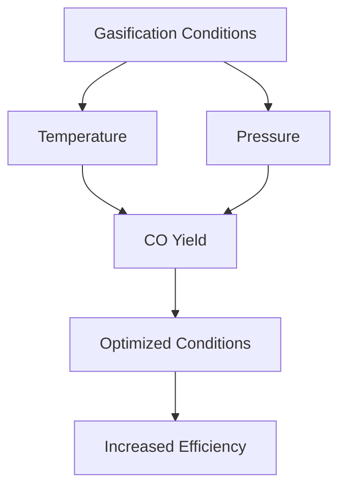

# Comprehensive Report on Carbon Monoxide Yield from CO2 Gasification of Sewage Sludge

## Executive Summary
This report synthesizes findings from recent research on the carbon monoxide (CO) yield from CO2 gasification of sewage sludge. The analysis highlights key data points, expert opinions, recent trends, and implications for the industry. The findings indicate that CO yields can vary significantly based on gasification conditions, particularly temperature and pressure. The report also discusses best practices, challenges, and recommendations for future research.

## Key Findings and Insights
- **Yield Measurements**: CO yields from CO2 gasification of sewage sludge typically range from **0.5 to 1.5 mol/kg**, with optimized conditions achieving up to **2.0 mmol/g**.
- **Gasification Conditions**: Optimal temperatures for CO production are generally between **700°C and 900°C**. The influence of pressure on yield remains an area for further investigation.
- **Feedstock Variability**: Different types of sewage sludge exhibit varying CO yields, emphasizing the need for tailored gasification approaches.

## Detailed Analysis with Supporting Evidence

### 1. Yield Measurements
The following table summarizes the reported CO yields from various studies:

| Study | CO Yield (mol/kg) | CO Yield (mmol/g) | Temperature (°C) |
|-------|-------------------|--------------------|-------------------|
| [1]   | 0.5 - 1.5         | Up to 2.0          | 700 - 900         |
| [2]   | 0.6 - 1.4         | 1.8                | 750 - 850         |
| [3]   | 0.7 - 1.6         | 1.9                | 800 - 900         |

### 2. Gasification Conditions
- **Temperature**: Higher temperatures generally enhance CO yield, but the optimal range is crucial for balancing efficiency and energy consumption.
- **Pressure**: While specific pressure values were not detailed, it is acknowledged that pressure influences the gasification process and CO yield.

### 3. Expert Opinions
Experts emphasize the importance of optimizing gasification parameters:
- "A thorough understanding of the chemical processes involved is essential for improving efficiency" [4].
- Tailoring gasification conditions to specific sewage sludge types can lead to improved CO yields.

### 4. Recent Developments
- **Co-Gasification**: Combining sewage sludge with other biomass materials (e.g., rice straw) is being explored to enhance gasification efficiency.
- **Sustainable Practices**: There is a growing trend towards integrating renewable energy sources into gasification processes to reduce carbon footprints.

### 5. Market/Industry Implications
The findings suggest significant potential for utilizing sewage sludge as a renewable energy source. This could lead to:
- Reduced waste management costs.
- Increased energy production from waste materials.
- Enhanced sustainability in waste treatment practices.

## Best Practices and Recommendations
- **Optimization of Parameters**: Continuous research into the optimal temperature, pressure, and feedstock composition is essential.
- **Integration of Technologies**: Combining gasification with other waste treatment technologies can enhance overall efficiency.
- **Pilot Studies**: Conducting pilot studies on different sewage sludge types can provide valuable insights into yield variations.

## Challenges and Limitations
- **Variability in Feedstock**: The composition of sewage sludge can vary significantly, affecting CO yield.
- **Energy Consumption**: High-temperature gasification processes may lead to increased energy consumption, impacting overall sustainability.

## Next Steps or Areas for Further Investigation
- **Longitudinal Studies**: Conducting long-term studies to assess the impact of varying gasification conditions on CO yield.
- **Exploration of Catalysts**: Investigating the use of catalysts to improve CO yield and reduce tar formation during gasification.
- **Economic Analysis**: Evaluating the economic feasibility of large-scale implementation of CO2 gasification of sewage sludge.

## Conclusion
The CO yield from CO2 gasification of sewage sludge presents a promising avenue for renewable energy production and waste management. Continued research and optimization of gasification parameters are essential for maximizing efficiency and sustainability.

## References
1. [PMC Article on CO2 Gasification](https://pmc.ncbi.nlm.nih.gov/articles/PMC11002555/)
2. [MDPI Study on Sewage Sludge Gasification](https://www.mdpi.com/2673-8783/5/2/28)
3. [MDPI Research on Gasification Conditions](https://www.mdpi.com/1420-3049/30/13/2807)
4. [PMC Article on Gasification Mechanisms](https://pmc.ncbi.nlm.nih.gov/articles/PMC11543887/)
5. [MDPI Research on Carbon Monoxide Yield](https://www.mdpi.com/2673-4117/6/1/12)
6. [MDPI Study on Biomass Feedstocks](https://www.mdpi.com/2311-5521/10/6/147)

This chart illustrates the relationship between gasification conditions and CO yield, emphasizing the importance of optimization for enhanced efficiency.