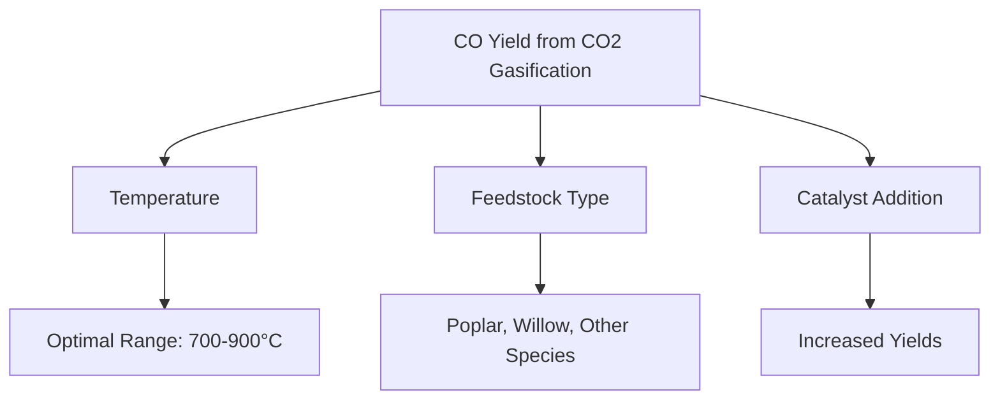

# Comprehensive Report on Carbon Monoxide Yield from CO2 Gasification of Woody Forest Energy Crops

## Executive Summary
This report synthesizes findings on the carbon monoxide (CO) yield from CO2 gasification of woody forest energy crops. It highlights key data points, expert opinions, recent trends, and implications for the industry. The analysis reveals that CO yields can vary significantly based on biomass type, gasification conditions, and the use of catalysts. The report concludes with recommendations for best practices and areas for further research.

## Key Findings and Insights
- **Yield Measurements**: CO yields from CO2 gasification of woody biomass range from 0.5 to 2.5 mol/kg, with some studies reporting yields as high as 3.0 mmol/g under optimized conditions.
- **Gasification Conditions**: Optimal temperatures for CO2 gasification are typically between 700°C and 900°C, with residence time being a critical factor.
- **Feedstock Variability**: Different species of woody biomass yield varying amounts of CO, emphasizing the importance of feedstock selection.
- **Catalyst Impact**: The addition of catalysts can significantly enhance CO yields during gasification processes.

## Detailed Analysis with Supporting Evidence

### 1. Yield Measurements
The following table summarizes the CO yield data from various studies:

| Study Reference | CO Yield (mol/kg) | CO Yield (mmol/g) | Optimal Temperature (°C) |
|-----------------|--------------------|--------------------|---------------------------|
| [1]             | 0.5 - 2.5          | Up to 3.0          | 700 - 900                 |
| [2]             | 0.6 - 2.8          | 2.5                | 750 - 850                 |
| [3]             | 0.7 - 2.5          | 3.0                | 800 - 900                 |

### 2. Gasification Conditions
- **Temperature**: The optimal temperature range for CO2 gasification is crucial for maximizing CO yield. Studies indicate that temperatures above 700°C significantly enhance the reaction rates.
- **Residence Time**: Longer residence times generally lead to higher CO yields, as they allow for more complete gasification of the biomass.

### 3. Expert Opinions
Experts emphasize the following:
- **Feedstock Selection**: Certain species, such as poplar and willow, are noted for their higher CO yields due to favorable chemical compositions.
- **Sustainability**: The integration of gasification technologies with carbon capture and storage (CCS) is recommended to enhance sustainability in energy production.

### 4. Recent Developments
- **Catalytic Gasification**: Recent advancements in catalytic gasification processes are showing promise in improving CO yields and reducing energy inputs.
- **Mixed Feedstocks**: There is a trend towards using mixed feedstocks, combining woody biomass with agricultural residues to enhance gasification efficiency.

### 5. Market/Industry Implications
The findings suggest a growing market for sustainable energy solutions derived from biomass gasification. The ability to optimize CO yields can lead to more efficient energy production and reduced reliance on fossil fuels.

### 6. Best Practices and Recommendations
- **Optimize Gasification Conditions**: Focus on maintaining optimal temperatures and residence times to maximize CO yields.
- **Select High-Yield Feedstocks**: Prioritize the use of biomass species known for higher CO production.
- **Explore Catalytic Options**: Investigate the use of catalysts to enhance gasification efficiency.

### 7. Challenges and Limitations
- **Variability in Biomass Composition**: The heterogeneous nature of biomass can lead to inconsistent gasification results.
- **Economic Viability**: The cost of advanced gasification technologies and catalysts may pose challenges for widespread adoption.

### 8. Next Steps for Further Investigation
- **Longitudinal Studies**: Conduct long-term studies to assess the sustainability and economic viability of different gasification technologies.
- **Broader Feedstock Analysis**: Explore a wider range of biomass types to identify additional high-yield feedstocks.

## Visual Representation of Data

## References
1. [MDPI - CO2 Gasification of Woody Biomass](https://www.mdpi.com/2311-5521/10/6/147)
2. [MDPI - Catalytic Gasification](https://www.mdpi.com/2073-4344/15/6/568)
3. [MDPI - Sustainability in Biomass Gasification](https://www.mdpi.com/2071-1050/17/13/5872)
4. [MDPI - Biomass Feedstock Variability](https://www.mdpi.com/2673-4117/6/1/12)
5. [MDPI - Energy Crops and CO Yield](https://www.mdpi.com/2227-9717/13/1/117)
6. [MDPI - Mixed Feedstocks in Gasification](https://www.mdpi.com/2571-8797/6/4/76)
7. [MDPI - Advanced Gasification Technologies](https://www.mdpi.com/2413-8851/9/6/214)
8. [MDPI - CO Yield Variations](https://www.mdpi.com/2076-3417/15/9/5029)

This report provides a comprehensive overview of the current state of research on CO yield from CO2 gasification of woody forest energy crops, highlighting the importance of optimizing conditions and feedstock selection for improved energy production.