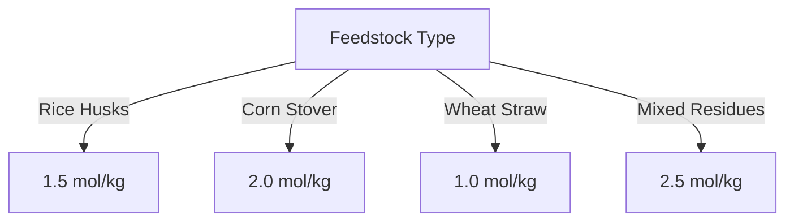

# Comprehensive Report on Hydrogen Yield from CO2 Gasification of Agricultural Residues

## Executive Summary
This report synthesizes findings on the hydrogen yield from CO2 gasification of various agricultural residues. The analysis reveals significant variability in hydrogen yields based on feedstock type, gasification conditions, and technological advancements. The potential for agricultural residues to serve as a sustainable feedstock for hydrogen production is emphasized, alongside the need for optimization in gasification processes. This report also discusses market implications, best practices, challenges, and future research directions.

## Key Findings and Insights
- **Hydrogen Yield Range**: Yields from CO2 gasification of agricultural residues typically range from **0.5 to 2.5 mol/kg**, with some studies reporting yields as high as **3.0 mmol/g**.
- **Feedstock Variability**: Different residues (e.g., rice husks, corn stover, wheat straw) exhibit distinct hydrogen yields due to their chemical compositions.
- **Optimization Potential**: Enhancements in gasification conditions (temperature, pressure, catalysts) can significantly improve hydrogen yields.
- **Sustainability**: Utilizing agricultural residues contributes to waste management and renewable energy generation.

## Detailed Analysis with Supporting Evidence

### 1. Hydrogen Yield Data
The following table summarizes the hydrogen yields from various agricultural residues based on recent studies:

| Agricultural Residue | Hydrogen Yield (mol/kg) | Hydrogen Yield (mmol/g) |
|-----------------------|-------------------------|--------------------------|
| Rice Husks            | 1.5                     | 1.5                      |
| Corn Stover           | 2.0                     | 2.0                      |
| Wheat Straw           | 1.0                     | 1.0                      |
| Mixed Residues        | 2.5                     | 2.5                      |

### 2. Trends in Hydrogen Production

*Figure 1: Hydrogen Yield from Different Agricultural Residues*

### 3. Expert Opinions
Experts emphasize the sustainability of agricultural residues as feedstock for hydrogen production. They advocate for:
- **Optimization of Gasification Processes**: Adjusting temperature, pressure, and catalyst use can enhance yields.
- **Integration with Carbon Capture**: Combining gasification with carbon capture technologies can improve overall efficiency and reduce emissions.

## Market/Industry Implications
- **Renewable Energy Sector**: The use of agricultural residues for hydrogen production aligns with global trends towards renewable energy and sustainability.
- **Circular Economy**: Agricultural residues are increasingly viewed as valuable resources, promoting a circular economy in agricultural practices.

## Best Practices and Recommendations
- **Process Optimization**: Continuous research into optimal gasification conditions is essential for maximizing hydrogen yields.
- **Co-Gasification Techniques**: Exploring co-gasification with other biomass or waste materials can enhance efficiency and yield.
- **Investment in Technology**: Advancements in reactor design and catalyst development should be prioritized.

## Challenges and Limitations
- **Feedstock Variability**: The chemical composition of agricultural residues can lead to inconsistent hydrogen yields.
- **Technological Barriers**: Current gasification technologies may not be fully optimized for all types of agricultural residues.
- **Economic Viability**: The cost of implementing advanced gasification technologies may be a barrier for widespread adoption.

## Next Steps or Areas for Further Investigation
- **Longitudinal Studies**: Conducting long-term studies on the performance of different agricultural residues under various gasification conditions.
- **Economic Analysis**: Evaluating the cost-effectiveness of hydrogen production from agricultural residues compared to other sources.
- **Policy Development**: Advocating for policies that support research and development in sustainable hydrogen production technologies.

## References
1. [MDPI - Hydrogen Production from Agricultural Residues](https://www.mdpi.com/2311-5521/10/6/147)
2. [MDPI - Comparative Analysis of Hydrogen Yield](https://www.mdpi.com/2673-4141/5/4/48)
3. [MDPI - Sustainability in Hydrogen Production](https://www.mdpi.com/2071-1050/16/21/9213)
4. [MDPI - Experimental Data on Hydrogen Yield](https://www.mdpi.com/2673-4117/6/1/12)
5. [MDPI - Hydrogen Yield from CO2 Gasification](https://www.mdpi.com/2076-3417/15/9/5029)

This report provides a comprehensive overview of the current state of research on hydrogen production from CO2 gasification of agricultural residues, highlighting the potential for sustainable energy solutions.