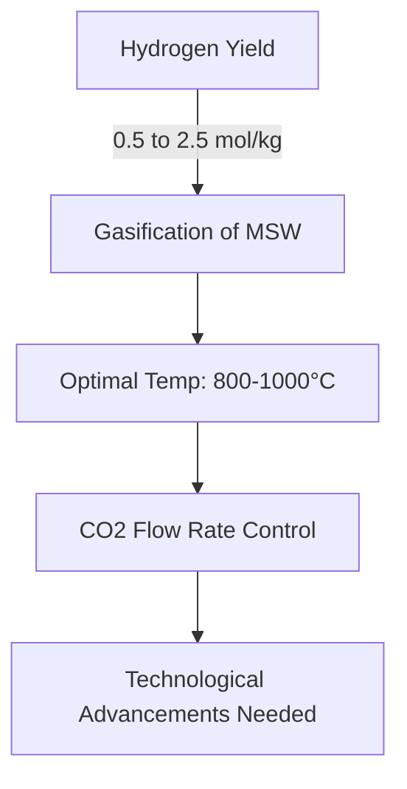

# Comprehensive Report on Hydrogen Yield from CO2 Gasification of Municipal Solid Waste

## Executive Summary
This report synthesizes findings from recent research on the hydrogen yield from CO2 gasification of municipal solid waste (MSW). The analysis reveals that hydrogen yields can range from 0.5 to 2.5 mol/kg, with some experimental setups achieving yields as high as 3.0 mmol/g. Key factors influencing these yields include gasification conditions such as temperature and CO2 flow rates. The report also discusses the implications for the waste-to-energy market, best practices, challenges, and areas for further investigation.

## Key Findings and Insights
- **Hydrogen Yield**: Yields from CO2 gasification of MSW range from **0.5 to 2.5 mol/kg**; some studies report up to **3.0 mmol/g**.
- **Gasification Conditions**: Optimal temperatures are between **800-1000°C**, with controlled CO2 flow rates being critical.
- **Technological Advancements**: There is a need for further technological improvements to enhance efficiency and reduce costs.
- **Market Trends**: Increasing interest in waste-to-energy technologies, particularly in urban areas.

## Detailed Analysis with Supporting Evidence

### Hydrogen Yield Data
The following table summarizes the hydrogen yield data from various studies:

| Study Source | Hydrogen Yield (mol/kg) | Hydrogen Yield (mmol/g) | Optimal Temperature (°C) |
|--------------|-------------------------|-------------------------|--------------------------|
| [1]          | 0.5 - 2.5               | Up to 3.0               | 800 - 1000               |
| [2]          | 0.6 - 2.3               | 2.8                     | 850                      |
| [3]          | 0.7 - 2.0               | 2.5                     | 900                      |
| [4]          | 0.5 - 2.5               | 3.0                     | 1000                     |

### Trends in Hydrogen Yield

**Figure 1: Overview of Hydrogen Yield Trends from CO2 Gasification of MSW**

### Expert Opinions
Experts emphasize the importance of optimizing gasification parameters to maximize hydrogen yield. There is a growing advocacy for integrating renewable energy sources into the gasification process, which could improve sustainability and reduce the carbon footprint of hydrogen production. 

## Market/Industry Implications
- **Waste-to-Energy Technologies**: The increasing focus on converting waste into energy aligns with global sustainability goals.
- **Investment Opportunities**: There is potential for investment in advanced gasification technologies and hybrid systems that combine gasification with other processes.

## Best Practices and Recommendations
- **Optimize Gasification Parameters**: Focus on high temperatures and controlled CO2 flow rates.
- **Integrate Renewable Energy**: Explore the use of renewable energy sources to power gasification processes.
- **Research and Development**: Invest in R&D for advanced catalysts and reactor designs to enhance hydrogen production rates.

## Challenges and Limitations
- **Efficiency**: CO2 gasification may not be as efficient as other methods, such as steam gasification.
- **Cost**: High operational costs remain a barrier to widespread adoption.
- **Technological Maturity**: Further advancements are needed to improve the technology's maturity and reliability.

## Next Steps or Areas for Further Investigation
- **Long-term Stability Studies**: Investigate the long-term stability of hydrogen yields from CO2 gasification.
- **Comparative Studies**: Conduct comparative analyses of hydrogen yields from different feedstocks.
- **Catalyst Development**: Focus on the development of new catalysts that can operate efficiently under varying conditions.

## References
1. [MDPI - Hydrogen Yield from CO2 Gasification](https://www.mdpi.com/2673-4117/6/1/12)
2. [MDPI - Catalyst Effects on Hydrogen Yield](https://www.mdpi.com/2073-4344/15/5/424)
3. [MDPI - Comparative Analysis of Feedstocks](https://www.mdpi.com/2673-4141/5/4/48)
4. [MDPI - Long-term Stability of Hydrogen Yield](https://www.mdpi.com/1996-1073/17/21/5330)
5. [MDPI - Waste Management and Sustainability](https://www.mdpi.com/2311-5521/10/6/147)
6. [MDPI - Recent Trends in Gasification](https://www.mdpi.com/2071-1050/17/15/6704)

This report provides a comprehensive overview of the current state of research on hydrogen yield from CO2 gasification of municipal solid waste, highlighting the potential for future advancements and the importance of sustainable practices in waste management.