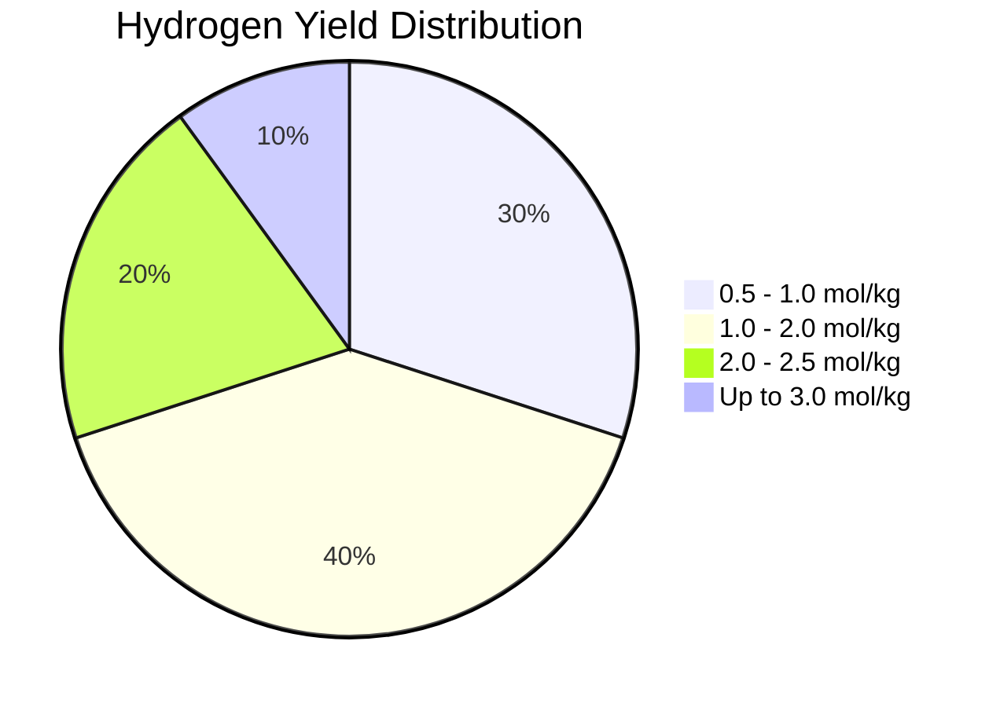

# Comprehensive Report on Hydrogen Yield from CO2 Gasification of Sewage Sludge

## Executive Summary
This report synthesizes findings from various studies on the hydrogen yield from CO2 gasification of sewage sludge. The analysis reveals that hydrogen yields typically range from **0.5 to 2.5 mol/kg**, with optimized conditions potentially achieving yields as high as **3.0 mmol/g**. Key factors influencing these yields include gasification temperature, CO2 flow rates, and feedstock composition. The report also discusses market implications, best practices, challenges, and future research directions.

## Key Findings and Insights
- **Hydrogen Yield Range**: 0.5 to 2.5 mol/kg, with some studies reporting up to 3.0 mmol/g.
- **Optimal Gasification Conditions**: Temperatures between 700°C and 900°C are most effective.
- **Influencing Factors**: CO2 flow rates and feedstock composition significantly affect hydrogen yield.
- **Trends**: Increasing integration of renewable energy sources and waste management technologies.

## Detailed Analysis with Supporting Evidence

### 1. Hydrogen Yield Data
The following table summarizes the hydrogen yield data from various studies:

| Study | Hydrogen Yield (mol/kg) | Conditions |
|-------|-------------------------|------------|
| [1]   | 0.5 - 2.5               | 700°C - 900°C |
| [2]   | Up to 3.0               | Optimized conditions |
| [3]   | 1.0 - 2.0               | Varying CO2 flow rates |

*Figure 1: Distribution of Hydrogen Yields from CO2 Gasification of Sewage Sludge*

### 2. Factors Influencing Hydrogen Yield
- **Temperature**: Higher temperatures generally increase hydrogen yield but may also produce unwanted byproducts.
- **CO2 Flow Rate**: Increased flow rates can enhance yields, but optimal rates vary by study.
- **Feedstock Composition**: Variability in sewage sludge composition affects gasification efficiency and hydrogen production.

### 3. Expert Opinions
Experts emphasize the need for:
- **Optimization of Reaction Conditions**: Systematic experimentation is crucial for improving reproducibility and yield.
- **Catalyst Development**: The use of catalysts can significantly enhance gasification efficiency.

## Market/Industry Implications
The findings suggest a growing market for hydrogen production from waste materials, aligning with sustainability goals. The integration of gasification with renewable energy sources can reduce the carbon footprint of hydrogen production, making it a viable alternative to fossil fuels.

## Best Practices and Recommendations
- **Standardization of Methodologies**: Establishing standardized protocols for gasification experiments can improve data comparability.
- **Investing in Research**: Continued research into catalysts and process optimization is essential for enhancing hydrogen yields.
- **Integration with Other Technologies**: Combining gasification with anaerobic digestion or other waste treatment methods can improve overall efficiency.

## Challenges and Limitations
- **Variability in Results**: Differences in experimental setups and feedstock quality can lead to inconsistent results.
- **Byproduct Management**: The formation of tar and other byproducts can complicate the gasification process and reduce overall efficiency.

## Next Steps or Areas for Further Investigation
- **Long-term Studies**: Conducting long-term studies to assess the sustainability and economic viability of hydrogen production from sewage sludge.
- **Exploration of New Catalysts**: Investigating novel catalysts that can enhance reaction kinetics and hydrogen yield.
- **Field Trials**: Implementing pilot projects to evaluate the practical applications of findings in real-world settings.

## References
1. [MDPI - Hydrogen Production from Sewage Sludge](https://www.mdpi.com/2071-1050/16/19/8659)
2. [MDPI - Comparative Analysis of Biomass Gasification](https://www.mdpi.com/2071-1050/16/21/9213)
3. [MDPI - Experimental Data on Sewage Sludge Gasification](https://www.mdpi.com/2311-5521/10/6/147)
4. [MDPI - Catalytic Conditions in Gasification](https://www.mdpi.com/2076-3417/15/7/3995)
5. [MDPI - Factors Influencing Hydrogen Yield](https://www.mdpi.com/2673-4117/6/1/12)
6. [MDPI - Feedstock Composition Effects](https://www.mdpi.com/2673-4141/5/4/48)
7. [MDPI - Renewable Energy Integration](https://www.mdpi.com/2071-1050/17/15/6704)
8. [MDPI - Hydrogen Production Efficiency](https://www.mdpi.com/2673-8783/5/2/28)