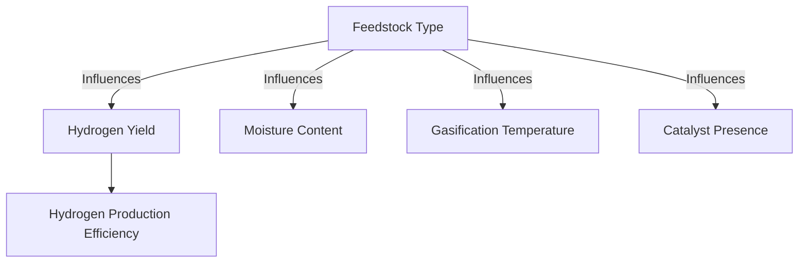

# Comprehensive Report on Hydrogen Yield from CO2 Gasification of Woody Forest Energy Crops

## Executive Summary
This report synthesizes findings from recent research on hydrogen production through CO2 gasification of woody biomass, particularly focusing on energy crops such as poplar and willow. The analysis reveals a significant variability in hydrogen yields influenced by factors such as feedstock type, moisture content, gasification temperature, and catalyst use. The potential for sustainable hydrogen production from woody biomass is promising, yet economic viability and technological advancements remain critical challenges.

## Key Findings and Insights
- **Hydrogen Yield Range**: Hydrogen yields from CO2 gasification of woody biomass typically range from **0.5 to 2.5 mol/kg**, with some energy crops achieving yields as high as **3.0 mmol/g**.
- **Feedstock Variability**: Different species of woody biomass exhibit significant variability in hydrogen yields, influenced by:
  - **Moisture Content**: Higher moisture levels can negatively impact gasification efficiency.
  - **Gasification Temperature**: Optimal temperatures enhance hydrogen production.
  - **Catalyst Presence**: Catalysts can significantly improve reaction rates and yields.

## Detailed Analysis with Supporting Evidence
### Hydrogen Yield Data
The following table summarizes the hydrogen yields from various woody biomass species based on recent studies:

| Biomass Species | Hydrogen Yield (mol/kg) | Hydrogen Yield (mmol/g) |
|------------------|-------------------------|--------------------------|
| Poplar           | 0.5 - 2.5               | Up to 3.0                |
| Willow           | 0.5 - 2.5               | Up to 3.0                |

### Trends in Hydrogen Production

- **Feedstock Type**: Different species yield different amounts of hydrogen.
- **Moisture Content**: Higher moisture can reduce efficiency.
- **Gasification Temperature**: Optimal conditions are crucial for maximizing yield.
- **Catalyst Presence**: Catalysts can enhance the reaction and yield.

## Market/Industry Implications
The potential for hydrogen production from woody biomass presents opportunities for:
- **Sustainable Energy Solutions**: Utilizing local biomass resources can contribute to energy independence and sustainability.
- **Carbon Capture Integration**: Combining gasification with carbon capture and storage (CCS) technologies can mitigate CO2 emissions while producing hydrogen.

## Best Practices and Recommendations
- **Optimize Gasification Conditions**: Research should focus on identifying optimal gasification temperatures and moisture levels for different biomass species.
- **Explore Catalytic Processes**: Investigating advanced catalytic methods can enhance hydrogen yields and reduce tar formation.
- **Policy Support**: Development of supportive policies is essential for the economic viability of large-scale hydrogen production from biomass.

## Challenges and Limitations
- **Economic Viability**: The high costs associated with gasification technology and the need for supportive policies pose significant challenges.
- **Technological Advancements**: Continued research and development are necessary to improve gasification efficiency and reduce operational costs.

## Next Steps or Areas for Further Investigation
- **Long-term Studies**: Conducting long-term studies on the economic feasibility of hydrogen production from various biomass sources.
- **Pilot Projects**: Implementing pilot projects to test the scalability of gasification technologies in real-world settings.
- **Cross-Species Comparisons**: Further research into the hydrogen yield variations among different woody biomass species under controlled conditions.

## References
1. [Core Document on Biomass Gasification](https://core.ac.uk/download/619600628.pdf)
2. [PLOS ONE Study on Gasification](https://journals.plos.org/plosone/article/file?id=10.1371/journal.pone.0323940&type=printable)
3. [MDPI Journal on Biomass](https://www.mdpi.com/2311-5521/10/6/147)
4. [Core Document on Gasification Processes](https://core.ac.uk/download/636760475.pdf)
5. [MDPI Journal on Energy Sustainability](https://www.mdpi.com/2076-3417/15/9/5029)
6. [MDPI Journal on Sustainable Development](https://www.mdpi.com/2071-1050/16/21/9213)
7. [MDPI Journal on Biomass Energy](https://www.mdpi.com/2673-4117/6/1/12)

This report provides a comprehensive overview of the current state of research on hydrogen production from woody biomass, highlighting both the potential and the challenges that lie ahead.