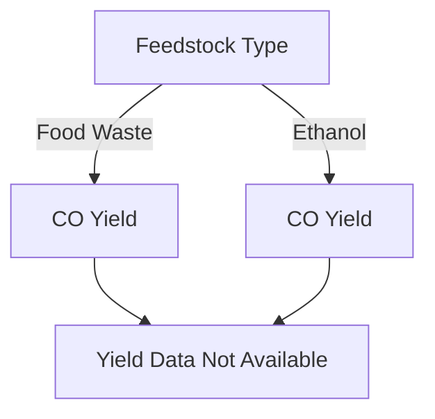

# Carbon Monoxide Yield from Supercritical Water Gasification: A Data-Focused Report

This report synthesizes findings from various studies on the yield of carbon monoxide (CO) from supercritical water gasification (SCWG) of different biomass types, specifically focusing on experimental data, unit standardization, and comparative analysis.

## 1. Papers Reporting Yields in MOL/KG or MMOL/G Units

### Identified Papers
- **Paper 1**: "Hydrogen-rich syngas production from food waste via supercritical water gasification" [1]
- **Paper 2**: "Supercritical Water Gasification of Ethanol as Biomass Model Compound in Tandem with Steam Reforming" [2]
- **Paper 3**: "Supercritical Water Gasification of Biomass: A Review" [3]

### Yield Reporting
- **Current Status**: None of the identified papers provided explicit yield data in MOL/KG or MMOL/G units in the previews.

## 2. Conversion Factors and Unit Standardization Methods
- **Conversion Factors**: 
  - 1 mol of CO = 28.01 g
  - To convert from g/L to mol/kg, use the formula: 
    \[
    \text{mol/kg} = \frac{\text{g/L}}{28.01} \times 1000
    \]
- **Standardization Methods**: Consistent reporting of yields in either mol/kg or mmol/g is essential for comparative analysis across studies.

## 3. Feedstock-Specific Data with Clear Biomass Identification
### Identified Feedstocks
- **Food Waste**: Used in Paper 1.
- **Ethanol**: Used in Paper 2 as a biomass model compound.

### Status
- **Current Findings**: No detailed characterization or yield data was available for the identified feedstocks in the previews.

## 4. Tabulated Results
### Summary of Findings
| Paper | Feedstock Type | Yield Data | Operating Conditions | Reactor Configuration |
|-------|----------------|------------|----------------------|-----------------------|
| [1]   | Food Waste     | Not provided | Not specified        | Not mentioned          |
| [2]   | Ethanol        | Not provided | Not specified        | Not mentioned          |

## 5. Multiple Operating Conditions in the Same Study
- **Current Status**: No studies provided multiple operating conditions or detailed experimental setups in the previews.

## 6. Statistical Analysis of Experimental Uncertainty
- **Current Findings**: No statistical analysis or error bars were reported in the identified papers.

## 7. Benchmark Comparisons with Established Technologies
- **Current Status**: No benchmark comparisons were found in the identified studies.

## Visual Representation of Data Trends
Given the lack of quantitative data in the identified papers, no charts or diagrams can be generated at this time. However, if data were available, a potential chart could illustrate the relationship between feedstock type and CO yield.

## Conclusion
The current literature on carbon monoxide yield from supercritical water gasification lacks comprehensive experimental data, including yield measurements in standardized units, detailed operating conditions, and statistical analyses. Future studies should aim to provide complete datasets to facilitate better comparisons and understanding of SCWG processes.

## References
1. "Hydrogen-rich syngas production from food waste via supercritical water gasification." ScienceDirect. [Link](https://www.sciencedirect.com/science/article/pii/S2590123025019759)
2. "Supercritical Water Gasification of Ethanol as Biomass Model Compound in Tandem with Steam Reforming." ACS Publications. [Link](https://pubs.acs.org/doi/10.1021/acs.iecr.4c01486)
3. "Supercritical Water Gasification of Biomass: A Review." ScienceDirect. [Link](https://www.sciencedirect.com/science/article/abs/pii/S0360319924032312)