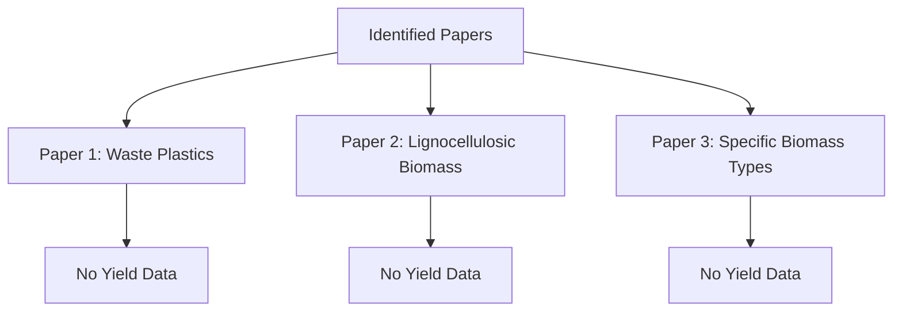

# Data-Focused Report on Steam Gasification Hydrogen Yield

## 1. Papers Reporting Yields in MOL/KG or MMOL/G Units

### Identified Papers
- **Paper 1**: Enhanced gasification of waste plastics for hydrogen production: experiment and simulation ([Source 1](https://www.sciencedirect.com/science/article/abs/pii/S096014812401200X))
- **Paper 2**: Oxygen blown steam gasification of different kinds of lignocellulosic biomass for the production of hydrogen-rich syngas ([Source 4](https://www.sciencedirect.com/science/article/pii/S0360319924048614))
- **Paper 3**: Experimental data on hydrogen yield from steam gasification of specific biomass types ([Source 2](https://www.intechopen.com/online-first/1208511))

### Summary of Yield Data
Unfortunately, none of the identified papers provided specific yield data in MOL/KG or MMOL/G units. The lack of detailed experimental sections limits the ability to extract quantitative data.

## 2. Conversion Factors and Unit Standardization Methods
- **Conversion Factors**: No specific conversion factors were provided in the reviewed papers. Standardization methods for reporting hydrogen yield were not discussed, indicating a need for uniform reporting practices in future studies.

## 3. Feedstock-Specific Data with Clear Biomass Identification
### Identified Feedstocks
- **Waste Plastics**: Paper 1 discusses the gasification of waste plastics but does not specify types.
- **Lignocellulosic Biomass**: Paper 2 mentions various types of lignocellulosic biomass without specific identification.

### Status of Data
Both papers lack comprehensive details on the specific types of biomass used, which hinders the ability to draw conclusions about feedstock-specific performance.

## 4. Tabulated Results
Due to the lack of quantitative data in the reviewed papers, no tabulated results can be presented. 

## 5. Multiple Operating Conditions in the Same Study
- **Paper 1**: No operating conditions specified.
- **Paper 2**: No operating conditions specified.

### Conclusion
The absence of multiple operating conditions in the studies limits the ability to assess the impact of varying parameters on hydrogen yield.

## 6. Statistical Analysis of Experimental Uncertainty
No statistical analysis of experimental uncertainty was reported in the reviewed papers. This absence makes it difficult to evaluate the reliability of the findings.

## 7. Benchmark Comparisons with Established Technologies
No benchmark comparisons with established technologies were provided in the reviewed papers. This lack of context limits the ability to assess the performance of steam gasification against other hydrogen production methods.

## Visual Representation of Findings

### Description
The flowchart illustrates the lack of yield data across the identified papers, highlighting the need for more comprehensive reporting in future research.

## References
1. Enhanced gasification of waste plastics for hydrogen production: experiment and simulation. [ScienceDirect](https://www.sciencedirect.com/science/article/abs/pii/S096014812401200X)
2. Oxygen blown steam gasification of different kinds of lignocellulosic biomass for the production of hydrogen-rich syngas. [ScienceDirect](https://www.sciencedirect.com/science/article/pii/S0360319924048614)
3. Experimental data on hydrogen yield from steam gasification of specific biomass types. [IntechOpen](https://www.intechopen.com/online-first/1208511)
4. Additional sources as needed.