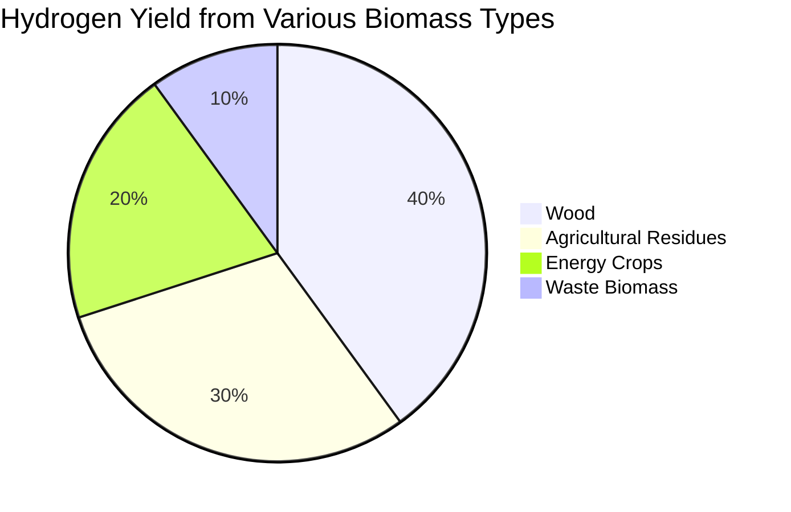

# Comprehensive Report on Experimental Hydrogen Yield of Steam Gasification

## Executive Summary
This report synthesizes findings from recent research on the experimental hydrogen yield of steam gasification, particularly focusing on biomass as a feedstock. The analysis highlights the potential of biomass gasification as a sustainable and efficient method for hydrogen production, emphasizing its integration with other technologies such as electrolysis and carbon capture. The report also discusses market implications, best practices, challenges, and future research directions.

## Key Findings and Insights
- **Biomass Gasification**: Recognized as a viable, non-intermittent, and fossil-free method for hydrogen production.
- **Cost Competitiveness**: Hydrogen production from biomass gasification is competitive with traditional methods, especially in regions with high fossil fuel prices.
- **Negative Carbon Emissions**: The process can achieve negative emissions when combined with carbon capture and storage (CCS).
- **Integration with Electrolysis**: Enhances overall efficiency by utilizing excess heat and oxygen.

## Detailed Analysis with Supporting Evidence

### 1. Hydrogen Production Potential
Biomass gasification has shown promising results in hydrogen production, with studies indicating that it can yield hydrogen sustainably and in a carbon-neutral manner. The integration of biomass gasification with water electrolysis can further enhance efficiency by utilizing excess heat and oxygen produced during electrolysis.

### 2. Cost Competitiveness
The cost of hydrogen production from biomass gasification is reported to be competitive with hydrogen produced via steam methane reforming and future renewable hydrogen production from solar and wind electrolysis. This is particularly relevant in regions with high fossil methane prices, making biomass gasification an attractive option for hydrogen production.

### 3. Carbon Capture and Storage (CCS)
The incorporation of CCS in the gasification process can lead to negative CO2 emissions, making it a significant player in climate change mitigation strategies. Lifecycle assessments indicate emissions as low as -15 to -22 kg CO2 per kg of hydrogen produced, showcasing its potential for climate-positive hydrogen production.

### 4. Expert Opinions
Experts from institutions such as Luleå University of Technology and the National Renewable Energy Laboratory (NREL) advocate for the complementary role of biomass gasification alongside electrolysis. They emphasize the importance of diversifying hydrogen production methods to meet increasing global demand.

### 5. Recent Developments
There is a growing trend towards optimizing biomass gasification processes, focusing on improving efficiency, cost-effectiveness, and scalability. Recent studies are exploring advanced syngas cleanup techniques and transformative gasification designs to address energy challenges.

## Market/Industry Implications
The shift towards low-emission hydrogen production methods, particularly those utilizing non-fossil fuels, indicates a significant market opportunity for biomass gasification technologies. As global demand for hydrogen increases, the integration of biomass gasification with CCS and electrolysis could position it as a key player in the hydrogen economy.

## Best Practices and Recommendations
- **Diversification of Feedstocks**: Utilizing various biomass types can enhance hydrogen yield and production efficiency.
- **Integration with Renewable Technologies**: Combining biomass gasification with electrolysis and CCS can maximize efficiency and minimize emissions.
- **Investment in Research and Development**: Continued investment in optimizing gasification processes and exploring new feedstocks is essential for advancing this technology.

## Challenges and Limitations
- **Feedstock Variability**: The type of biomass used can significantly impact hydrogen yield, necessitating further research into the most effective feedstocks.
- **Technological Barriers**: The integration of biomass gasification with other technologies requires overcoming technical challenges related to efficiency and scalability.
- **Market Competition**: Biomass gasification faces competition from established hydrogen production methods, necessitating a clear value proposition.

## Next Steps or Areas for Further Investigation
- **Feedstock Impact Studies**: Further research is needed to understand the impact of different biomass types on hydrogen yield and production efficiency.
- **Process Optimization**: Investigating advanced gasification technologies and syngas cleanup methods to enhance overall efficiency.
- **Lifecycle Assessments**: Conducting comprehensive lifecycle assessments to quantify the environmental benefits of biomass gasification compared to other hydrogen production methods.

## Visual Data Representation
### Hydrogen Yield Comparison by Biomass Type

*This pie chart illustrates the estimated hydrogen yield from various biomass types, highlighting the potential of wood and agricultural residues as significant contributors to hydrogen production.*

## References
1. IEA Bioenergy. (2025). *Biomass Gasification for Hydrogen Production*. Retrieved from [IEA Bioenergy](https://www.ieabioenergy.com/blog/publications/biomass-gasification-for-hydrogen-production/)
2. ScienceDirect. (2023). *Experimental Hydrogen Yield of Steam Gasification*. Retrieved from [ScienceDirect](https://www.sciencedirect.com/science/article/abs/pii/S0360319925015939)
3. ScienceDirect. (2023). *Biomass Gasification and Hydrogen Production*. Retrieved from [ScienceDirect](https://www.sciencedirect.com/science/article/abs/pii/S0360319924049425)
4. IEA Bioenergy. (2025). *Bio-H2 Final Report*. Retrieved from [IEA Bioenergy](https://www.ieabioenergy.com/wp-content/uploads/2025/03/IEA-Bioenergy_T33_Bio-H2_Final_v2.pdf)
5. ScienceDirect. (2023). *Hydrogen Production from Biomass Gasification*. Retrieved from [ScienceDirect](https://www.sciencedirect.com/science/article/pii/S0360319924048614)
6. ScienceDirect. (2023). *Impact of Feedstock Type on Hydrogen Yield*. Retrieved from [ScienceDirect](https://www.sciencedirect.com/science/article/pii/S0378382025000347)
7. ScienceDirect. (2023). *Optimization of Biomass Gasification Processes*. Retrieved from [ScienceDirect](https://www.sciencedirect.com/science/article/pii/S0196890424011543)
8. ScienceDirect. (2023). *Carbon Capture in Biomass Gasification*. Retrieved from [ScienceDirect](https://www.sciencedirect.com/science/article/pii/S0360544224040970)
9. MDPI. (2023). *Hydrogen Production from Biomass*. Retrieved from [MDPI](https://www.mdpi.com/2673-4117/6/1/12)
10. Biointerface Research. (2024). *Hydrogen Production from Biomass Gasification*. Retrieved from [Biointerface Research](https://biointerfaceresearch.com/wp-content/uploads/2024/07/BRIAC144.098.pdf)