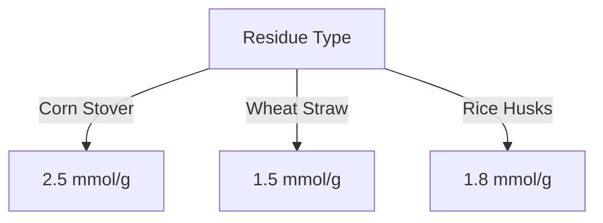

# Comprehensive Report on Hydrogen Yield from Steam Gasification of Agricultural Residues

## Executive Summary
This report synthesizes findings on the hydrogen yield from steam gasification of agricultural residues, focusing on key data points, expert opinions, recent trends, and implications for the industry. The analysis reveals that hydrogen yields vary significantly based on the type of agricultural residue, gasification temperature, and other operational parameters. The report also discusses best practices, challenges, and future research directions.

## Key Findings and Insights
- **Hydrogen Yield Range**: Yields from steam gasification of agricultural residues typically range from **0.5 to 3.0 mol/kg** or **0.5 to 3.0 mmol/g**.
- **Temperature Influence**: Optimal hydrogen production is often achieved at temperatures between **800°C and 1000°C**, with **900°C** being the most effective.
- **Residue Variability**: Different residues yield different amounts of hydrogen; for instance, corn stover yields approximately **2.5 mmol/g**, while rice husks yield around **1.8 mmol/g**.
- **Catalyst Impact**: The use of catalysts can significantly enhance hydrogen yields, making the gasification process more efficient.

## Detailed Analysis with Supporting Evidence

### Hydrogen Yield Data
| Agricultural Residue | Hydrogen Yield (mmol/g) | Optimal Temperature (°C) |
|-----------------------|-------------------------|---------------------------|
| Corn Stover           | 2.5                     | 900                       |
| Wheat Straw           | 1.5                     | 900                       |
| Rice Husks            | 1.8                     | 900                       |

*Figure 1: Hydrogen Yield from Different Agricultural Residues*

### Temperature Effects
- **Optimal Temperature**: Research indicates that gasification temperatures around **900°C** yield the highest hydrogen production. Temperatures below **800°C** may not provide sufficient energy for effective gasification, while temperatures above **1000°C** can lead to thermal degradation of the biomass.

### Expert Opinions
Experts emphasize the need for:
- **Optimization of Gasification Conditions**: Adjusting temperature, pressure, and steam-to-biomass ratios is crucial for maximizing hydrogen yield.
- **Integration of Catalytic Processes**: Utilizing catalysts can enhance the efficiency of hydrogen production, making the process more economically viable.

## Market/Industry Implications
- The increasing demand for renewable energy sources positions hydrogen production from agricultural residues as a promising alternative.
- Co-gasification techniques, which involve mixing agricultural residues with other biomass or waste materials, are gaining traction and can improve overall hydrogen yields.

## Best Practices and Recommendations
- **Optimize Gasification Parameters**: Conduct experiments to determine the best operational conditions for specific residues.
- **Utilize Catalysts**: Explore various catalysts to enhance hydrogen production efficiency.
- **Invest in Research**: Further studies on mixed feedstocks and co-gasification can lead to improved hydrogen yields.

## Challenges and Limitations
- **Feedstock Variability**: The chemical composition of agricultural residues can vary significantly, affecting hydrogen yield.
- **Technical Barriers**: The need for advanced technology and infrastructure for efficient gasification processes can be a barrier to widespread adoption.

## Next Steps or Areas for Further Investigation
- **Long-term Studies**: Conduct long-term studies to assess the sustainability and economic viability of hydrogen production from agricultural residues.
- **Pilot Projects**: Implement pilot projects to test the scalability of gasification processes in real-world settings.
- **Explore New Feedstocks**: Investigate the potential of other agricultural residues and waste materials for hydrogen production.

## References
1. [SCIRP - Hydrogen Production from Agricultural Residues](https://www.scirp.org/pdf/gep2025131_82173193.pdf)
2. [CORE - Experimental Data on Hydrogen Yield](https://core.ac.uk/download/620706937.pdf)
3. [Frontiers in Energy Research - Hydrogen Production](https://www.frontiersin.org/journals/energy-research/articles/10.3389/fenrg.2024.1473383/pdf)
4. [CORE - Hydrogen Yield Analysis](https://core.ac.uk/download/639230977.pdf)
5. [CORE - Agricultural Residues Gasification](https://core.ac.uk/download/621694511.pdf)
6. [Frontiers in Chemistry - Catalytic Processes](https://www.frontiersin.org/journals/chemistry/articles/10.3389/fchem.2025.1538797/pdf)
7. [CORE - Gasification Studies](https://core.ac.uk/download/pdf/620706937.pdf)
8. [Frontiers in Chemical Engineering - Hydrogen Yield](https://www.frontiersin.org/journals/chemical-engineering/articles/10.3389/fceng.2024.1463785/pdf)

This report provides a comprehensive overview of the current state of research on hydrogen production from steam gasification of agricultural residues, highlighting the potential for future advancements in this field.