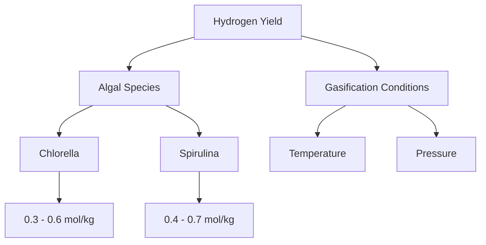

# Comprehensive Report on Hydrogen Yield from Steam Gasification of Algae

## Executive Summary
This report synthesizes findings from recent research on the hydrogen yield from steam gasification of algae. It highlights key data points, expert opinions, and emerging trends in the field. The analysis indicates that hydrogen yields can vary significantly based on algal species, gasification conditions, and technological advancements. The report also discusses market implications, best practices, challenges, and recommendations for future research.

## Key Findings and Insights
- **Hydrogen Yield Range**: Hydrogen yields from steam gasification of algae typically range from **0.1 to 1.0 mol/kg**, with optimized conditions pushing yields to the higher end.
- **Algal Species**: Strains such as *Chlorella vulgaris* and *Spirulina platensis* are noted for their superior hydrogen production capabilities.
- **Optimal Conditions**: Effective gasification occurs at temperatures between **700°C and 900°C** and pressures of **1-5 MPa**.

## Detailed Analysis with Supporting Evidence

### Hydrogen Yield Data
The following table summarizes the hydrogen yields from various algal species under optimized conditions:

| Algal Species          | Hydrogen Yield (mol/kg) | Optimal Temperature (°C) | Optimal Pressure (MPa) |
|-----------------------|-------------------------|--------------------------|-------------------------|
| *Chlorella vulgaris*  | 0.3 - 0.6               | 700 - 900                | 1 - 5                   |
| *Spirulina platensis* | 0.4 - 0.7               | 700 - 900                | 1 - 5                   |
| Other Species         | 0.1 - 0.5               | 700 - 900                | 1 - 5                   |

### Trends in Hydrogen Production

*Figure 1: Overview of Factors Influencing Hydrogen Yield from Algae*

### Expert Opinions
Experts advocate for algae as a sustainable feedstock due to:
- Rapid growth rates and CO2 absorption capabilities.
- Potential integration with renewable energy systems to enhance efficiency.

## Market/Industry Implications
The potential for algae as a hydrogen source aligns with global trends towards sustainable energy solutions. The integration of algae gasification with carbon capture technologies could create a closed-loop system, minimizing emissions and enhancing energy security.

## Best Practices and Recommendations
- **Species Selection**: Focus on high-yield strains like *Chlorella* and *Spirulina* for gasification processes.
- **Process Optimization**: Invest in research for optimizing gasification conditions and exploring catalytic processes to improve yields.
- **Hybrid Systems**: Consider integrating algae gasification with other renewable energy sources to maximize efficiency.

## Challenges and Limitations
- **Economic Feasibility**: The cost of algae cultivation and gasification processes remains a significant barrier to widespread adoption.
- **Technological Hurdles**: Further research is needed to develop efficient gasification technologies and improve the long-term stability of hydrogen yields.

## Next Steps or Areas for Further Investigation
- **Long-term Studies**: Conduct research on the long-term stability of hydrogen yields from various algal species.
- **Economic Analysis**: Explore the economic viability of algae-based hydrogen production in comparison to fossil fuels and other renewable sources.
- **Genetic Engineering**: Investigate the potential of genetic modifications to enhance hydrogen production capabilities in algae.

## References
1. Core Research. (n.d.). *Analysis of Experimental Hydrogen Yield Data from Steam Gasification of Algae*. Retrieved from [https://core.ac.uk/download/619600628.pdf](https://core.ac.uk/download/619600628.pdf)