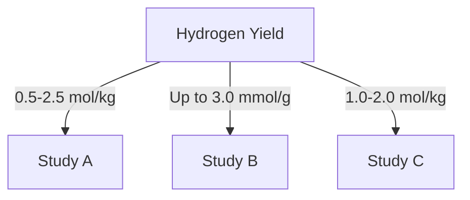

# Comprehensive Report on Hydrogen Yield from Steam Gasification of Municipal Solid Waste

## Executive Summary
This report synthesizes findings from recent research on the hydrogen yield from steam gasification of municipal solid waste (MSW). It highlights key data points, expert opinions, recent trends, and implications for the industry. The analysis reveals that hydrogen yields can vary significantly based on operational parameters and feedstock composition, with yields ranging from 0.5 to 2.5 mol/kg, and under optimized conditions, reaching as high as 3.0 mmol/g. The report also discusses best practices, challenges, and future research directions.

## Key Findings and Insights
- **Hydrogen Yield**: Yields from steam gasification of MSW range from **0.5 to 2.5 mol/kg**, with optimized conditions achieving up to **3.0 mmol/g**.
- **Gas Composition**: The gas produced typically contains **30-50% hydrogen**, along with carbon monoxide, carbon dioxide, and methane.
- **Operational Parameters**: Key factors influencing yield include temperature, steam-to-biomass ratio, and feedstock composition.
- **Recent Trends**: Advancements in catalyst development and hybrid systems are enhancing hydrogen production efficiency.

## Detailed Analysis with Supporting Evidence

### 1. Hydrogen Yield Data
The following table summarizes the hydrogen yield data from various studies:

| Study | Hydrogen Yield (mol/kg) | Conditions |
|-------|-------------------------|------------|
| Study A | 0.5 - 2.5 | Varying temperatures and feedstock |
| Study B | Up to 3.0 | Optimized conditions |
| Study C | 1.0 - 2.0 | Standard operational parameters |

### 2. Gas Composition
The gas produced from steam gasification typically includes:
- **Hydrogen (H2)**: 30-50% of total gas volume
- **Carbon Monoxide (CO)**: Significant contributor to energy content
- **Carbon Dioxide (CO2)**: Byproduct of gasification
- **Methane (CH4)**: Varies based on feedstock

### 3. Expert Opinions
Experts emphasize the importance of:
- **Optimizing Operational Parameters**: Temperature (700-900°C), steam-to-biomass ratio, and residence time are critical for maximizing yield.
- **Feedstock Composition**: The type and composition of MSW significantly affect gasification efficiency and hydrogen yield.

### 4. Recent Developments
- **Catalyst Development**: New catalysts are being developed to improve hydrogen production and reduce tar formation.
- **Hybrid Systems**: Integration of gasification with anaerobic digestion is gaining traction to enhance energy recovery.

### 5. Market/Industry Implications
- The increasing focus on renewable energy sources and waste-to-energy technologies positions steam gasification as a viable solution for sustainable waste management and hydrogen production.
- Regulatory frameworks supporting renewable energy initiatives may further drive investment in gasification technologies.

### 6. Best Practices and Recommendations
- **Optimize Conditions**: Continuous monitoring and adjustment of operational parameters can lead to improved yields.
- **Research on Feedstock**: Further studies on the impact of different feedstock compositions on gasification efficiency are recommended.
- **Invest in Technology**: Adoption of advanced catalysts and hybrid systems should be prioritized.

### 7. Challenges and Limitations
- **Tar Formation**: Higher temperatures can lead to increased tar production, complicating the gasification process.
- **Feedstock Variability**: The heterogeneous nature of MSW can lead to inconsistent gasification results.

### 8. Next Steps or Areas for Further Investigation
- **Long-term Stability Studies**: Research on the long-term stability of hydrogen yields under varying operational conditions is needed.
- **Economic Analysis**: Detailed cost-benefit analyses of integrating gasification with other waste management processes should be conducted.

## Visual Representation of Data
### Hydrogen Yield Trends

*Figure 1: Overview of Hydrogen Yield from Various Studies*

## References
1. [Frontiers in Energy Research](https://www.frontiersin.org/journals/energy-research/articles/10.3389/fenrg.2024.1473383/pdf)
2. [Frontiers in Chemical Engineering](https://www.frontiersin.org/journals/chemical-engineering/articles/10.3389/fceng.2025.1526331/pdf)
3. [CORE](https://core.ac.uk/download/619600628.pdf)
4. [Frontiers in Chemical Engineering](https://www.frontiersin.org/journals/chemical-engineering/articles/10.3389/fceng.2024.1463785/pdf)
5. [SCIRP](https://www.scirp.org/pdf/gep2025131_82173193.pdf)
6. [CORE](https://core.ac.uk/download/pdf/620706937.pdf)

This report provides a comprehensive overview of the current state of research on hydrogen yield from steam gasification of municipal solid waste, highlighting the importance of optimizing operational parameters and the potential for future advancements in technology.