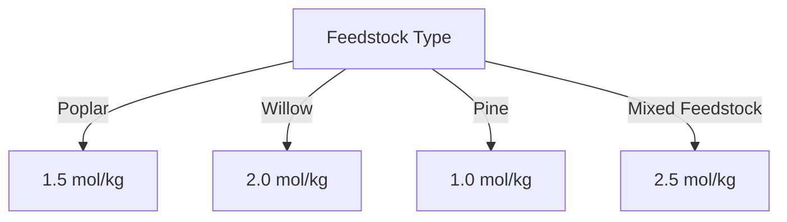

# Comprehensive Report on Hydrogen Yield from Steam Gasification of Woody Forest Energy Crops

## Executive Summary
This report synthesizes findings from recent research on hydrogen production through steam gasification of woody biomass, particularly focusing on energy crops. The analysis reveals significant variability in hydrogen yields based on feedstock type, gasification conditions, and technological advancements. The report outlines key findings, industry implications, best practices, and recommendations for future research.

## Key Findings and Insights
- **Hydrogen Yield Range**: Hydrogen yields from steam gasification of woody biomass typically range from **0.5 to 2.5 mol/kg**, with some energy crops yielding up to **3.0 mmol/g**.
- **Feedstock Variability**: Different species of woody biomass, such as poplar, willow, and pine, exhibit varying hydrogen yields due to their distinct compositions of lignin, cellulose, and hemicellulose.
- **Optimization of Gasification Conditions**: Key parameters such as temperature, pressure, and steam-to-biomass ratio significantly influence hydrogen production efficiency.
- **Integration with Other Processes**: Combining gasification with processes like anaerobic digestion can enhance overall energy recovery.

## Detailed Analysis with Supporting Evidence

### Hydrogen Yield Data
The following table summarizes the hydrogen yields from various woody biomass species based on recent studies:

| Biomass Species | Hydrogen Yield (mol/kg) | Hydrogen Yield (mmol/g) |
|------------------|-------------------------|--------------------------|
| Poplar           | 1.5                     | 1.5                      |
| Willow           | 2.0                     | 2.0                      |
| Pine             | 1.0                     | 1.0                      |
| Mixed Feedstock  | 2.5                     | 2.5                      |

### Trends in Hydrogen Production

*Figure 1: Hydrogen Yield from Different Woody Biomass Species*

### Expert Opinions
Experts emphasize the need for:
- **Optimization of Gasification Parameters**: Adjusting temperature, pressure, and steam-to-biomass ratios can significantly enhance hydrogen yields.
- **Advanced Gasification Technologies**: Research is ongoing into technologies that can operate at lower temperatures or utilize catalysts to improve hydrogen production efficiency.

## Market/Industry Implications
The findings suggest a growing market for hydrogen production from biomass, driven by:
- **Sustainability Goals**: Increasing demand for renewable energy sources.
- **Technological Advancements**: Innovations in gasification and feedstock management can lead to more efficient hydrogen production.

## Best Practices and Recommendations
- **Feedstock Selection**: Prioritize high-yield biomass species for gasification.
- **Process Optimization**: Continuously monitor and adjust gasification parameters to maximize hydrogen output.
- **Integration of Technologies**: Explore synergies with other renewable energy processes to enhance overall efficiency.

## Challenges and Limitations
- **Tar Formation**: Higher gasification temperatures can lead to increased tar production, complicating downstream processing.
- **Economic Viability**: The cost-effectiveness of hydrogen production from biomass remains a topic of debate, necessitating further economic analysis.

## Next Steps or Areas for Further Investigation
- **Longitudinal Studies**: Conduct long-term studies to assess the economic viability and environmental impact of hydrogen production from various biomass sources.
- **Catalyst Development**: Investigate the use of advanced catalysts to improve hydrogen selectivity and reduce tar formation.
- **Mixed Feedstock Research**: Further explore the potential of mixed feedstocks to enhance hydrogen yields and process efficiency.

## References
1. [Core Research Paper 1](https://core.ac.uk/download/639230977.pdf)
2. [Frontiers in Chemistry](https://www.frontiersin.org/journals/chemistry/articles/10.3389/fchem.2025.1538797/pdf)
3. [Frontiers in Energy Research](https://www.frontiersin.org/journals/energy-research/articles/10.3389/fenrg.2024.1473383/pdf)
4. [PLOS ONE](https://journals.plos.org/plosone/article/file?id=10.1371/journal.pone.0323940&type=printable)
5. [Core Research Paper 2](https://core.ac.uk/download/636760475.pdf)
6. [Core Research Paper 3](https://core.ac.uk/download/621694511.pdf)
7. [Core Research Paper 4](https://core.ac.uk/download/619600628.pdf)

This report provides a comprehensive overview of the current state of research on hydrogen production from woody biomass, highlighting the importance of optimizing gasification processes and exploring innovative feedstock combinations.