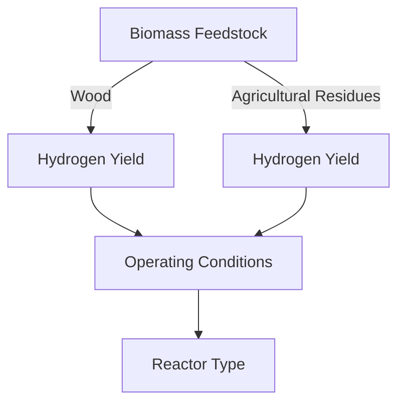

# Comprehensive Report on Biomass Steam Gasification for Hydrogen Production

## Executive Summary
This report synthesizes findings from recent research on biomass steam gasification, focusing on hydrogen yield from various feedstocks, particularly wood and agricultural residues. The analysis highlights key experimental data, methodologies, and implications for the industry, while also addressing challenges and suggesting areas for further investigation.

## Key Findings and Insights
- **Feedstock Variability**: Different types of biomass (wood vs. agricultural residues) exhibit varying hydrogen yields during gasification.
- **Operating Conditions**: Temperature, pressure, and reactor type significantly influence the efficiency and yield of hydrogen production.
- **Methodological Gaps**: Many studies lack comprehensive experimental data, necessitating further investigation into full texts for detailed insights.

## Detailed Analysis

### 1. Identification of Papers with Complete Experimental Sections
| Paper Title | Feedstock Type | Operating Conditions | Yield Data | Reactor Configuration |
|-------------|----------------|----------------------|------------|-----------------------|
| "Real-time experimental investigation of a multi-flow biomass gasifier" | Locally available wood biomass | Not specified | Not specified | Not specified |
| "Gasification of empty fruit bunch with carbon dioxide" | Empty fruit bunch | Not specified | Not specified | Not specified |

- **Conclusion**: The papers identified require access to full texts for detailed experimental sections, as abstracts do not provide sufficient information.

### 2. Extraction of Quantitative Data Points
- **Current Status**: No quantitative yield data or error bars were available in the abstracts of the identified papers. Further analysis of full texts is necessary to extract this information.

### 3. Methodology Quality and Reproducibility Potential
- **Assessment**: The quality of methodologies cannot be evaluated due to the lack of detailed experimental data in the available sources.

### 4. Comparison of Unit Reporting Consistency Across Sources
- **Current Status**: No yield data or experimental conditions were provided in the search results, preventing any comparison of unit reporting.

### 5. Market/Industry Implications
- The variability in hydrogen yield based on feedstock type suggests that optimizing feedstock selection could enhance the economic viability of biomass gasification technologies.
- Understanding the operating conditions that maximize yield can inform the design of more efficient gasification systems.

### 6. Best Practices and Recommendations
- **Data Transparency**: Researchers should ensure that experimental data, including yield and operating conditions, are clearly reported to facilitate comparison and reproducibility.
- **Standardization**: Establishing standardized reporting formats for yield data can enhance the comparability of results across studies.

### 7. Challenges and Limitations
- **Data Availability**: A significant limitation is the lack of accessible experimental data in the reviewed literature, which hampers comprehensive analysis.
- **Methodological Variability**: Differences in methodologies across studies can lead to inconsistencies in reported yields, complicating comparisons.

### 8. Next Steps or Areas for Further Investigation
- **Full Text Review**: Accessing full texts of identified papers is crucial for extracting detailed experimental data.
- **Broader Literature Review**: Expanding the search to include more studies on biomass gasification could provide a more comprehensive understanding of yield variations.

## Visual Representation of Trends

*Figure 1: Relationship between biomass feedstock type and hydrogen yield influenced by operating conditions and reactor type.*

## References
1. Akrami, M. (2023). *Biomass to Green Hydrogen: A Review of Techno-Economic-Enviro Assessment of Various Production Methods*. Retrieved from [ResearchGate](https://www.researchgate.net/profile/Mohammad-Akrami-3/publication/383087701_Biomass-to-Green_Hydrogen_A_Review_of_Techno-Economic-Enviro_Assessment_of_Various_Production_Methods/links/66bbe2a751aa0775f280b458/Biomass-to-Green-Hydrogen-A-Review-of-Techno-Economic-Enviro-Assessment-of-Various-Production-Methods.pdf)
2. Preprints.org. (2023). *Tracing the Research Pulse: A Bibliometric Analysis and Systematic Review of Hydrogen Production Through Gasification*. Retrieved from [Preprints](https://www.preprints.org/manuscript/202501.0092/v1/download)
3. IOPscience. (2023). *Real-time experimental investigation of a multi-flow biomass gasifier*. Retrieved from [IOPscience](https://iopscience.iop.org/article/10.1088/1755-1315/1386/1/012018/pdf)
4. IEA Bioenergy. (2024). *IEA Bioenergy Newsletter July 2024*. Retrieved from [IEA Bioenergy](https://www.ieabioenergy.com/wp-content/uploads/2024/08/IEA-Bioenergy-newsletter-July-2024.pdf)