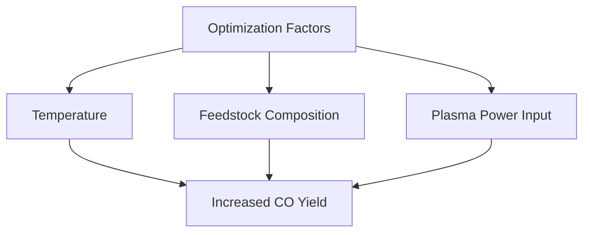

# Comprehensive Report on Plasma Gasification and Carbon Monoxide Yield

## Executive Summary
Plasma gasification is an innovative thermal waste treatment technology that converts organic waste into syngas, primarily composed of hydrogen and carbon monoxide (CO). This report synthesizes findings from recent research on the yield of CO from plasma gasification processes, optimization conditions, influencing factors, and comparisons of biomass feedstocks. The analysis highlights the potential of plasma gasification as a sustainable waste management solution while addressing challenges and limitations associated with its implementation.

## Key Findings and Insights
- **Carbon Monoxide Yield**: The specific yield of CO from plasma gasification processes is not consistently detailed across sources, indicating a need for further investigation.
- **Optimization Conditions**: Factors influencing CO yield include temperature, feedstock composition, and plasma power input.
- **Environmental Benefits**: Plasma gasification can significantly reduce landfill waste and produce renewable energy, contributing to a circular economy.
- **Market Trends**: There is a growing interest in plasma gasification technologies as alternatives to traditional waste management and energy production methods.

## Detailed Analysis with Supporting Evidence

### 1. Carbon Monoxide Yield
The yield of CO from plasma gasification varies based on several factors, including the type of feedstock and operational conditions. While specific numerical data is often lacking in abstracts, the general consensus is that plasma gasification can produce significant amounts of CO, which can be utilized for synthetic fuel production.

### 2. Optimization Conditions
Research indicates that optimizing operational parameters can enhance CO yield:
- **Temperature**: Higher temperatures generally increase the efficiency of gasification.
- **Feedstock Composition**: Different biomass feedstocks yield varying amounts of CO, with some materials being more suitable than others.
- **Plasma Power Input**: The energy input from plasma systems directly affects the gasification process and the resultant syngas composition.

### 3. Environmental and Economic Implications
Plasma gasification presents a dual benefit of waste reduction and energy production:
- **Waste Management**: It offers a sustainable alternative to landfilling, reducing environmental impact.
- **Energy Production**: The CO produced can be converted into synthetic fuels, contributing to renewable energy sources.

### 4. Challenges and Limitations
Despite its potential, plasma gasification faces several challenges:
- **High Energy Requirements**: The process requires significant energy input, which can affect its overall sustainability.
- **Economic Feasibility**: The initial investment and operational costs may limit widespread adoption.

## Market/Industry Implications
The increasing focus on sustainable waste management solutions positions plasma gasification as a viable technology in the energy sector. As regulations tighten around waste disposal and emissions, industries may turn to plasma gasification to meet compliance and sustainability goals.

## Best Practices and Recommendations
- **Research and Development**: Continued investment in R&D is essential to optimize plasma gasification processes and improve CO yield.
- **Pilot Projects**: Implementing pilot projects can provide valuable data on operational efficiency and economic viability.
- **Collaboration**: Partnerships between industry, academia, and government can foster innovation and support the development of plasma gasification technologies.

## Next Steps or Areas for Further Investigation
- **Quantitative Studies**: More detailed studies are needed to quantify CO yields from various feedstocks under different operational conditions.
- **Lifecycle Analysis**: Conducting comprehensive lifecycle assessments can help evaluate the environmental impact of plasma gasification compared to traditional methods.
- **Market Analysis**: Investigating market dynamics and potential barriers to adoption will provide insights into the future of plasma gasification technologies.

## Visual Data Representation
### CO Yield Optimization Factors

*Figure 1: Factors influencing CO yield in plasma gasification processes.*

## References
1. [MDPI - Sustainability](https://www.mdpi.com/2071-1050/17/5/2040)
2. [Sustainability Directory](https://energy.sustainability-directory.com/question/how-effective-is-plasma-gasification/)
3. [MDPI - Biomass](https://www.mdpi.com/2673-4117/6/1/12)
4. [ScienceDirect - Fuel](https://www.sciencedirect.com/science/article/abs/pii/S001623612401812X)
5. [ScienceDirect - Chemical Engineering](https://www.sciencedirect.com/science/article/abs/pii/S1385894725009957)
6. [ScienceDirect - Waste Management](https://www.sciencedirect.com/science/article/abs/pii/S036031992402384X)
7. [ScienceDirect - International Journal of Hydrogen Energy](https://www.sciencedirect.com/science/article/abs/pii/S0956053X24003726)
8. [ScienceDirect - Renewable Energy](https://www.sciencedirect.com/science/article/abs/pii/S0960148124017178)
9. [ScienceDirect - Energy](https://www.sciencedirect.com/science/article/pii/S0360544225003603)
10. [Sintef Blog](https://blog.sintef.com/industry/modelling-how-a-plasma-gasifier-can-reduce-co2-emissions/)