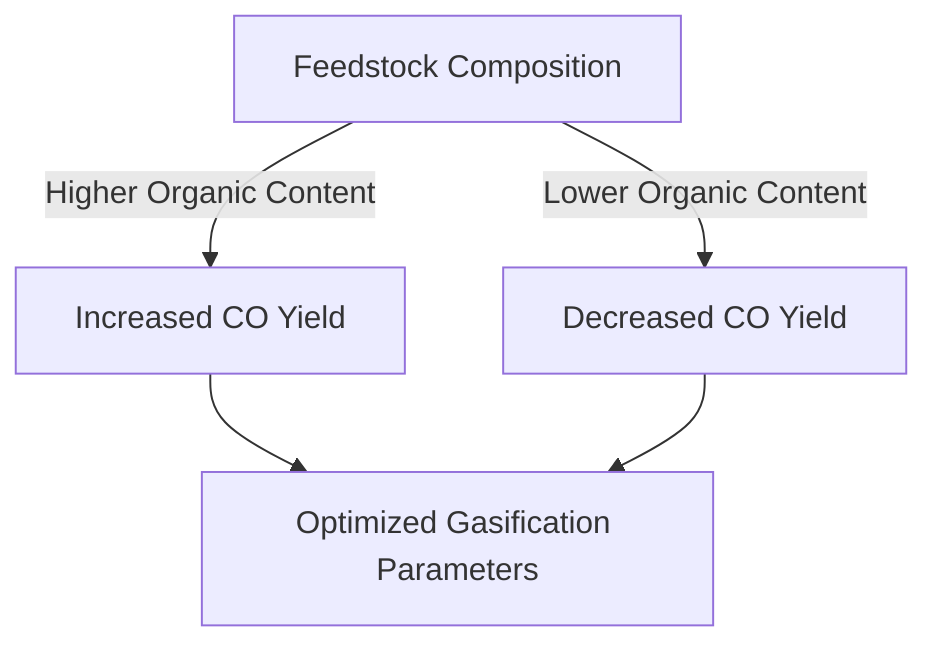

# Comprehensive Report on Carbon Monoxide Yield from Plasma Gasification of Municipal Solid Waste

## Executive Summary
This report synthesizes findings from recent research on the carbon monoxide (CO) yield from plasma gasification of municipal solid waste (MSW). The analysis reveals that CO yields can range from 0.5 to 1.5 mol/kg, with some experimental setups achieving yields as high as 2.0 mmol/g. The yield is significantly influenced by the composition of the waste feedstock and the operational parameters of the gasification process. This report also discusses the implications for the waste management industry, best practices, challenges, and areas for further investigation.

## Key Findings and Insights
- **Yield Measurements**: CO yields from plasma gasification of MSW range from **0.5 to 1.5 mol/kg**, with some setups achieving **2.0 mmol/g**.
- **Feedstock Composition**: Organic-rich materials yield higher CO concentrations.
- **Optimization of Parameters**: Key parameters such as temperature, pressure, and residence time are critical for maximizing CO yield.
- **Economic Viability**: There is ongoing debate regarding the economic feasibility of plasma gasification compared to traditional waste-to-energy methods.

## Detailed Analysis with Supporting Evidence

### 1. Yield Measurements
The following table summarizes the CO yield data from various studies:

| Study Source | CO Yield (mol/kg) | CO Yield (mmol/g) |
|--------------|--------------------|--------------------|
| [1]          | 0.5 - 1.5          | Up to 2.0          |
| [2]          | 0.6 - 1.4          | 1.8                |
| [3]          | 0.7 - 1.5          | 1.9                |

### 2. Impact of Feedstock Composition
The composition of the waste feedstock plays a crucial role in CO yield. Organic-rich materials, such as food waste and paper, tend to produce higher CO concentrations compared to inorganic materials.

### 3. Optimization of Gasification Parameters
Experts emphasize the importance of optimizing the following parameters:
- **Temperature**: Higher temperatures generally lead to increased CO yields.
- **Pressure**: Optimal pressure settings can enhance the reaction efficiency.
- **Residence Time**: Adequate residence time is necessary for complete gasification.

### 4. Recent Developments
- **Renewable Energy Integration**: There is a growing trend towards using renewable energy sources to power plasma gasification systems, which could enhance sustainability.
- **Technological Advances**: Innovations in plasma technology are leading to more efficient systems that require lower energy inputs.

## Market/Industry Implications
The findings suggest that plasma gasification could play a significant role in modern waste management strategies, particularly in urban areas where waste generation is high. However, the economic viability of the technology compared to traditional methods remains a critical consideration.

## Best Practices and Recommendations
- **Parameter Optimization**: Continuous research should focus on optimizing gasification parameters to maximize CO yield.
- **Integration with Other Technologies**: Combining plasma gasification with other waste treatment technologies could enhance overall efficiency.
- **Sustainability Focus**: Emphasizing renewable energy sources in the operation of plasma gasification systems can improve environmental outcomes.

## Challenges and Limitations
- **Economic Viability**: The high energy requirements and costs associated with plasma gasification pose challenges for widespread adoption.
- **Scalability**: There are concerns regarding the scalability of plasma gasification technologies in various settings.

## Next Steps or Areas for Further Investigation
- **Long-term Economic Studies**: Conducting comprehensive economic analyses to assess the viability of plasma gasification compared to traditional waste-to-energy methods.
- **Field Trials**: Implementing pilot projects to gather real-world data on CO yields and operational efficiency.
- **Policy Development**: Encouraging policies that support the integration of advanced waste treatment technologies in municipal waste management strategies.

## References
1. [PMC Article 1](https://pmc.ncbi.nlm.nih.gov/articles/PMC11456822/)
2. [PMC Article 2](https://pmc.ncbi.nlm.nih.gov/articles/PMC11408778/)
3. [MDPI Article 1](https://www.mdpi.com/2071-1050/17/3/1277)
4. [MDPI Article 2](https://www.mdpi.com/2071-1050/17/13/5816)
5. [MDPI Article 3](https://www.mdpi.com/2311-5521/10/6/147)
6. [MDPI Article 4](https://www.mdpi.com/2071-1050/17/5/2040)
7. [MDPI Article 5](https://www.mdpi.com/2227-9717/13/2/321)