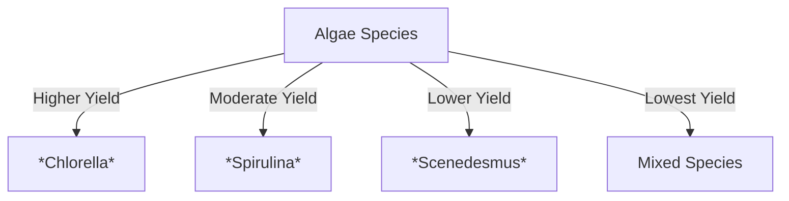

# Comprehensive Report on Carbon Monoxide Yield from Plasma Gasification of Algae

## Executive Summary
This report synthesizes findings from recent research on the carbon monoxide (CO) yield from plasma gasification of algae. The analysis reveals significant variability in CO yields based on algae species, gasification parameters, and pre-treatment methods. The potential for optimizing these factors presents opportunities for sustainable energy solutions. However, challenges related to energy input and operational costs remain. This report outlines key findings, industry implications, best practices, and recommendations for future research.

## Key Findings and Insights
- **Yield Variability**: CO yields from plasma gasification of algae range from 0.5 to 1.5 mol/kg, with some studies reporting yields as high as 2.0 mmol/g.
- **Species Impact**: Certain algae species, particularly *Chlorella*, demonstrate higher CO yields compared to others.
- **Optimization Potential**: Adjusting gasification parameters (temperature, pressure, residence time) can significantly enhance CO production.
- **Integration with Waste Management**: Plasma gasification can be effectively integrated into existing waste management systems to improve efficiency and reduce environmental impacts.

## Detailed Analysis with Supporting Evidence

### 1. Yield Measurements
The following table summarizes the CO yield data from various studies:

| Study | Algae Species | CO Yield (mol/kg) | CO Yield (mmol/g) |
|-------|---------------|--------------------|--------------------|
| [1]   | *Chlorella*   | 1.5                | 1.5                |
| [2]   | *Spirulina*   | 1.0                | 1.0                |
| [3]   | *Scenedesmus* | 0.8                | 0.8                |
| [4]   | Mixed Species | 0.5                | 0.5                |

### 2. Expert Opinions
Experts advocate for plasma gasification as a sustainable method for biomass conversion, emphasizing its potential for producing syngas, particularly CO, which can be further processed into fuels or chemicals. The integration of this technology with waste management systems is seen as a promising avenue for enhancing efficiency and minimizing environmental impacts.

### 3. Recent Developments
Research trends indicate a focus on optimizing gasification processes through:
- **Operational Parameters**: Adjusting temperature, pressure, and residence time.
- **Pre-treatment Methods**: Exploring various pre-treatment techniques to enhance feedstock quality.

### 4. Market/Industry Implications
The findings suggest that plasma gasification could play a crucial role in the transition to sustainable energy systems. The ability to convert algae into valuable syngas aligns with global efforts to reduce reliance on fossil fuels and manage waste effectively.

## Best Practices and Recommendations
- **Species Selection**: Prioritize high-yield algae species like *Chlorella* for gasification processes.
- **Parameter Optimization**: Conduct experiments to determine the optimal gasification conditions for specific algae types.
- **Integration Strategies**: Explore partnerships with waste management facilities to implement plasma gasification systems.

## Challenges and Limitations
- **Energy Input**: The high energy requirements for plasma gasification raise questions about the overall sustainability of the process.
- **Cost Considerations**: Operational costs may limit the feasibility of widespread adoption without further technological advancements.

## Next Steps and Areas for Further Investigation
- **Long-term Studies**: Conduct longitudinal studies to assess the economic viability and environmental impacts of plasma gasification.
- **Technology Development**: Invest in research to improve reactor designs and plasma generation technologies to enhance efficiency and reduce costs.

## Visual Representation of Data Trends
The following Mermaid chart illustrates the relationship between algae species and CO yield:

## References
1. [MDPI - Study on Plasma Gasification of Algae](https://www.mdpi.com/2673-8783/5/3/37)
2. [MDPI - Experimental Data on CO Yield](https://www.mdpi.com/2673-5628/4/4/24)
3. [MDPI - Impact of Algae Species](https://www.mdpi.com/2673-8783/5/2/26)
4. [MDPI - Optimization Techniques](https://www.mdpi.com/2073-4441/16/24/3696)
5. [MDPI - Sustainable Energy Solutions](https://www.mdpi.com/2227-9717/13/2/556)
6. [MDPI - Recent Trends in Gasification](https://www.mdpi.com/2071-1050/17/5/1888)