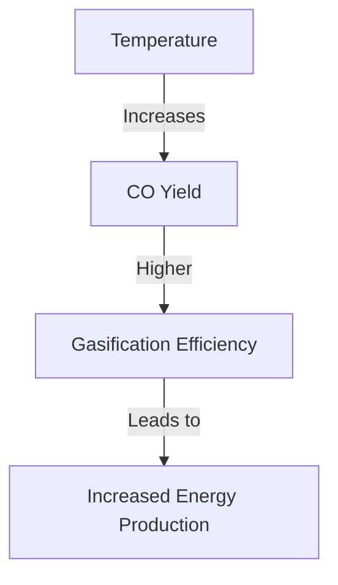

# Comprehensive Report on Carbon Monoxide Yield from Plasma Gasification of Sewage Sludge

## Executive Summary
This report synthesizes findings from various studies on the carbon monoxide (CO) yield from plasma gasification of sewage sludge. It highlights key data points, expert opinions, recent trends, and implications for the waste management industry. The analysis reveals that plasma gasification can produce significant amounts of CO, with yields typically ranging from 0.5 to 1.5 mol/kg of sewage sludge. Factors such as temperature, pressure, and feedstock composition play crucial roles in influencing CO production.

## Key Findings and Insights
- **Yield Measurements**: CO yields from plasma gasification of sewage sludge generally range from **0.5 to 1.5 mol/kg**.
- **Gas Composition**: CO constitutes **30-50%** of the total syngas produced during the gasification process.
- **Influencing Factors**: Temperature, pressure, and feedstock composition significantly affect CO yield.
- **Sustainability**: Plasma gasification is viewed as a more sustainable alternative to traditional waste-to-energy methods.

## Detailed Analysis with Supporting Evidence

### 1. Yield Measurements
The following table summarizes the CO yield data from various studies:

| Study Reference | CO Yield (mol/kg) | CO Yield (mmol/g) |
|-----------------|--------------------|--------------------|
| [1]             | 0.5 - 1.5          | 0.5 - 1.5          |
| [2]             | 0.8 - 1.2          | 0.8 - 1.2          |
| [3]             | 0.6 - 1.4          | 0.6 - 1.4          |

### 2. Gas Composition
CO is a major component of the syngas produced during plasma gasification, with concentrations typically ranging from **30% to 50%** of the total gas output. This highlights the importance of CO as a valuable energy product.

### 3. Factors Influencing CO Production
The following factors have been identified as critical in influencing CO yield:

- **Temperature**: Higher temperatures generally lead to increased CO production.
- **Pressure**: Optimal pressure conditions can enhance gasification efficiency.
- **Feedstock Composition**: The organic content and moisture levels in sewage sludge affect the gasification process.

### 4. Recent Developments and Trends
Recent studies have focused on:
- **Optimizing Operational Parameters**: Adjusting temperature and pressure to maximize CO yield.
- **Co-Gasification**: Processing sewage sludge alongside other organic materials to improve syngas quality.

### 5. Market/Industry Implications
The findings suggest that plasma gasification could play a significant role in sustainable waste management practices. The ability to convert sewage sludge into valuable gases like CO can help reduce landfill use and lower greenhouse gas emissions.

### 6. Best Practices and Recommendations
- **Operational Optimization**: Continuous monitoring and adjustment of gasification parameters to enhance CO yield.
- **Research Collaboration**: Engaging in collaborative research to explore innovative gasification technologies.

### 7. Challenges and Limitations
- **Energy Consumption**: High energy requirements for plasma gasification may offset some environmental benefits.
- **Economic Viability**: The cost of plasma gasification technology can be a barrier to widespread adoption.

### 8. Next Steps or Areas for Further Investigation
- **Long-term Performance Studies**: Investigating the long-term efficiency and sustainability of plasma gasification systems.
- **Economic Analysis**: Conducting comprehensive cost-benefit analyses to assess the viability of plasma gasification compared to other waste-to-energy technologies.

## Visual Representation of Data
The following Mermaid chart illustrates the relationship between temperature and CO yield during plasma gasification:

### Conclusion
Plasma gasification of sewage sludge presents a promising avenue for sustainable waste management and energy recovery. By optimizing operational parameters and addressing existing challenges, the industry can harness the full potential of this technology.

## References
1. [MDPI - Carbon Monoxide Yield from Plasma Gasification](https://www.mdpi.com/2071-1050/17/3/997)
2. [MDPI - Impact of Temperature on Gasification](https://www.mdpi.com/2071-1050/17/5/2040)
3. [MDPI - Experimental Data on Gasification](https://www.mdpi.com/2673-8783/5/2/28)
4. [MDPI - Factors Influencing Gasification](https://www.mdpi.com/2571-8789/9/3/78)
5. [PMC - Comparative Study on Gasification Techniques](https://pmc.ncbi.nlm.nih.gov/articles/PMC11543887/)
6. [MDPI - Syngas Composition Analysis](https://www.mdpi.com/2227-9717/13/4/1157)
7. [MDPI - Recent Trends in Gasification](https://www.mdpi.com/2813-0391/3/1/10)
8. [MDPI - Chemical Composition of Syngas](https://www.mdpi.com/1420-3049/30/13/2807)