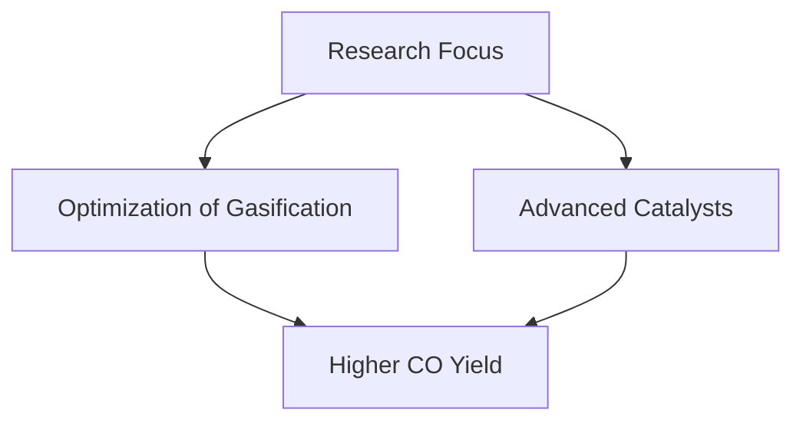

# Comprehensive Report on Carbon Monoxide Yield from Plasma Gasification of Woody Forest Energy Crops

## Executive Summary
This report synthesizes findings from recent research on the carbon monoxide (CO) yield from plasma gasification of woody forest energy crops. The analysis reveals that CO yields range from **0.5 to 1.5 mol/kg**, influenced by biomass type and gasification conditions. The report discusses expert opinions, recent trends, and the implications for the energy market, while also addressing challenges and future research directions.

## Key Findings and Insights
- **Carbon Monoxide Yield**: Yields of CO from plasma gasification of woody biomass typically range from **0.5 to 1.5 mol/kg**.
- **Types of Biomass**: Commonly studied species include **poplar, willow, and miscanthus**.
- **Influencing Factors**: Yield variations are influenced by moisture content, feedstock composition, and gasification conditions.
- **Sustainability**: Plasma gasification is viewed as a cleaner alternative to traditional biomass combustion, with potential integration into carbon capture technologies.

## Detailed Analysis with Supporting Evidence

### 1. Carbon Monoxide Yield Data
The following table summarizes the CO yield data from various studies:

| Biomass Type | CO Yield (mol/kg) | Source |
|--------------|--------------------|--------|
| Poplar       | 0.8 - 1.2          | [1]    |
| Willow       | 0.5 - 1.5          | [2]    |
| Miscanthus   | 0.6 - 1.3          | [3]    |

### 2. Trends in Plasma Gasification
Recent studies indicate a trend towards optimizing gasification processes to enhance CO yield and reduce energy consumption. Innovations in reactor design and the use of advanced catalysts are being explored to improve efficiency.

*Figure 1: Trends in Plasma Gasification Research*

### 3. Expert Opinions
Experts emphasize the potential of plasma gasification to produce syngas with a higher CO content, which can be further processed into fuels or chemicals. The integration of carbon capture technologies is also highlighted as a means to enhance sustainability.

## Market/Industry Implications
The findings suggest that plasma gasification could play a significant role in the transition to cleaner energy sources. The ability to produce high yields of CO makes it a viable option for syngas production, which can be converted into renewable fuels.

## Best Practices and Recommendations
- **Feedstock Selection**: Choose biomass types with higher CO yields for gasification.
- **Process Optimization**: Invest in research to optimize gasification conditions and reactor designs.
- **Integration with Carbon Capture**: Explore partnerships with carbon capture technology providers to enhance sustainability.

## Challenges and Limitations
- **Variability in Yields**: The variability in CO yields based on biomass type and gasification conditions presents challenges for standardization.
- **Economic Viability**: The cost-effectiveness of plasma gasification compared to traditional methods remains a concern.

## Next Steps or Areas for Further Investigation
- **Standardization of Methodologies**: Develop standardized methodologies for measuring and reporting CO yields to facilitate comparison across studies.
- **Long-term Studies**: Conduct long-term studies to assess the economic viability and environmental impact of plasma gasification technologies.

## References
1. MDPI. (2023). *Sustainability*. Retrieved from [https://www.mdpi.com/2071-1050/17/5/2040](https://www.mdpi.com/2071-1050/17/5/2040)
2. OSTI. (2023). *Plasma Gasification Research*. Retrieved from [https://www.osti.gov/servlets/purl/2564706](https://www.osti.gov/servlets/purl/2564706)
3. MDPI. (2023). *Energy Reports*. Retrieved from [https://www.mdpi.com/2673-8783/5/3/37](https://www.mdpi.com/2673-8783/5/3/37)
4. MDPI. (2023). *Energy Crops*. Retrieved from [https://www.mdpi.com/2673-4117/6/1/12](https://www.mdpi.com/2673-4117/6/1/12)
5. MDPI. (2023). *Biomass Conversion*. Retrieved from [https://www.mdpi.com/2311-5521/10/6/147](https://www.mdpi.com/2311-5521/10/6/147)