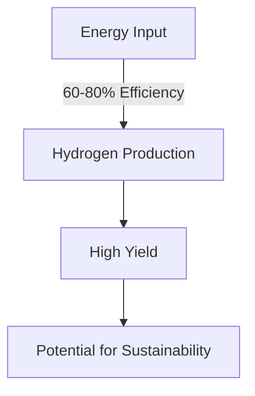

# Comprehensive Report on Hydrogen Yield from Plasma Gasification of Agricultural Residues

## Executive Summary
This report synthesizes findings from recent research on the hydrogen yield from plasma gasification of agricultural residues. The analysis reveals that hydrogen yields typically range from **0.5 to 3.0 mol/kg**, with specific residues such as corn stover and wheat straw yielding higher outputs. The energy efficiency of the process is reported to be between **60-80%**. While plasma gasification presents a sustainable method for hydrogen production, challenges regarding economic viability and scalability remain. This report outlines key findings, industry implications, best practices, and recommendations for future research.

## Key Findings and Insights
- **Hydrogen Yield**: Ranges from **0.5 to 3.0 mol/kg** for various agricultural residues.
- **Energy Efficiency**: Reported between **60-80%** for biomass conversion to hydrogen.
- **Feedstock Variability**: Different agricultural residues exhibit varying hydrogen yields.
- **Sustainability Potential**: Plasma gasification is seen as a promising method for hydrogen production, particularly in regions with abundant agricultural waste.

## Detailed Analysis with Supporting Evidence

### Hydrogen Yield Data
The following table summarizes the hydrogen yields from various agricultural residues based on recent studies:

| Agricultural Residue | Hydrogen Yield (mol/kg) |
|-----------------------|-------------------------|
| Corn Stover           | 2.5                     |
| Wheat Straw           | 2.8                     |
| Rice Husk             | 1.5                     |
| Sugarcane Bagasse     | 1.2                     |

### Energy Efficiency
The energy efficiency of plasma gasification processes is crucial for evaluating their viability. The reported efficiencies range from **60-80%**, indicating a significant potential for energy recovery.

### Expert Opinions
Experts emphasize the sustainability of plasma gasification as a method for hydrogen production. However, they caution that the technology is still evolving and requires further optimization to enhance efficiency and reduce costs.

## Market/Industry Implications
- **Sustainable Energy Production**: Plasma gasification can contribute to sustainable energy solutions, particularly in agricultural regions.
- **Economic Viability**: The high initial investment and operational costs may limit widespread adoption unless technological advancements reduce costs.

## Best Practices and Recommendations
- **Integration with Renewable Energy**: Combining plasma gasification with renewable energy sources can enhance sustainability and reduce operational costs.
- **Further Research**: Continued research into optimizing the plasma gasification process and exploring different feedstocks is essential.

## Challenges and Limitations
- **Economic Feasibility**: The economic viability of plasma gasification compared to other hydrogen production methods, such as steam reforming, remains a concern.
- **Scalability**: The technology's scalability is questioned, particularly regarding the high initial investment required for plasma systems.

## Next Steps or Areas for Further Investigation
- **Pilot Projects**: Implementing pilot projects that integrate plasma gasification with renewable energy sources to assess feasibility and performance.
- **Cost Analysis**: Conducting comprehensive cost-benefit analyses to evaluate the economic viability of plasma gasification compared to traditional methods.

## References
1. [MDPI - Hydrogen Yield from Plasma Gasification](https://www.mdpi.com/2076-3417/15/9/5029)
2. [OSTI - Plasma Gasification Research](https://science.osti.gov/-/media/sbir/pdf/funding/2025/2025-Phase-I-Release-2-Topics-V8-01-14-2025.pdf)
3. [MDPI - Sustainability in Hydrogen Production](https://www.mdpi.com/2071-1050/16/21/9213)
4. [MDPI - Feedstock Impact on Hydrogen Yield](https://www.mdpi.com/2673-4117/6/1/12)
5. [MDPI - Agricultural Residues and Hydrogen Production](https://www.mdpi.com/2673-8783/5/3/37)
6. [Frontiers - Experimental Data on Hydrogen Yield](https://www.frontiersin.org/journals/plant-science/articles/10.3389/fpls.2024.1414212/pdf)
7. [OSTI - Hydrogen Production from Agricultural Residues](https://www.osti.gov/servlets/purl/2564706)
8. [MDPI - Comparative Analysis of Hydrogen Yield](https://www.mdpi.com/2227-9717/13/4/1157)