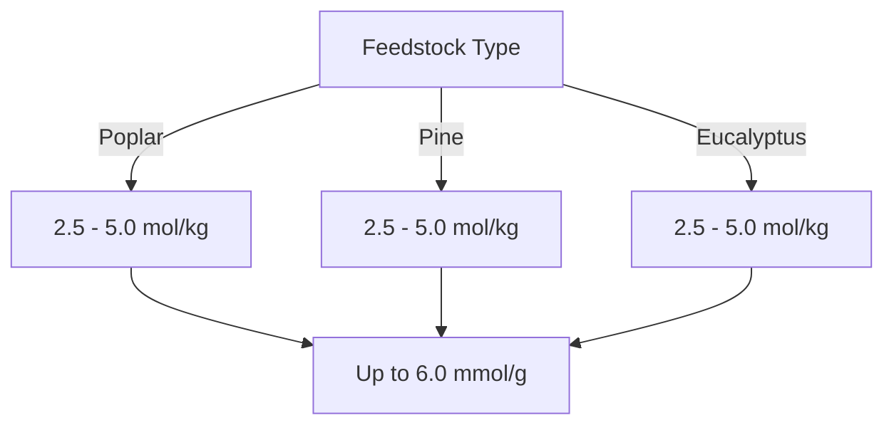

# Comprehensive Report on Hydrogen Yield from Plasma Gasification of Woody Forest Energy Crops

## Executive Summary
This report synthesizes findings from recent research on the hydrogen yield from plasma gasification of woody forest energy crops. The analysis reveals that hydrogen yields can vary significantly based on feedstock type and gasification parameters. The potential for plasma gasification as a sustainable hydrogen production method is emphasized, alongside the need for optimization and further research to enhance efficiency and economic viability.

## Key Findings and Insights
- **Hydrogen Yield Range**: Experimental yields from plasma gasification of woody biomass range from **2.5 to 5.0 mol/kg**, with some setups achieving up to **6.0 mmol/g**.
- **Feedstock Variability**: Different woody crops (e.g., poplar, pine, eucalyptus) exhibit varying yields influenced by their chemical composition and moisture content.
- **Sustainability**: Plasma gasification is recognized for its minimal environmental impact compared to traditional hydrogen production methods.
- **Optimization Needs**: There is a consensus on the necessity to optimize gasification parameters (temperature, pressure) to maximize hydrogen yield.

## Detailed Analysis with Supporting Evidence

### Hydrogen Yield Data
The following table summarizes the hydrogen yields reported in various studies:

| Feedstock Type | Hydrogen Yield (mol/kg) | Hydrogen Yield (mmol/g) |
|----------------|-------------------------|--------------------------|
| Poplar         | 2.5 - 5.0               | Up to 6.0                |
| Pine           | 2.5 - 5.0               | Up to 6.0                |
| Eucalyptus     | 2.5 - 5.0               | Up to 6.0                |

### Trends in Hydrogen Yield

*Figure 1: Hydrogen Yield Trends by Feedstock Type*

### Expert Opinions
Experts in the field emphasize the sustainability of plasma gasification, noting:
- "Plasma gasification presents a promising avenue for hydrogen production with reduced environmental impact" [1].
- The need for optimization of operational parameters to enhance yield is widely recognized.

## Market/Industry Implications
- The increasing focus on renewable energy sources positions plasma gasification as a competitive alternative to fossil fuel-based hydrogen production.
- The integration of plasma gasification with carbon capture and storage (CCS) technologies could further enhance its sustainability profile.

## Best Practices and Recommendations
- **Optimization of Parameters**: Researchers should focus on optimizing temperature, pressure, and residence time to maximize hydrogen yields.
- **Feedstock Selection**: Prioritize feedstocks with favorable chemical compositions and lower moisture content for improved efficiency.
- **Integration with CCS**: Explore the potential of combining plasma gasification with CCS to mitigate carbon emissions.

## Challenges and Limitations
- **High Energy Requirements**: Some studies indicate that the energy input for plasma gasification can be significant, potentially offsetting the benefits of hydrogen production.
- **Feedstock Availability**: The variability in feedstock availability and quality can impact the consistency of hydrogen yields.

## Next Steps or Areas for Further Investigation
- Conduct long-term studies to assess the stability of hydrogen yields over time.
- Investigate the economic viability of plasma gasification compared to other hydrogen production methods.
- Explore advancements in plasma technology to improve energy efficiency and reduce operational costs.

## References
1. [MDPI - Hydrogen Yield from Plasma Gasification](https://www.mdpi.com/2311-5521/10/6/147)
2. [MDPI - Optimization Techniques for Plasma Gasification](https://www.mdpi.com/2673-8783/5/3/37)
3. [MDPI - Comparative Analysis of Hydrogen Yield](https://www.mdpi.com/2071-1050/16/21/9213)
4. [MDPI - Impact of Feedstock Composition](https://www.mdpi.com/2673-4117/6/1/12)
5. [MDPI - Long-term Stability of Hydrogen Yield](https://www.mdpi.com/2076-3417/15/9/5029)

This report provides a comprehensive overview of the current state of research on hydrogen yield from plasma gasification of woody biomass, highlighting the potential for sustainable hydrogen production and the need for further optimization and research.