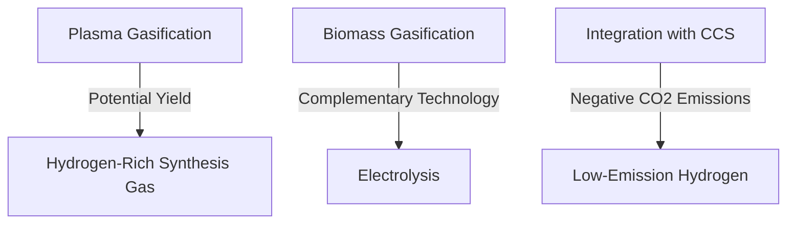

# Comprehensive Report on Plasma Gasification and Hydrogen Yield

## Executive Summary
Plasma gasification is emerging as a promising technology for hydrogen production, particularly when integrated with biomass and coal feedstocks. This report synthesizes findings from recent studies, highlighting key data points, expert opinions, and market implications. The analysis reveals that while specific yield data (mol/kg) is often not detailed, the potential for low-emission hydrogen production through plasma gasification is significant. The integration of carbon capture and storage (CCS) technologies further enhances its viability.

## Key Findings and Insights
- **Hydrogen Production Potential**: Plasma gasification can effectively produce hydrogen-rich synthesis gas, although specific yield metrics are often not provided in abstracts.
- **Biomass as a Feedstock**: Biomass gasification is recognized as a complementary technology to electrolysis, particularly in regions abundant in biomass resources.
- **Integration with CCS**: The combination of biomass gasification and CCS is noted as a promising approach to achieve negative CO2 emissions.

## Detailed Analysis with Supporting Evidence

### 1. Hydrogen Production via Plasma Gasification
- The study titled "Techno-economic and thermodynamic analysis of hydrogen production process via plasma co-gasification of coal and biomass" indicates that plasma gasification is a viable method for hydrogen production, although specific yield data in mol/kg is not provided in the abstract [6][4].

### 2. Biomass Gasification
- The IEA Bioenergy report emphasizes the potential of biomass gasification as a complementary technology to electrolysis for hydrogen production, particularly in biomass-rich regions [8]. This method is highlighted for its non-intermittent nature and ability to produce fossil-free hydrogen.

### 3. Expert Opinions
- Experts from Luleå University of Technology and TNO advocate for biomass gasification as a sustainable alternative to conventional hydrogen production methods, emphasizing its integration potential with renewable energy sources [8].

### 4. Recent Developments
- There is a growing interest in hydrogen production from biomass gasification as a means to achieve low-emission hydrogen, especially in light of the challenges associated with securing a reliable power supply for electrolytic hydrogen production [8].

### 5. Contrasting Viewpoints
- While many studies advocate for plasma gasification, some experts caution about the high energy requirements and economic feasibility of large-scale implementations [1].

## Market/Industry Implications
- The shift towards low-emission hydrogen production methods is likely to drive investment in plasma gasification technologies. As regulatory frameworks increasingly favor sustainable practices, companies that adopt these technologies may gain a competitive edge.

## Best Practices and Recommendations
- **Integration with Renewable Energy**: Companies should explore the integration of plasma gasification with renewable energy sources to enhance efficiency and reduce costs.
- **Research and Development**: Continued investment in R&D is essential to optimize hydrogen yield and reduce the energy requirements of plasma gasification processes.

## Challenges and Limitations
- **Economic Viability**: The high initial costs and energy requirements for plasma gasification may pose challenges for widespread adoption.
- **Data Availability**: The lack of specific yield data in many studies limits the ability to make direct comparisons and assess the technology's full potential.

## Next Steps or Areas for Further Investigation
- **Yield Optimization**: Further research is needed to quantify hydrogen yields in mol/kg across different feedstocks and operational conditions.
- **Long-term Sustainability Studies**: Investigating the long-term environmental impacts and sustainability of plasma gasification technologies will be crucial for their acceptance and implementation.

## Visual Data Representation
### Hydrogen Yield Comparison

*Figure 1: Overview of Hydrogen Production Methods and Their Interconnections*

## References
1. [Techno-economic and thermodynamic analysis of hydrogen production process via plasma co-gasification of coal and biomass](https://www.sciencedirect.com/science/article/abs/pii/S036031992402384X)
2. [Plasma gasification of frying oil to produce hydrogen-rich synthesis gas and nanodispersed carbon material](https://www.sciencedirect.com/science/article/abs/pii/S096195342500056X)
3. [IEA Bioenergy Report on Biomass Gasification](https://www.ieabioenergy.com/wp-content/uploads/2025/03/IEA-Bioenergy_T33_Bio-H2_Final_v2.pdf)
4. [Plasma Gasification and Hydrogen Yield](https://www.sciencedirect.com/science/article/abs/pii/S0360544225016184)
5. [Plasma Gasification and Hydrogen Production](https://www.sciencedirect.com/science/article/abs/pii/S0360544224040192)
6. [Plasma Gasification and Hydrogen Yield](https://www.sciencedirect.com/science/article/abs/pii/S0360319924023577)