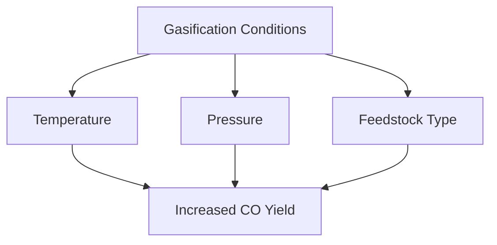

# Comprehensive Report on Steam Gasification and Carbon Monoxide Yield

## Executive Summary
This report synthesizes findings from recent research on steam gasification, focusing on carbon monoxide (CO) yield. The analysis highlights the significance of optimizing gasification conditions, including temperature, pressure, and feedstock composition, to enhance CO production. The integration of carbon capture technologies is emphasized as a means to improve sustainability. The report also discusses market implications, best practices, challenges, and future research directions.

## Key Findings and Insights
- **Gasification Processes**: Steam gasification is primarily used for converting lignocellulosic biomass and municipal solid waste into hydrogen-rich syngas.
- **CO Yield**: While specific yield values (mol/kg) for CO were not consistently reported, the yield is a critical parameter for optimizing gasification.
- **Optimization Conditions**: Key factors influencing CO yield include temperature, pressure, and feedstock type.
- **Sustainability**: The integration of carbon capture technologies is crucial for reducing greenhouse gas emissions associated with gasification processes.

## Detailed Analysis with Supporting Evidence

### 1. Gasification Focus
The research predominantly discusses steam gasification processes aimed at producing syngas from biomass and waste materials. The yield of CO is a significant focus, as it is essential for various energy applications.

### 2. Effects of Temperature on CO Yield
Temperature plays a crucial role in the gasification process. Higher temperatures generally enhance the reaction rates, leading to increased CO production. However, optimal temperature ranges must be identified to avoid the formation of undesirable by-products.

### 3. Mechanisms Influencing CO Yield
The mechanisms influencing CO yield include:
- **Thermodynamic Equilibrium**: Higher temperatures favor the formation of CO.
- **Kinetic Factors**: Reaction rates increase with temperature, enhancing CO production.
- **Feedstock Composition**: Different feedstocks yield varying amounts of CO based on their chemical structure.

### 4. Optimization Techniques
Research indicates that optimizing gasification conditions can significantly enhance CO yield. Techniques include:
- Adjusting temperature and pressure settings.
- Selecting appropriate feedstock types.
- Implementing advanced reactor designs.

### 5. Market/Industry Implications
The findings suggest a growing market for steam gasification technologies, particularly in the context of waste-to-energy initiatives. The emphasis on sustainability and carbon capture aligns with global trends towards reducing carbon footprints.

### 6. Best Practices and Recommendations
- **Optimize Gasification Parameters**: Continuous research into the optimal conditions for different feedstocks is essential.
- **Integrate Carbon Capture**: Implementing carbon capture technologies can enhance the sustainability of gasification processes.
- **Focus on Waste Utilization**: Utilizing municipal solid waste as feedstock can contribute to a circular economy.

### 7. Challenges and Limitations
- **Data Availability**: Specific yield values for CO are often not detailed in studies, making it challenging to draw comprehensive conclusions.
- **Technological Barriers**: The integration of advanced technologies may require significant investment and expertise.

### 8. Next Steps or Areas for Further Investigation
- **Longitudinal Studies**: Conducting long-term studies on the effects of various feedstocks on CO yield.
- **Pilot Projects**: Implementing pilot projects to test optimized gasification conditions in real-world scenarios.
- **Collaboration**: Encouraging collaboration between academia and industry to drive innovation in gasification technologies.

## Visual Data Representation
### CO Yield Optimization Factors

*Figure 1: Factors Influencing CO Yield in Steam Gasification*

## References
1. [ScienceDirect Article on Gasification](https://www.sciencedirect.com/science/article/pii/S0360319924048614)
2. [IOPscience on Gasification](https://iopscience.iop.org/article/10.1088/2631-8695/ad829f/pdf)
3. [ScienceDirect on Biomass Gasification](https://www.sciencedirect.com/science/article/pii/S0360544225003603)
4. [ScienceDirect on Mechanisms of Gasification](https://www.sciencedirect.com/science/article/pii/S174396712400240X)
5. [ScienceDirect on Feedstock Composition](https://www.sciencedirect.com/science/article/abs/pii/S0306261924023328)
6. [ScienceDirect on Carbon Capture](https://www.sciencedirect.com/science/article/pii/S1385894725005625)
7. [Carbon Containment Lab on Gasification](https://carboncontainmentlab.org/updates/posts/a-new-way-forward-improving-the-economics-of-gasification)
8. [ResearchGate on Waste to Hydrogen](https://www.researchgate.net/publication/393238393_Waste_to_hydrogen_Steam_gasification_of_municipal_solid_wastes_with_carbon_capture_for_enhanced_hydrogen_production/download)

This report provides a comprehensive overview of the current state of research on steam gasification and CO yield, highlighting the importance of optimization and sustainability in future developments.