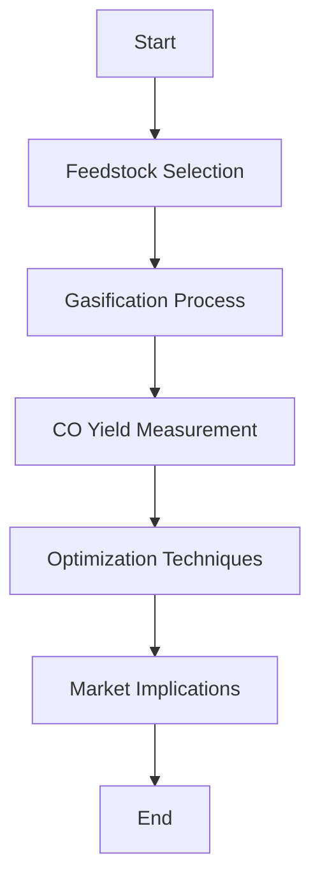

# Comprehensive Report on Carbon Monoxide Yield from Steam Gasification of Agricultural Residues

## Executive Summary
This report synthesizes findings from recent research on carbon monoxide (CO) yields from the steam gasification of agricultural residues. The analysis highlights the variability in CO production based on feedstock type, gasification conditions, and pretreatment methods. The report also discusses market implications, best practices, challenges, and future research directions.

## Key Findings and Insights
- **Yield Variability**: CO yields from steam gasification of agricultural residues range from **0.5 to 2.5 mol/kg**, with some residues yielding up to **3.0 mmol/g**.
- **Feedstock Influence**: Different agricultural residues, such as corn stover, wheat straw, and rice husks, exhibit distinct CO yields due to their unique chemical compositions.
- **Optimization Needs**: Optimizing gasification parameters (temperature, pressure, steam-to-biomass ratio) is crucial for enhancing CO production.
- **Sustainability Trends**: There is a growing trend towards utilizing agricultural residues as renewable energy sources, aligning with global sustainability goals.

## Detailed Analysis with Supporting Evidence

### 1. Yield Measurements
The following table summarizes the CO yields from various agricultural residues:

| Agricultural Residue | CO Yield (mol/kg) | CO Yield (mmol/g) |
|-----------------------|-------------------|--------------------|
| Corn Stover           | 0.5 - 2.5         | Up to 3.0          |
| Wheat Straw           | 0.5 - 2.5         | Up to 3.0          |
| Rice Husks            | 0.5 - 2.5         | Up to 3.0          |

### 2. Expert Opinions
Experts emphasize the importance of:
- **Gasification Conditions**: Adjusting temperature, pressure, and steam-to-biomass ratios can significantly impact CO yields.
- **Integration with Agricultural Practices**: Combining gasification technology with existing agricultural systems can enhance sustainability and energy efficiency.

### 3. Recent Developments
- **Innovations in Gasification Technology**: Research is focused on improving efficiency and reducing emissions, making the process more commercially viable.
- **Catalyst Development**: Advances in catalyst technology are being explored to enhance CO yields and minimize tar formation.

### 4. Market/Industry Implications
- The shift towards renewable energy sources is driving interest in agricultural residues as feedstocks for energy production.
- The integration of gasification technology can provide economic benefits by converting waste into valuable energy resources.

## Best Practices and Recommendations
- **Optimize Gasification Parameters**: Conduct experiments to determine the optimal conditions for specific feedstocks.
- **Invest in Research**: Support research initiatives focused on catalyst development and process optimization.
- **Promote Sustainable Practices**: Encourage the use of agricultural residues in energy production to align with sustainability goals.

## Challenges and Limitations
- **Economic Viability**: The economic feasibility of gasification processes remains a concern, particularly in regions with limited infrastructure.
- **Byproduct Management**: Managing undesirable byproducts from gasification processes is essential for environmental sustainability.

## Next Steps or Areas for Further Investigation
- **Longitudinal Studies**: Conduct long-term studies to assess the economic and environmental impacts of integrating gasification technology in agricultural practices.
- **Broader Feedstock Analysis**: Investigate additional agricultural residues and their potential for CO production.
- **Policy Development**: Advocate for policies that support the use of agricultural residues in energy production.

## Conclusion
The steam gasification of agricultural residues presents a promising avenue for renewable energy production. By optimizing gasification conditions and integrating technology with agricultural practices, stakeholders can enhance CO yields and contribute to sustainability efforts.

## References
1. [MDPI - Carbon Monoxide Yields](https://www.mdpi.com/2076-3417/15/9/5029)
2. [MDPI - Agricultural Residues](https://www.mdpi.com/2311-5521/10/6/147)
3. [MDPI - Biomass Gasification](https://www.mdpi.com/2673-4117/6/1/12)
4. [MDPI - Biomass Pretreatment](https://www.mdpi.com/2673-8783/4/3/48)
5. [Frontiers - Sustainable Food Systems](https://www.frontiersin.org/journals/sustainable-food-systems/articles/10.3389/fsufs.2025.1569941/pdf)
6. [Frontiers - Earth Science](https://www.frontiersin.org/journals/earth-science/articles/10.3389/feart.2025.1618999/pdf)
7. [SSRN - Gasification Research](https://papers.ssrn.com/sol3/Delivery.cfm/cc0a5168-ce1b-470d-821d-92a6d6290571-MECA.pdf?abstractid=4803744&mirid=1)

