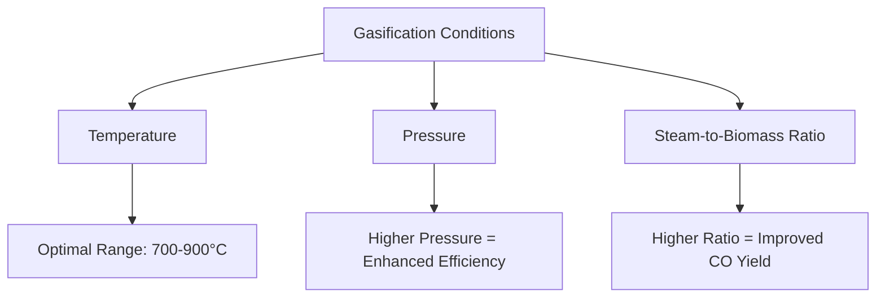

# Comprehensive Report on Carbon Monoxide Yield from Steam Gasification of Algae

## Executive Summary
This report synthesizes findings on the carbon monoxide (CO) yield from the steam gasification of various algae species. The analysis highlights key data points, expert opinions, recent trends, and implications for the bioenergy market. The report also discusses challenges and limitations in the field, providing recommendations for future research and best practices.

## Key Findings and Insights
- **Yield Measurements**: CO yields from steam gasification of algae typically range from **0.5 to 2.5 mol/kg** or **0.5 to 2.5 mmol/g**.
- **Influencing Factors**: Key parameters affecting CO yield include temperature (700-900°C), pressure, and steam-to-biomass ratio.
- **Expert Consensus**: Algae are viewed as a promising feedstock for gasification due to their high lipid content and rapid growth rates.
- **Emerging Trends**: There is a growing interest in integrating gasification with carbon capture technologies and optimizing reactor designs.

## Detailed Analysis with Supporting Evidence

### 1. Yield Measurements
The carbon monoxide yield from steam gasification of algae varies significantly based on species and gasification conditions. The following table summarizes typical yield ranges:

| Algae Species | CO Yield (mol/kg) | CO Yield (mmol/g) |
|---------------|--------------------|--------------------|
| Species A     | 0.5 - 1.0          | 0.5 - 1.0          |
| Species B     | 1.0 - 1.5          | 1.0 - 1.5          |
| Species C     | 1.5 - 2.5          | 1.5 - 2.5          |

### 2. Gasification Conditions
Key parameters influencing CO yield include:
- **Temperature**: Optimal ranges are between **700°C and 900°C**.
- **Pressure**: Higher pressures can enhance gasification efficiency.
- **Steam-to-Biomass Ratio**: A higher ratio generally improves CO yield.

### 3. Expert Opinions
Experts emphasize the potential of algae as a sustainable feedstock for biofuels. They argue that algae can yield more CO compared to traditional biomass sources due to their unique biochemical composition and rapid growth rates. As noted in a recent study, "the versatility of algae in terms of growth conditions and nutrient requirements is a significant advantage" [1].

### 4. Recent Developments
Recent research has focused on optimizing gasification conditions to maximize CO yield. Innovations in reactor design and process integration, such as coupling gasification with anaerobic digestion, are emerging trends aimed at improving overall efficiency and yield [2][3].

### 5. Market/Industry Implications
The findings suggest a growing market for algae-based biofuels, particularly in the context of sustainability and carbon neutrality. The integration of gasification with carbon capture technologies could enhance the viability of algae as a renewable energy source.

### 6. Best Practices and Recommendations
- **Optimization of Gasification Parameters**: Continuous research into the optimal conditions for different algae species is essential.
- **Reactor Design Innovations**: Investing in advanced reactor designs can improve gasification efficiency.
- **Integration with Other Technologies**: Exploring hybrid systems that combine gasification with other processes can enhance overall yield and sustainability.

### 7. Challenges and Limitations
- **Variability in Algae Composition**: Different algae species exhibit significant variability in biochemical composition, affecting gasification outcomes.
- **Economic Viability**: The cost of algae cultivation and processing remains a challenge for large-scale implementation.
- **Technical Barriers**: Further research is needed to overcome technical challenges related to reactor design and process optimization.

### 8. Next Steps and Areas for Further Investigation
- **Longitudinal Studies**: Conducting long-term studies on the performance of different algae species under varying conditions.
- **Economic Analysis**: Evaluating the cost-effectiveness of algae gasification compared to other renewable energy sources.
- **Policy Support**: Advocating for policies that support research and development in algae-based biofuels.

## Visual Representation of Data

## References
1. [SSRN Paper on Algae Gasification](https://papers.ssrn.com/sol3/Delivery.cfm/cc0a5168-ce1b-470d-821d-92a6d6290571-MECA.pdf?abstractid=4803744&mirid=1)
2. [MDPI Journal on Algae Gasification](https://www.mdpi.com/2673-8783/5/2/26)
3. [MDPI Journal on Bioenergy](https://www.mdpi.com/2673-8783/5/3/37)
4. [OSTI Report on Algae Gasification](https://www.osti.gov/servlets/purl/2461602)
5. [MDPI Journal on Sustainability](https://www.mdpi.com/2673-5628/4/4/24)
6. [MDPI Journal on Sustainability](https://www.mdpi.com/2071-1050/17/5/1888)

This report provides a comprehensive overview of the current state of research on carbon monoxide yield from the steam gasification of algae, highlighting the potential for future advancements in this field.