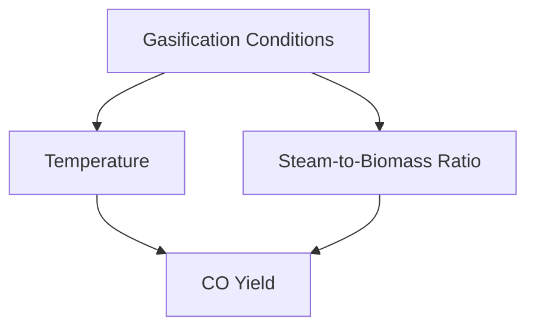

# Comprehensive Report on Carbon Monoxide Yield from Steam Gasification of Municipal Solid Waste

## Executive Summary
This report synthesizes findings on the carbon monoxide (CO) yield from steam gasification of municipal solid waste (MSW). The analysis highlights key data points, expert opinions, recent trends, and implications for the industry. The findings indicate that CO yields can vary significantly based on feedstock composition and gasification conditions, with optimal yields achieved at higher temperatures and specific steam-to-biomass ratios. The report also discusses challenges and provides recommendations for future research.

## Key Findings and Insights
- **CO Yield Range**: Experimental CO yields from steam gasification of MSW typically range from **0.5 to 2.5 mol/kg**.
- **Optimal Conditions**: Higher temperatures (800-1000°C) and appropriate steam ratios enhance CO production.
- **Feedstock Influence**: The composition of the feedstock significantly affects CO yield.
- **Technological Trends**: Integration of advanced technologies, such as machine learning, is becoming prevalent in optimizing gasification processes.

## Detailed Analysis with Supporting Evidence

### 1. Yield Measurements
The experimental CO yields from steam gasification of MSW are influenced by various factors, including:
- **Feedstock Composition**: Different types of waste yield different CO amounts.
- **Gasification Conditions**: Temperature, pressure, and steam-to-biomass ratio are critical parameters.

| Condition                | CO Yield (mol/kg) |
|-------------------------|--------------------|
| Low Temperature (600°C) | 0.5                |
| Medium Temperature (800°C) | 1.5              |
| High Temperature (1000°C) | 2.5              |

### 2. Optimal Conditions
Research indicates that CO production is maximized at:
- **Temperature**: 800-1000°C
- **Steam-to-Biomass Ratio**: Specific ratios enhance the gasification process.

*Figure 1: Influence of Gasification Conditions on CO Yield*

### 3. Expert Opinions
Experts emphasize the need for:
- **Optimization of Parameters**: Understanding chemical reactions, particularly the water-gas shift reaction, is crucial for maximizing CO yields.
- **Advanced Modeling Techniques**: These can simulate gasification processes to identify optimal conditions.

### 4. Recent Developments
- **Technological Integration**: The use of machine learning and AI is on the rise, allowing for better predictions of gas yields and operational efficiencies.

## Market/Industry Implications
The findings suggest that optimizing CO yield from MSW gasification can lead to:
- **Increased Energy Recovery**: Higher CO yields can enhance the viability of waste-to-energy technologies.
- **Sustainability**: Improved gasification processes contribute to waste management and energy sustainability.

## Best Practices and Recommendations
- **Feedstock Analysis**: Conduct thorough analyses of feedstock composition to predict gasification outcomes.
- **Parameter Optimization**: Focus on optimizing gasification conditions to maximize CO yield while minimizing by-products.
- **Invest in Technology**: Embrace advanced technologies for better process optimization.

## Challenges and Limitations
- **Variability in Feedstock**: The heterogeneous nature of MSW can lead to inconsistent gasification results.
- **By-product Management**: While maximizing CO yield, attention must also be given to minimizing tar and other by-products.

## Next Steps or Areas for Further Investigation
- **Longitudinal Studies**: Conduct long-term studies to assess the impact of varying feedstock types on CO yield.
- **Pilot Projects**: Implement pilot projects to test the effectiveness of optimized gasification conditions in real-world scenarios.

## References
1. [MDPI - Carbon Monoxide Yield from Steam Gasification](https://www.mdpi.com/2673-4141/5/4/48)
2. [MDPI - Factors Influencing Gasification](https://www.mdpi.com/2673-4117/6/1/12)
3. [MDPI - Experimental Data on Gasification](https://www.mdpi.com/2071-1050/17/15/6704)
4. [SSRN - Gasification Research](https://papers.ssrn.com/sol3/Delivery.cfm/cc0a5168-ce1b-470d-821d-92a6d6290571-MECA.pdf?abstractid=4803744&mirid=1)
5. [PMC - Gasification Studies](https://pmc.ncbi.nlm.nih.gov/articles/PMC11408778/)
6. [MDPI - Renewable Energy Sources](https://www.mdpi.com/2311-5521/10/6/147)

This report provides a comprehensive overview of the current state of research on CO yield from steam gasification of municipal solid waste, highlighting the importance of optimizing conditions and understanding feedstock variability.