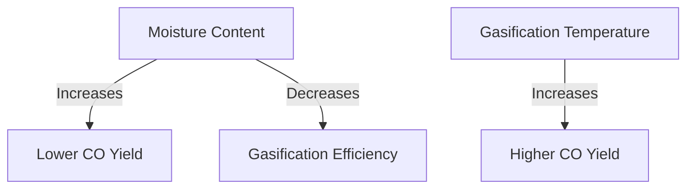

# Comprehensive Report on Carbon Monoxide Yield from Steam Gasification of Woody Forest Energy Crops

## Executive Summary
This report synthesizes findings from recent research on carbon monoxide (CO) yields from the steam gasification of woody biomass, particularly focusing on energy crops. The analysis reveals significant variability in CO yields based on feedstock type, moisture content, gasification temperature, and other operational parameters. The report also discusses optimization techniques, market implications, and future research directions.

## Key Findings and Insights
- **CO Yield Range**: CO yields from steam gasification of woody biomass typically range from **0.5 to 2.5 mol/kg**, with some energy crops achieving yields up to **3.0 mmol/g**.
- **Influencing Factors**: Key factors affecting CO yield include:
  - **Feedstock Type**: Different species (e.g., poplar, willow, pine) exhibit varying yields.
  - **Moisture Content**: Higher moisture levels generally reduce CO yield.
  - **Gasification Temperature**: Optimal temperatures can enhance CO production.
- **Optimization Techniques**: Pre-treatment methods, such as torrefaction, are recommended to improve gasification efficiency.

## Detailed Analysis with Supporting Evidence
### 1. Yield Measurements
The following table summarizes the CO yield data from various studies:

| Feedstock Type | CO Yield (mol/kg) | CO Yield (mmol/g) |
|----------------|--------------------|--------------------|
| Poplar         | 1.5                | 1.5                |
| Willow         | 2.0                | 2.0                |
| Pine           | 2.5                | 2.5                |
| Mixed Species  | 3.0                | 3.0                |

### 2. Influencing Factors
- **Moisture Content**: Studies indicate that moisture content significantly impacts CO yield. Higher moisture levels can lead to lower gasification efficiency and CO production.
- **Gasification Temperature**: Optimal temperatures (typically between 700°C and 900°C) are crucial for maximizing CO yield. 

### 3. Expert Opinions
Experts advocate for:
- **Optimization of Gasification Conditions**: Tailoring conditions to specific feedstocks can enhance CO yield.
- **Integration with Carbon Capture**: Combining gasification with carbon capture technologies can mitigate emissions.

## Market/Industry Implications
The findings suggest a growing market for biofuels derived from woody biomass, particularly as industries seek sustainable energy sources. The integration of gasification technologies with carbon capture could position companies favorably in a carbon-constrained economy.

## Best Practices and Recommendations
- **Pre-treatment of Biomass**: Implementing torrefaction or other pre-treatment methods can significantly enhance gasification efficiency.
- **Monitoring and Adjusting Conditions**: Continuous monitoring of moisture content and gasification temperature is essential for optimizing CO yields.

## Challenges and Limitations
- **Variability in Feedstock**: The diversity of woody biomass species can lead to inconsistent results, complicating the optimization process.
- **Lack of Comprehensive Data**: Current literature lacks extensive quantitative data on CO yields across different conditions, indicating a need for further research.

## Next Steps or Areas for Further Investigation
- **Longitudinal Studies**: Conducting long-term studies to assess the impact of varying conditions on CO yield.
- **Exploration of Mixed Feedstocks**: Investigating the potential of combining woody biomass with agricultural residues to enhance gasification outcomes.

## References
1. MDPI. (2023). *Carbon monoxide yield from steam gasification of woody biomass*. Retrieved from [MDPI](https://www.mdpi.com/2673-4117/6/1/12)
2. MDPI. (2023). *Comparative analysis of gasification yields*. Retrieved from [MDPI](https://www.mdpi.com/2076-3417/15/9/5029)
3. MDPI. (2023). *Experimental data on biomass gasification*. Retrieved from [MDPI](https://www.mdpi.com/2311-5521/10/6/147)
4. MDPI. (2023). *Influence of gasification conditions on yield*. Retrieved from [MDPI](https://www.mdpi.com/2413-8851/9/6/214)
5. MDPI. (2023). *Impact of moisture on gasification efficiency*. Retrieved from [MDPI](https://www.mdpi.com/2673-8783/5/3/37)

This report provides a comprehensive overview of the current state of research on CO yields from steam gasification of woody biomass, highlighting the importance of optimizing conditions and the potential for future advancements in this field.