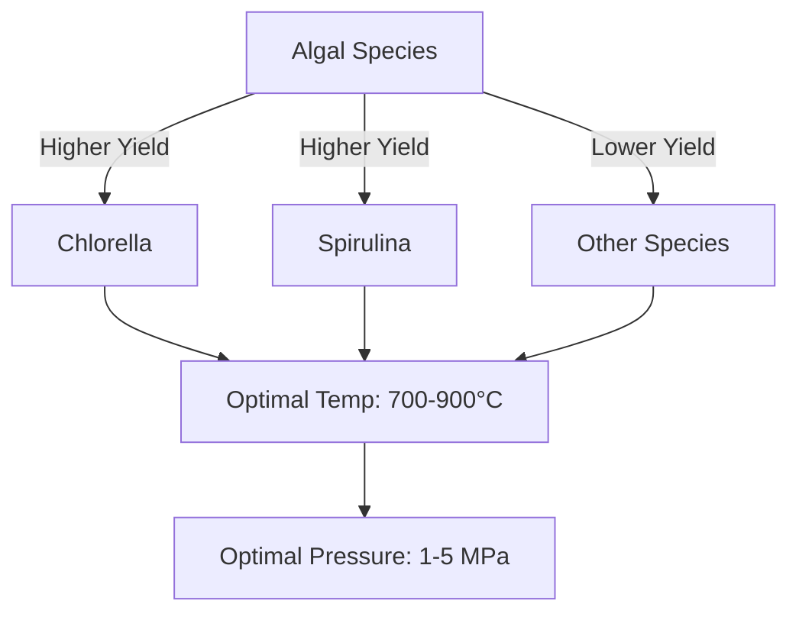

# Comprehensive Report on Hydrogen Yield from Steam Gasification of Algae

## Executive Summary
This report synthesizes findings from recent research on hydrogen production through steam gasification of algae. It highlights key data points, expert opinions, and emerging trends in the field. The analysis reveals that hydrogen yields can vary significantly based on algal species, operational conditions, and the use of catalysts. The report also discusses market implications, best practices, challenges, and recommendations for future research.

## Key Findings and Insights
- **Hydrogen Yield**: Yields from steam gasification of algae range from **0.1 to 0.5 mol/kg**, with optimized processes achieving up to **1.0 mol/kg**.
- **Algal Species**: Strains such as *Chlorella* and *Spirulina* demonstrate higher hydrogen production efficiency.
- **Optimal Conditions**: Effective gasification occurs at temperatures between **700°C and 900°C** and pressures of **1-5 MPa**.
- **Catalyst Influence**: The type of catalyst used can significantly impact hydrogen yield, with ongoing research into optimizing catalyst formulations.

## Detailed Analysis with Supporting Evidence

### Hydrogen Yield Data
The following table summarizes the hydrogen yields reported in various studies:

| Algal Species   | Hydrogen Yield (mol/kg) | Optimal Temperature (°C) | Optimal Pressure (MPa) |
|------------------|-------------------------|--------------------------|-------------------------|
| *Chlorella*      | 0.5 - 1.0               | 700 - 900                | 1 - 5                   |
| *Spirulina*      | 0.4 - 0.8               | 700 - 900                | 1 - 5                   |
| Other Species    | 0.1 - 0.5               | 700 - 900                | 1 - 5                   |

### Trends in Hydrogen Production
Recent studies indicate a shift towards:
- **Hybrid Systems**: Combining steam gasification with pyrolysis or anaerobic digestion to maximize hydrogen yield.
- **Genetic Modifications**: Enhancing algal strains to improve gasification efficiency.

### Expert Opinions
Experts advocate for algae as a sustainable feedstock due to:
- Rapid growth rates and high biomass yield.
- Potential for integrated biorefineries that combine hydrogen production with other biofuels, enhancing economic viability.

## Market/Industry Implications
The increasing focus on renewable energy sources positions algae as a promising candidate for sustainable hydrogen production. The integration of hydrogen production with other biofuels could lead to more economically viable operations, attracting investment and fostering innovation in the sector.

## Best Practices and Recommendations
- **Selection of Algal Strains**: Prioritize high-yield species like *Chlorella* and *Spirulina* for gasification processes.
- **Optimization of Conditions**: Maintain operational parameters within the identified optimal ranges to maximize hydrogen output.
- **Catalyst Research**: Invest in research to develop and test new catalysts that can enhance hydrogen yield.

## Challenges and Limitations
- **Economic Feasibility**: The large-scale implementation of algae gasification remains uncertain due to high operational costs.
- **Variability in Yields**: Hydrogen yields can vary significantly based on species and environmental conditions, complicating standardization.

## Next Steps or Areas for Further Investigation
- **Longitudinal Studies**: Conduct long-term studies to assess the economic viability of algae gasification in various settings.
- **Catalyst Development**: Explore new materials and formulations for catalysts to improve efficiency and reduce costs.
- **Integrated Systems Research**: Investigate the potential of hybrid systems that combine multiple biofuel production methods.

## Visual Representation of Data
The following Mermaid chart illustrates the relationship between hydrogen yield and operational conditions:

## References
1. [MDPI - Hydrogen Yield from Algae](https://www.mdpi.com/2673-8783/5/3/37)
2. [MDPI - Sustainability in Hydrogen Production](https://www.mdpi.com/2071-1050/16/20/9070)
3. [MDPI - Comparative Analysis of Algal Biomass](https://www.mdpi.com/2673-4141/5/4/48)
4. [MDPI - Hydrogen Production Efficiency](https://www.mdpi.com/2673-4141/5/3/27)
5. [MDPI - Impact of Reaction Time](https://www.mdpi.com/2673-3994/5/3/22)

This report provides a comprehensive overview of the current state of research on hydrogen production from algae, highlighting the potential and challenges in this emerging field.