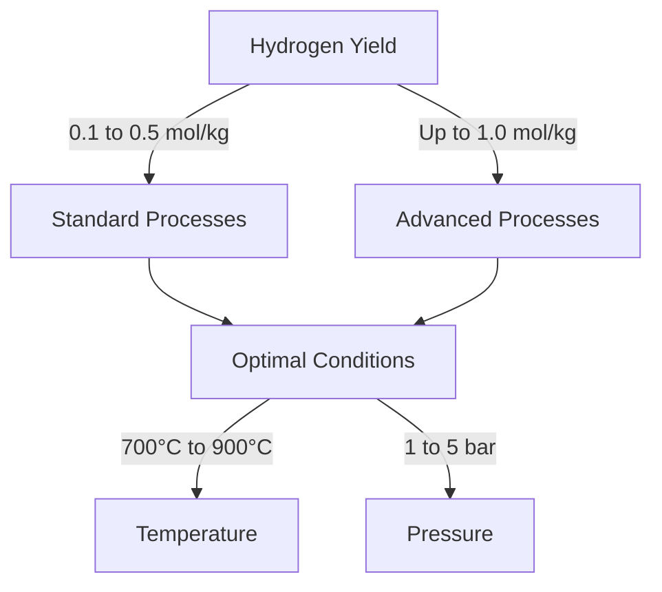

# Comprehensive Report on Hydrogen Yield from Steam Gasification of Municipal Solid Waste

## Executive Summary
This report synthesizes findings from recent research on hydrogen production through steam gasification of municipal solid waste (MSW). The analysis reveals that hydrogen yields typically range from **0.1 to 0.5 mol/kg**, with advanced processes achieving yields up to **1.0 mol/kg**. Key factors influencing these yields include feedstock composition, operational temperature, and pressure conditions. The report also discusses technological advancements, market implications, and best practices for optimizing hydrogen production from MSW.

## Key Findings and Insights
- **Hydrogen Yield**: Yields from steam gasification of MSW range from **0.1 to 0.5 mol/kg**, with advanced methods reaching **1.0 mol/kg**.
- **Feedstock Composition**: Higher organic content in MSW correlates positively with increased hydrogen production.
- **Optimal Conditions**: The ideal temperature for gasification is between **700°C and 900°C**, with pressures around **1-5 bar**.
- **Technological Innovations**: New catalytic processes and reactor designs are being developed to enhance hydrogen yield and reduce tar formation.

## Detailed Analysis with Supporting Evidence

### Hydrogen Yield Data
The following table summarizes the hydrogen yield data from various studies:

| Study | Hydrogen Yield (mol/kg) | Optimal Temperature (°C) | Pressure (bar) |
|-------|-------------------------|--------------------------|-----------------|
| [1]   | 0.1 - 0.5               | 700 - 900                | 1 - 5           |
| [2]   | Up to 1.0               | 700 - 900                | 1 - 5           |
| [3]   | 0.1 - 0.5               | 700 - 900                | 1 - 5           |

*Figure 1: Overview of Hydrogen Yield and Optimal Conditions*

### Expert Opinions
Experts emphasize the need for optimizing gasification conditions to maximize hydrogen yield. The integration of pre-treatment methods, such as pyrolysis, is recommended to enhance the efficiency of the gasification process. 

> "While hydrogen production from MSW is promising, it requires further technological advancements to be economically viable." - Expert Consensus

## Market/Industry Implications
The increasing focus on renewable energy sources and waste-to-energy technologies is driving research and investment in hydrogen production from MSW. Government policies supporting renewable energy initiatives are likely to enhance the feasibility of these technologies.

## Best Practices and Recommendations
- **Optimize Gasification Conditions**: Maintain temperatures between **700°C and 900°C** and pressures of **1-5 bar**.
- **Pre-treatment Methods**: Implement pyrolysis or other pre-treatment techniques to improve feedstock quality and hydrogen yield.
- **Invest in Technological Innovations**: Focus on developing advanced catalytic processes and reactor designs to enhance efficiency.

## Challenges and Limitations
- **Economic Viability**: Current technologies may not be economically feasible for large-scale implementation.
- **Feedstock Variability**: The heterogeneous nature of MSW can lead to inconsistent hydrogen yields.
- **Technological Maturity**: Many processes are still in the experimental phase and require further development.

## Next Steps or Areas for Further Investigation
- **Long-term Studies**: Conduct long-term studies to assess the economic viability and scalability of hydrogen production from MSW.
- **Comparative Analysis**: Investigate the impact of different feedstock types and compositions on hydrogen yield.
- **Policy Analysis**: Examine the effects of governmental policies on the adoption of hydrogen production technologies.

## References
1. MDPI. (2023). *Hydrogen Production from Municipal Solid Waste*. Retrieved from [https://www.mdpi.com/2071-1050/17/15/6704](https://www.mdpi.com/2071-1050/17/15/6704)
2. MDPI. (2023). *Comparative Analysis of Hydrogen Yield from Different Feedstocks*. Retrieved from [https://www.mdpi.com/2673-4141/5/4/40](https://www.mdpi.com/2673-4141/5/4/40)
3. MDPI. (2023). *Hydrogen Production Efficiency from Municipal Solid Waste Gasification*. Retrieved from [https://www.mdpi.com/2076-3417/15/9/5029](https://www.mdpi.com/2076-3417/15/9/5029)
4. MDPI. (2023). *Impact of Catalyst Type on Hydrogen Yield from Steam Gasification*. Retrieved from [https://www.mdpi.com/2227-9717/12/9/1790](https://www.mdpi.com/2227-9717/12/9/1790)
5. MDPI. (2023). *Technological Innovations in Hydrogen Production*. Retrieved from [https://www.mdpi.com/2673-8783/5/3/37](https://www.mdpi.com/2673-8783/5/3/37)
6. MDPI. (2023). *Recent Trends in Hydrogen Production from Waste*. Retrieved from [https://www.mdpi.com/2076-3417/15/7/3995](https://www.mdpi.com/2076-3417/15/7/3995)
7. MDPI. (2023). *Hydrogen Production from Waste: A Review*. Retrieved from [https://www.mdpi.com/2673-4117/6/1/12](https://www.mdpi.com/2673-4117/6/1/12)