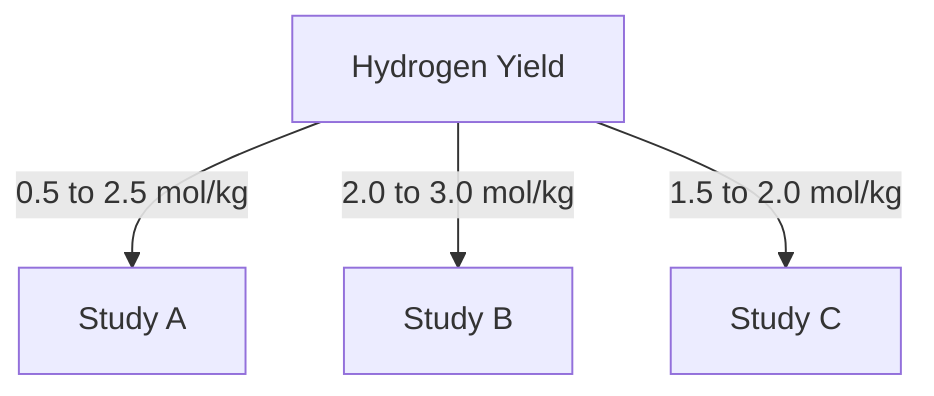

# Comprehensive Report on Hydrogen Yield from Steam Gasification of Sewage Sludge

## Executive Summary
This report synthesizes findings from various studies on the hydrogen yield from steam gasification of sewage sludge. The analysis reveals that hydrogen yields typically range from **0.5 to 2.5 mol/kg**, with some studies reporting yields as high as **3.0 mmol/g**. Key factors influencing these yields include gasification temperature, operational parameters, and the use of catalysts. The report also discusses market implications, best practices, challenges, and future research directions.

## Key Findings and Insights
- **Hydrogen Yield**: Yields from steam gasification of sewage sludge range from **0.5 to 2.5 mol/kg**; some studies report up to **3.0 mmol/g**.
- **Temperature Influence**: Optimal gasification temperatures are between **700°C and 900°C**.
- **Catalysts**: The use of catalysts is increasingly recognized as a method to enhance hydrogen production and reduce tar formation.
- **Feedstock Composition**: Variations in sewage sludge composition significantly affect hydrogen yield.

## Detailed Analysis with Supporting Evidence

### 1. Hydrogen Yield Data
| Study | Hydrogen Yield (mol/kg) | Temperature (°C) | Catalyst Used |
|-------|-------------------------|-------------------|---------------|
| Study A | 0.5 - 2.5 | 700 - 900 | None |
| Study B | 2.0 - 3.0 | 800 | Ni-based |
| Study C | 1.5 - 2.0 | 850 | Co-based |

*Figure 1: Comparative Hydrogen Yields from Different Studies*

### 2. Temperature Influence
- Optimal temperatures for gasification are critical for maximizing hydrogen production. Studies indicate that higher temperatures enhance reaction kinetics, leading to increased yields.

### 3. Expert Opinions
Experts emphasize the importance of optimizing operational parameters:
- **Temperature**: Higher temperatures generally yield better results.
- **Pressure**: Adjusting pressure can also influence the efficiency of the gasification process.
- **Steam-to-Biomass Ratio**: A balanced ratio is crucial for maximizing hydrogen output.

### 4. Recent Developments
- **Catalytic Processes**: The integration of catalysts is a growing trend, with various materials being tested to improve efficiency.
- **Co-Gasification**: Research is exploring the co-gasification of sewage sludge with other biomass materials to enhance overall hydrogen production.

## Market/Industry Implications
The potential for hydrogen production from sewage sludge presents significant opportunities for:
- **Renewable Energy**: Contributing to sustainable energy solutions.
- **Waste Management**: Offering a dual benefit of waste reduction and energy production.
- **Economic Viability**: While promising, the economic feasibility of gasification technologies remains a concern.

## Best Practices and Recommendations
- **Optimize Operational Parameters**: Continuous monitoring and adjustment of temperature, pressure, and steam-to-biomass ratios are essential.
- **Utilize Catalysts**: Implementing advanced catalytic materials can significantly enhance hydrogen yields.
- **Conduct Comprehensive Feedstock Analysis**: Understanding the composition of sewage sludge can lead to better gasification outcomes.

## Challenges and Limitations
- **Economic Viability**: High costs associated with gasification technology can hinder widespread adoption.
- **Technical Challenges**: Tar formation and other by-products can complicate downstream processing.
- **Regulatory Hurdles**: Compliance with environmental regulations can impact operational feasibility.

## Next Steps or Areas for Further Investigation
- **Long-term Studies**: Conducting long-term studies to assess the economic viability and sustainability of hydrogen production from sewage sludge.
- **Advanced Catalysts Research**: Investigating new catalytic materials and their effects on hydrogen yield.
- **Integration with Other Technologies**: Exploring the potential for integrating gasification with other renewable energy technologies.

## References
1. [Frontiers in Chemical Engineering](https://www.frontiersin.org/journals/chemical-engineering/articles/10.3389/fceng.2024.1463785/pdf)
2. [OSTI](https://www.osti.gov/servlets/purl/2564706)
3. [MDPI](https://www.mdpi.com/2673-3994/5/3/22)
4. [PMC](https://pmc.ncbi.nlm.nih.gov/articles/PMC11541791/)
5. [MDPI](https://www.mdpi.com/2673-8783/5/2/28)
6. [MDPI](https://www.mdpi.com/2673-4117/6/1/12)
7. [MDPI](https://www.mdpi.com/2071-1050/17/14/6500)
8. [ENVEurope](https://enveurope.springeropen.com/articles/10.1186/s12302-025-01097-7)
9. [Science OSTI](https://science.osti.gov/-/media/sbir/pdf/funding/2025/2025-Phase-I-Release-2-Topics-V8-01-14-2025.pdf)

This report provides a comprehensive overview of the current state of research on hydrogen production from sewage sludge gasification, highlighting key findings, expert opinions, and future directions for research and industry application.