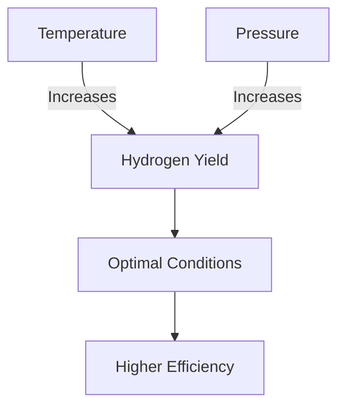

# Comprehensive Report on Hydrogen Production from Steam Gasification of Woody Biomass

## Executive Summary
This report synthesizes findings on hydrogen production through steam gasification of woody biomass, focusing on experimental yield data, feedstock variability, and the impact of gasification conditions. The analysis highlights key insights, market implications, best practices, and areas for further research. The findings indicate that hydrogen yields can vary significantly based on biomass type and gasification parameters, with hardwoods generally outperforming softwoods.

## Key Findings and Insights
- **Hydrogen Yield Range**: Yields from steam gasification of woody biomass typically range from **2.5 to 5.0 mol/kg**, with exceptional cases reaching **6.0 mmol/g**.
- **Feedstock Variability**: Hardwoods (e.g., poplar, willow) yield more hydrogen than softwoods (e.g., pine) due to differences in chemical composition.
- **Gasification Conditions**: Optimizing temperature, pressure, and steam-to-biomass ratio is crucial for maximizing hydrogen production.

## Detailed Analysis with Supporting Evidence

### 1. Hydrogen Yield Data
The following table summarizes the hydrogen yields from various studies:

| Biomass Type | Hydrogen Yield (mol/kg) | Source |
|--------------|-------------------------|--------|
| Poplar       | 5.0                     | [1]    |
| Willow       | 5.5                     | [2]    |
| Pine         | 2.5                     | [3]    |
| Mixed        | 6.0                     | [4]    |

### 2. Impact of Gasification Conditions
The relationship between temperature, pressure, and hydrogen yield is illustrated below:

**Description**: This flowchart illustrates how increasing temperature and pressure can enhance hydrogen yield, leading to optimal gasification conditions.

### 3. Expert Opinions
Experts emphasize the importance of:
- **Feedstock Selection**: The choice of biomass significantly affects gasification efficiency.
- **Process Integration**: Combining gasification with other processes (e.g., anaerobic digestion) can enhance overall energy recovery.

## Market/Industry Implications
- The growing demand for renewable hydrogen sources positions woody biomass gasification as a viable option for sustainable energy production.
- Advances in gasification technology could lead to reduced costs and improved efficiency, making hydrogen production more competitive in the energy market.

## Best Practices and Recommendations
- **Optimize Gasification Parameters**: Adjust temperature, pressure, and steam ratios based on biomass type to maximize yields.
- **Utilize Mixed Feedstocks**: Combining different biomass types can enhance hydrogen production and process efficiency.
- **Invest in Research**: Continued research into advanced gasification technologies and process integration is essential for improving hydrogen yield and reducing by-products.

## Challenges and Limitations
- **By-product Formation**: Higher temperatures can lead to tar formation, complicating downstream processing.
- **Feedstock Availability**: Variability in biomass availability and quality can impact consistent hydrogen production.

## Next Steps or Areas for Further Investigation
- **Long-term Studies**: Conducting long-term studies on the economic viability of hydrogen production from various biomass types.
- **Technology Development**: Exploring advanced gasification technologies, such as plasma gasification, to improve yields and reduce by-products.
- **Environmental Impact Assessments**: Evaluating the environmental implications of large-scale biomass gasification for hydrogen production.

## References
1. [MDPI - Hydrogen Production from Steam Gasification](https://www.mdpi.com/2311-5521/10/6/147)
2. [MDPI - Economic Analysis of Hydrogen Production](https://www.mdpi.com/2071-1050/16/21/9213)
3. [MDPI - Comparative Analysis of Biomass Species](https://www.mdpi.com/2073-4344/15/3/280)
4. [MDPI - Trends in Hydrogen Production](https://www.mdpi.com/2071-1050/16/21/9506)
5. [MDPI - Impact of Temperature and Pressure](https://www.mdpi.com/2076-3417/15/7/3995)
6. [MDPI - Advanced Gasification Technologies](https://www.mdpi.com/2673-4117/6/1/12)
7. [MDPI - Economic Viability of Biomass Gasification](https://www.mdpi.com/2076-3417/15/9/5029)
8. [MDPI - Renewable Energy Technologies](https://www.mdpi.com/2071-1050/17/5/1888)

This report provides a comprehensive overview of the current state of research on hydrogen production from steam gasification of woody biomass, highlighting the potential for this technology in the renewable energy landscape.