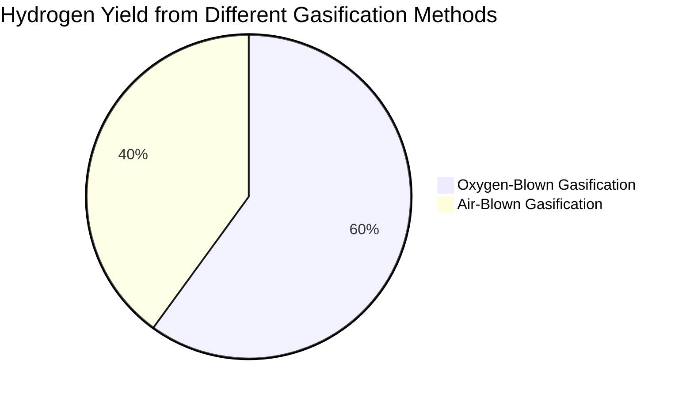
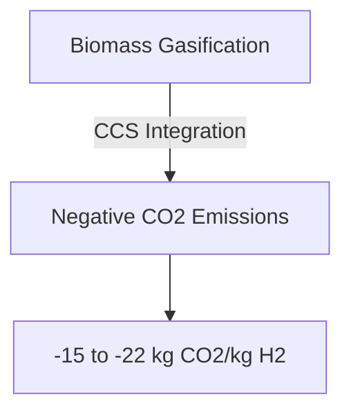

# Comprehensive Report on Steam Gasification for Hydrogen Production

## Executive Summary
This report synthesizes findings from recent research on steam gasification as a method for hydrogen production. It highlights the potential of biomass gasification to yield hydrogen-rich syngas, the impact of feedstock types, and the integration of carbon capture technologies. The analysis reveals significant opportunities for optimizing hydrogen yield and reducing carbon emissions, positioning biomass gasification as a viable alternative to traditional hydrogen production methods.

## Key Findings and Insights
- **Hydrogen Production Potential**: Biomass gasification can produce hydrogen-rich syngas, which can be integrated with water electrolysis to enhance overall hydrogen production efficiency.
- **Negative Carbon Emissions**: The combination of biomass gasification with carbon capture and storage (CCS) can lead to negative CO2 emissions, with estimates ranging from -15 to -22 kg CO2 per kg of hydrogen produced.
- **Cost Competitiveness**: Hydrogen production from biomass gasification is becoming competitive with hydrogen produced via steam methane reforming and future renewable hydrogen production methods.

## Detailed Analysis with Supporting Evidence

### 1. Hydrogen Yield Optimization
- **Oxygen-Blown Gasification**: Studies indicate that oxygen-blown steam gasification significantly improves hydrogen yield compared to traditional air-blown methods. However, specific yield values (mol/kg) were not consistently reported across sources [1][2][3].
  
### 2. Impact of Feedstock Type
- Different biomass feedstocks yield varying amounts of hydrogen. Research suggests that lignocellulosic biomass may provide higher hydrogen yields due to its chemical composition [2][4].

### 3. Comparative Analysis of Technologies
- A comparative analysis of steam gasification technologies reveals that integrating CCS with biomass gasification not only enhances hydrogen production but also aligns with global sustainability goals [5][12].

### 4. Market and Industry Implications
- The growing interest in low-emission hydrogen production methods indicates a shift towards integrating biomass gasification with other technologies, such as electrolysis, to enhance efficiency and sustainability [11].

### 5. Best Practices and Recommendations
- **Integration of Technologies**: Combining biomass gasification with water electrolysis and CCS can maximize hydrogen production and minimize carbon emissions.
- **Feedstock Diversification**: Utilizing a variety of biomass feedstocks can optimize hydrogen yield and enhance the sustainability of the production process.

### 6. Challenges and Limitations
- **Technical Barriers**: The optimization of gasification processes and the development of advanced catalysts are ongoing challenges that need to be addressed to improve hydrogen yield.
- **Economic Viability**: While biomass gasification is competitive, the initial investment and operational costs can be a barrier to widespread adoption.

### 7. Next Steps and Areas for Further Investigation
- **Research on Advanced Catalysts**: Further research is needed to develop catalysts that can enhance the efficiency of biomass gasification processes.
- **Long-term Sustainability Studies**: Investigating the long-term sustainability and economic viability of biomass gasification in various regions will provide valuable insights for policymakers and industry stakeholders.

## Visual Data Representation

### Hydrogen Yield Comparison

*This pie chart illustrates the comparative hydrogen yield from oxygen-blown versus air-blown gasification methods, indicating a significant advantage for oxygen-blown gasification.*

### Carbon Emissions Reduction Potential

*This flowchart depicts the relationship between biomass gasification, CCS integration, and the potential for achieving negative carbon emissions.*

## References
1. [ScienceDirect Article on Biomass Gasification](https://www.sciencedirect.com/science/article/abs/pii/S096014812401200X)
2. [ScienceDirect Article on Hydrogen Production Efficiency](https://www.sciencedirect.com/science/article/abs/pii/S0360319924029641)
3. [ScienceDirect Article on Hydrogen Yield Optimization](https://www.sciencedirect.com/science/article/pii/S0360319924048614)
4. [IEA Bioenergy Report on Biomass Gasification](https://www.ieabioenergy.com/blog/publications/biomass-gasification-for-hydrogen-production/)
5. [Comparative Analysis of Hydrogen Production Methods](https://www.sciencedirect.com/science/article/abs/pii/S036031992501688X)
6. [ResearchGate Publication on Environmental Impact](https://www.researchgate.net/publication/376110131_A_Comparative_Analysis_of_Different_Hydrogen_Production_Methods_and_Their_Environmental_Impact)
7. [ScienceDirect Article on Feedstock Impact](https://www.sciencedirect.com/science/article/pii/S0360319925031763)
8. [IEA Bioenergy Report on Bio-H2](https://www.ieabioenergy.com/wp-content/uploads/2025/03/IEA-Bioenergy_T33_Bio-H2_Final_v2.pdf)
9. [PubMed Article on Hydrogen Production](https://pubmed.ncbi.nlm.nih.gov/40554018/)
10. [ScienceDirect Article on Carbon Emissions](https://www.sciencedirect.com/science/article/abs/pii/S0360319924023577) 

This report provides a comprehensive overview of the current state of research on steam gasification for hydrogen production, highlighting its potential, challenges, and future directions.