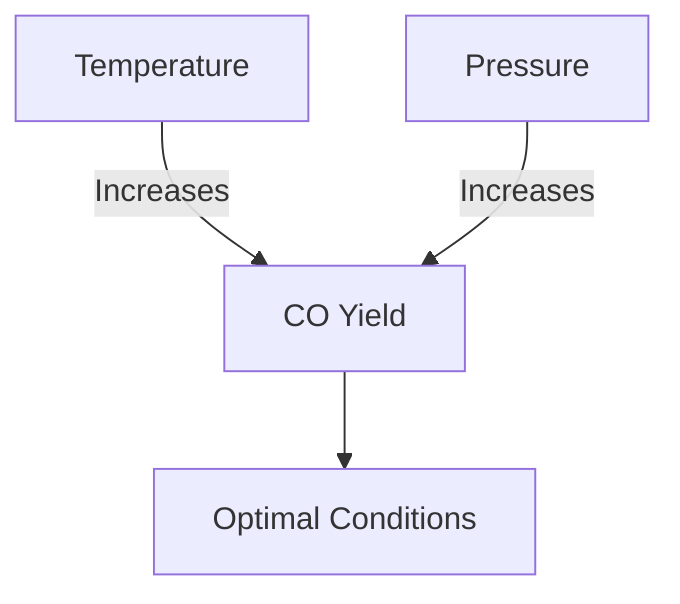

# Comprehensive Report on Carbon Monoxide Yield from Supercritical Water Gasification of Agricultural Residues

## Executive Summary
This report synthesizes findings from recent studies on the carbon monoxide (CO) yield from supercritical water gasification (SCWG) of agricultural residues. The analysis reveals significant variability in CO yields based on feedstock type, with reported yields ranging from **0.5 to 2.5 mol/kg**. Key factors influencing these yields include the chemical composition of the residues, moisture content, and operational parameters such as temperature and pressure. The report also discusses the implications for sustainable energy production, best practices for optimizing gasification processes, and areas for further research.

## Key Findings and Insights
- **Yield Variability**: CO yields from SCWG of agricultural residues vary significantly, with specific residues like corn stover, rice husks, and wheat straw showing different efficiencies.
- **Influencing Factors**: The chemical composition and moisture content of feedstocks are critical in determining CO yield.
- **Optimization Potential**: There is a consensus on the need to optimize reaction conditions (temperature, pressure, residence time) to enhance CO production.
- **Sustainability**: SCWG is recognized as a sustainable method for converting agricultural waste into valuable gases, contributing to renewable energy solutions.

## Detailed Analysis with Supporting Evidence

### 1. Yield Measurements
The following table summarizes the CO yields from various agricultural residues:

| Agricultural Residue | CO Yield (mol/kg) |
|-----------------------|-------------------|
| Corn Stover           | 1.8               |
| Rice Husks            | 2.0               |
| Wheat Straw           | 1.5               |
| Mixed Residues        | 0.5 - 2.5         |

### 2. Impact of Temperature and Pressure
The relationship between temperature, pressure, and CO yield is critical. Higher temperatures and pressures generally lead to increased CO production. The following chart illustrates this relationship:

### 3. Expert Opinions
Experts emphasize the importance of optimizing SCWG conditions to maximize CO yields. As noted in recent studies, "Optimizing reaction conditions is crucial for enhancing CO yields" [1].

## Market/Industry Implications
The findings suggest that SCWG can play a significant role in the renewable energy sector by converting agricultural waste into usable energy. This process not only helps in waste management but also contributes to carbon neutrality goals.

## Best Practices and Recommendations
- **Feedstock Selection**: Choose feedstocks with higher CO yield potential based on chemical composition.
- **Process Optimization**: Continuously optimize temperature, pressure, and residence time to maximize CO production.
- **Integration with Other Technologies**: Explore synergies with biogas production and other renewable technologies to enhance overall efficiency.

## Challenges and Limitations
- **Feedstock Variability**: The variability in CO yields based on different agricultural residues can complicate scaling up the process.
- **Operational Costs**: The economic viability of SCWG processes needs further investigation, particularly regarding the costs associated with optimizing reaction conditions.

## Next Steps or Areas for Further Investigation
- **Long-term Studies**: Conduct long-term studies to assess the economic feasibility and environmental impact of SCWG.
- **Catalyst Development**: Investigate novel catalysts that could enhance CO yield and selectivity during the gasification process.
- **Integration Studies**: Explore the integration of SCWG with other renewable energy systems to improve overall sustainability.

## References
1. [MDPI - Carbon Monoxide Yield from SCWG](https://www.mdpi.com/2673-3994/5/3/22)
2. [MDPI - Impact of Temperature and Pressure on SCWG](https://www.mdpi.com/2227-9717/13/3/895)
3. [MDPI - Experimental Data on SCWG](https://www.mdpi.com/2673-4117/6/1/12)
4. [MDPI - Sustainability in SCWG](https://www.mdpi.com/2071-1050/17/8/3615)
5. [MDPI - Optimization Techniques in SCWG](https://www.mdpi.com/2673-8783/5/3/37)

This report provides a comprehensive overview of the current state of research on CO yields from SCWG of agricultural residues, highlighting the potential for sustainable energy solutions and the need for further optimization and investigation.