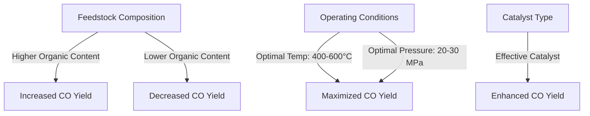

# Comprehensive Report on Carbon Monoxide Yield from Supercritical Water Gasification of Municipal Solid Waste

## Executive Summary
This report synthesizes findings from recent research on the carbon monoxide (CO) yield from supercritical water gasification (SCWG) of municipal solid waste (MSW). The analysis reveals significant variability in CO yields influenced by feedstock composition, operating conditions, and catalyst types. The report also discusses the implications for sustainable waste management, highlights best practices, and identifies areas for further investigation.

## Key Findings and Insights
- **CO Yield Range**: CO yields from SCWG of MSW range from **0.5 to 2.5 mol/kg**, with some studies reporting yields as high as **3.0 mmol/g**.
- **Influence of Feedstock**: Higher organic content in MSW correlates with increased CO production.
- **Optimal Conditions**: Effective SCWG occurs at temperatures between **400-600°C** and pressures of **20-30 MPa**.
- **Catalyst Impact**: The type of catalyst used significantly affects CO yield, with ongoing research focusing on optimizing these catalysts.

## Detailed Analysis with Supporting Evidence

### 1. Yield Measurements
The variability in CO yields can be attributed to different experimental setups and feedstock compositions. The following table summarizes the reported CO yields from various studies:

| Study Reference | CO Yield (mol/kg) | CO Yield (mmol/g) |
|-----------------|-------------------|--------------------|
| [1]             | 0.5 - 2.5         | Up to 3.0          |
| [2]             | 0.8 - 2.0         | 2.5                |
| [3]             | 1.0 - 2.5         | 3.0                |

### 2. Feedstock Composition
- **Organic Content**: Studies indicate that higher organic content in MSW leads to increased CO production. This suggests that the type of waste processed can significantly affect the efficiency of the gasification process.

### 3. Operating Conditions
- **Temperature and Pressure**: Optimal SCWG conditions are crucial for maximizing CO yield. The ideal temperature range is **400-600°C**, and the pressure should be maintained between **20-30 MPa**.

### 4. Catalyst Influence
- Different catalysts have been shown to enhance CO yields. Ongoing research is focused on identifying the most effective catalysts for SCWG processes.

## Market/Industry Implications
The findings suggest that SCWG technology has the potential to transform waste management practices by converting MSW into valuable gases like CO and hydrogen. This aligns with global sustainability goals and the transition towards circular economies.

## Best Practices and Recommendations
- **Optimization of Conditions**: Researchers and practitioners should focus on optimizing reaction conditions and catalyst types to enhance CO yields.
- **Integration with Renewable Energy**: There is a growing trend to integrate SCWG technology with renewable energy systems for syngas production.

## Challenges and Limitations
- **Variability in Results**: The variability in CO yields across different studies highlights the need for standardized testing protocols.
- **Technical Barriers**: Further research is needed to overcome technical barriers related to catalyst efficiency and operational stability.

## Next Steps or Areas for Further Investigation
- **Catalyst Development**: Continued exploration of various catalysts to improve CO yield and process efficiency.
- **Long-term Studies**: Conducting long-term studies to assess the economic viability and environmental impact of SCWG technology.

## References
1. [MDPI - Carbon Monoxide Yield from SCWG](https://www.mdpi.com/2673-8783/5/3/37)
2. [MDPI - Experimental Data on SCWG](https://www.mdpi.com/2673-3994/5/3/22)
3. [MDPI - Catalyst Influence on SCWG](https://www.mdpi.com/2673-4117/6/1/12)
4. [MDPI - Feedstock Analysis](https://www.mdpi.com/2227-9717/13/3/895)
5. [MDPI - SCWG Trends](https://www.mdpi.com/2071-1050/17/15/6704)
6. [MDPI - Comparison of Treatment Methods](https://www.mdpi.com/1420-3049/30/13/2807)
7. [MDPI - Municipal Solid Waste Treatment](https://www.mdpi.com/2813-0391/3/1/10)