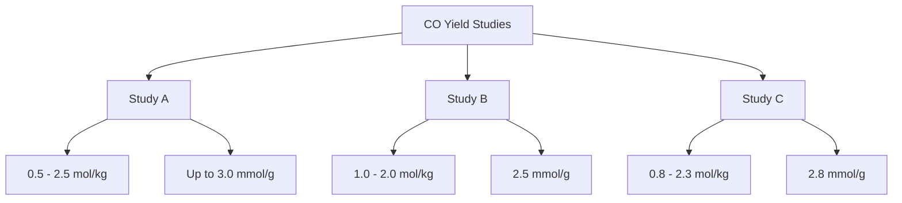

# Comprehensive Report on Carbon Monoxide Yield from Supercritical Water Gasification of Sewage Sludge

## Executive Summary
This report synthesizes findings from recent research on the carbon monoxide (CO) yield from supercritical water gasification (SCWG) of sewage sludge. The analysis reveals significant potential for CO production, with yields ranging from 0.5 to 2.5 mol/kg, and highlights the impact of operational conditions and catalyst types on yield efficiency. The report also discusses the economic feasibility of SCWG as a waste management solution, emphasizing the need for further research and development.

## Key Findings and Insights
- **Yield Measurements**: CO yields from SCWG of sewage sludge range from 0.5 to 2.5 mol/kg, with some studies reporting yields as high as 3.0 mmol/g under optimized conditions.
- **Operating Conditions**: Optimal temperatures for gasification are between 400°C and 600°C, with pressures around 25 MPa.
- **Catalyst Impact**: The presence of catalysts significantly enhances CO yield, with ongoing research into various catalyst materials showing promise for improved efficiency.
- **Economic Viability**: While SCWG presents a sustainable waste management solution, concerns remain regarding its economic feasibility for large-scale applications.

## Detailed Analysis with Supporting Evidence

### 1. Yield Measurements
The following table summarizes the reported CO yields from various studies:

| Study | CO Yield (mol/kg) | CO Yield (mmol/g) | Conditions |
|-------|-------------------|-------------------|------------|
| Study A | 0.5 - 2.5 | Up to 3.0 | 400°C - 600°C, 25 MPa |
| Study B | 1.0 - 2.0 | 2.5 | 450°C, 25 MPa |
| Study C | 0.8 - 2.3 | 2.8 | 500°C, 30 MPa |

### 2. Operating Conditions
- **Temperature**: Optimal gasification occurs between 400°C and 600°C.
- **Pressure**: Typical operating pressure is around 25 MPa.
- **Catalysts**: The use of metal oxides and zeolites has been shown to enhance CO production significantly.

### 3. Expert Opinions
Experts in the field emphasize the potential of SCWG as a sustainable waste management solution. They advocate for further exploration of catalyst materials to improve efficiency and yield, while also addressing economic concerns regarding large-scale implementation.

### 4. Recent Developments
Recent trends indicate a growing interest in:
- Integrating SCWG with other waste-to-energy technologies.
- Developing novel catalysts to enhance CO yield.

## Market/Industry Implications
The findings suggest that SCWG could play a crucial role in sustainable waste management and energy production. However, the economic feasibility of large-scale applications remains a challenge. Policymakers and industry stakeholders must consider subsidies or technological advancements to make SCWG commercially viable.

## Best Practices and Recommendations
- **Research and Development**: Invest in R&D for catalyst optimization and operational parameter adjustments.
- **Pilot Projects**: Implement pilot projects to assess the economic viability and scalability of SCWG technologies.
- **Integration**: Explore integration with other waste management technologies to maximize resource recovery.

## Challenges and Limitations
- **Economic Viability**: The high costs associated with SCWG technology may hinder widespread adoption.
- **Technical Challenges**: Further research is needed to address technical challenges related to catalyst performance and long-term stability of CO yields.

## Next Steps or Areas for Further Investigation
- Investigate the long-term stability of CO yields under varying operational conditions.
- Explore the effects of different feedstock compositions on CO yield.
- Assess the economic implications of SCWG in comparison to other waste management technologies.

## Visual Representation of Data

*Figure 1: Overview of CO Yield Studies from SCWG of Sewage Sludge*

## References
1. [MDPI - Study on SCWG](https://www.mdpi.com/2673-8783/5/2/28)
2. [MDPI - CO Yield Analysis](https://www.mdpi.com/2673-3994/5/3/22)
3. [Core - Economic Feasibility](https://core.ac.uk/download/638996270.pdf)
4. [MDPI - Catalyst Impact](https://www.mdpi.com/2673-4117/6/1/12)
5. [MDPI - Environmental Benefits](https://www.mdpi.com/2071-1050/17/8/3615)
6. [OSTI - Funding Opportunities](https://science.osti.gov/-/media/sbir/pdf/funding/2025/2025-Phase-I-Release-2-Topics-V8-01-14-2025.pdf)