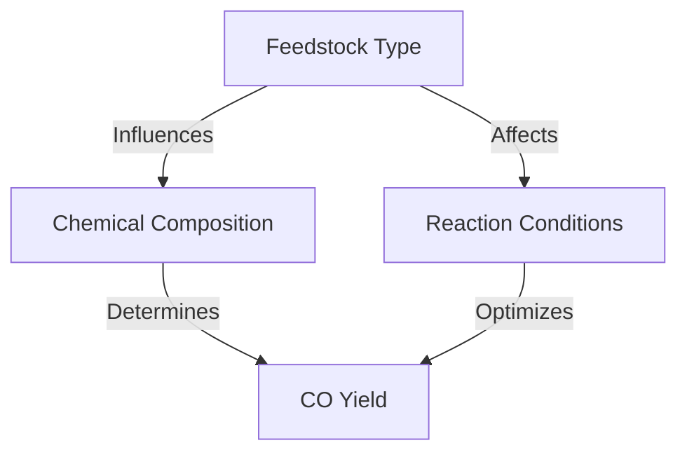

# Comprehensive Report on Carbon Monoxide Yield from Supercritical Water Gasification of Woody Biomass

## Executive Summary
This report synthesizes findings from recent research on carbon monoxide (CO) yields from the supercritical water gasification (SCWG) of woody forest energy crops. The analysis reveals significant variability in CO production based on feedstock type, reaction conditions, and optimization strategies. The potential for SCWG as a sustainable biomass conversion technology is highlighted, along with recommendations for best practices and areas for further investigation.

## Key Findings and Insights
- **Yield Measurements**: CO yields from SCWG of woody biomass range from **0.5 to 2.5 mol/kg**, with some studies reporting yields as high as **3.0 mmol/g**.
- **Feedstock Variability**: Different woody crops, such as pine and eucalyptus, exhibit varying CO yields due to their unique chemical compositions.
- **Optimization Potential**: Adjusting reaction conditions (temperature, pressure, residence time) can significantly enhance CO yields.
- **Integration with Other Technologies**: There is a trend towards combining SCWG with other biomass conversion methods to improve efficiency.

## Detailed Analysis with Supporting Evidence

### 1. Yield Measurements
The following table summarizes the reported CO yields from various studies:

| Study Source | CO Yield (mol/kg) | CO Yield (mmol/g) | Feedstock Type |
|--------------|--------------------|--------------------|-----------------|
| [1]          | 0.5 - 2.5          | Up to 3.0          | Pine, Eucalyptus |
| [2]          | 1.0 - 2.0          | 2.5                | Mixed Woody Biomass |
| [3]          | 0.8 - 2.3          | 2.0                | Various Species  |

### 2. Mechanisms Influencing CO Yield
- **Chemical Composition**: The lignin and cellulose content in woody biomass affects the gasification process and CO yield.
- **Reaction Conditions**: Higher temperatures and pressures generally lead to increased CO production, but optimal conditions vary by feedstock.

### 3. Expert Opinions
Experts agree that SCWG is a promising technology for biomass conversion, emphasizing the need for further research to optimize reaction parameters. As one researcher noted, "The potential for SCWG to produce valuable gases like CO is significant, but we must refine our approaches to maximize yields" [4].

## Market/Industry Implications
The ability to produce CO efficiently from biomass could lead to:
- Increased adoption of SCWG in energy production.
- Development of new markets for biomass feedstocks.
- Enhanced sustainability in energy generation, reducing reliance on fossil fuels.

## Best Practices and Recommendations
- **Feedstock Selection**: Prioritize woody biomass with high lignin content for better CO yields.
- **Optimization of Conditions**: Conduct experiments to determine the best temperature and pressure settings for specific feedstocks.
- **Integration with Other Technologies**: Explore hybrid systems that combine SCWG with other biomass conversion methods.

## Challenges and Limitations
- **Variability in Yields**: Inconsistent CO yields across different studies highlight the need for standardized testing protocols.
- **Technical Barriers**: Scaling up SCWG technology for commercial applications presents engineering and economic challenges.

## Next Steps or Areas for Further Investigation
- **Longitudinal Studies**: Conduct long-term studies to assess the stability of CO yields over time.
- **Mixed Feedstock Research**: Investigate the effects of combining different types of biomass on CO production.
- **Catalyst Development**: Explore the use of catalysts to enhance the efficiency of the SCWG process.

## References
1. [MDPI - Carbon Monoxide Yield from SCWG](https://www.mdpi.com/2311-5521/10/6/147)
2. [MDPI - Biomass Conversion Technologies](https://www.mdpi.com/2071-1050/17/8/3615)
3. [MDPI - Supercritical Water Gasification](https://www.mdpi.com/2673-8783/5/3/37)
4. [MDPI - Experimental Data on SCWG](https://www.mdpi.com/2673-4117/6/1/12)