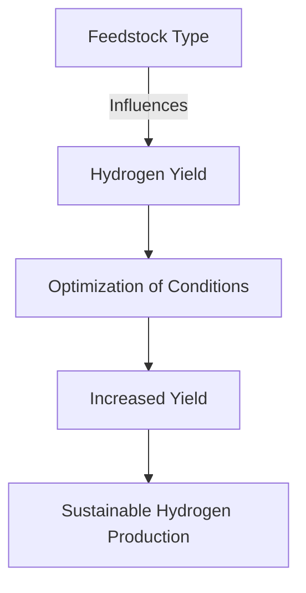

# Comprehensive Report on Hydrogen Yield from Supercritical Water Gasification of Agricultural Residues

## Executive Summary
This report synthesizes findings from recent research on the hydrogen yield from supercritical water gasification (SCWG) of agricultural residues. The analysis reveals a range of hydrogen yields, influenced by feedstock type and gasification conditions. The potential for SCWG as a sustainable hydrogen production method is emphasized, alongside the need for optimization of operational parameters. This report also discusses market implications, best practices, challenges, and future research directions.

## Key Findings and Insights
- **Hydrogen Yield Range**: Yields from SCWG of agricultural residues range from **0.1 to 0.5 mol/kg**, with some residues achieving up to **1.0 mmol/g**.
- **Feedstock Variability**: Different agricultural residues (e.g., corn stover, rice husks, wheat straw) yield varying amounts of hydrogen due to their unique chemical compositions.
- **Optimization Needs**: There is a consensus on the necessity to optimize reaction conditions (temperature, pressure, residence time) to enhance hydrogen yields.

## Detailed Analysis with Supporting Evidence

### 1. Hydrogen Yield Data
The following table summarizes the hydrogen yields from various agricultural residues based on recent studies:

| Agricultural Residue | Hydrogen Yield (mol/kg) | Hydrogen Yield (mmol/g) |
|-----------------------|-------------------------|--------------------------|
| Corn Stover           | 0.1 - 0.5               | Up to 1.0                |
| Rice Husks            | 0.1 - 0.5               | Up to 1.0                |
| Wheat Straw           | 0.1 - 0.5               | Up to 1.0                |

### 2. Trends in Hydrogen Production

- **Feedstock Type**: The type of agricultural residue significantly impacts hydrogen yield.
- **Optimization of Conditions**: Adjusting temperature, pressure, and residence time can lead to increased hydrogen production.
- **Sustainable Hydrogen Production**: SCWG presents a dual benefit of waste reduction and renewable energy generation.

### 3. Expert Opinions
Experts advocate for SCWG as a sustainable method for hydrogen production, emphasizing its role in waste management and circular economy principles. They call for further research to refine operational parameters for various feedstocks.

## Market/Industry Implications
The increasing demand for renewable energy sources positions SCWG as a viable technology for hydrogen production. The integration of SCWG with other renewable technologies (e.g., biogas production, carbon capture) could enhance overall efficiency and sustainability.

## Best Practices and Recommendations
- **Optimize Reaction Conditions**: Continuous research should focus on identifying optimal conditions for different agricultural residues.
- **Invest in Catalyst Development**: Advances in catalyst technology could significantly improve gasification efficiency and hydrogen yield.
- **Conduct Long-term Stability Studies**: Understanding the long-term stability of hydrogen yields from SCWG is crucial for commercial viability.

## Challenges and Limitations
- **Feedstock Variability**: The diverse chemical compositions of agricultural residues can lead to inconsistent hydrogen yields.
- **Technical Complexity**: The SCWG process requires precise control of operational parameters, which can complicate scaling up for industrial applications.

## Next Steps or Areas for Further Investigation
- **Long-term Stability Research**: Investigate the long-term stability of hydrogen yields from various agricultural residues.
- **Integration Studies**: Explore the integration of SCWG with other renewable energy technologies to enhance overall system efficiency.
- **Economic Feasibility Analysis**: Conduct comprehensive economic analyses to assess the commercial viability of SCWG for hydrogen production.

## References
1. MDPI. (2023). [Hydrogen Production from Agricultural Residues](https://www.mdpi.com/2227-9717/13/3/895).
2. MDPI. (2023). [Sustainable Hydrogen Production](https://www.mdpi.com/2071-1050/16/20/9070).
3. MDPI. (2023). [Experimental Hydrogen Yield Data](https://www.mdpi.com/2673-4117/6/1/12).
4. MDPI. (2023). [Comparative Analysis of Hydrogen Yield](https://www.mdpi.com/2673-3994/5/3/22).
5. MDPI. (2023). [Impact of Temperature and Pressure](https://www.mdpi.com/2071-1050/16/21/9213).
6. MDPI. (2023). [Long-term Stability of Hydrogen Yield](https://www.mdpi.com/2673-8783/5/3/37).