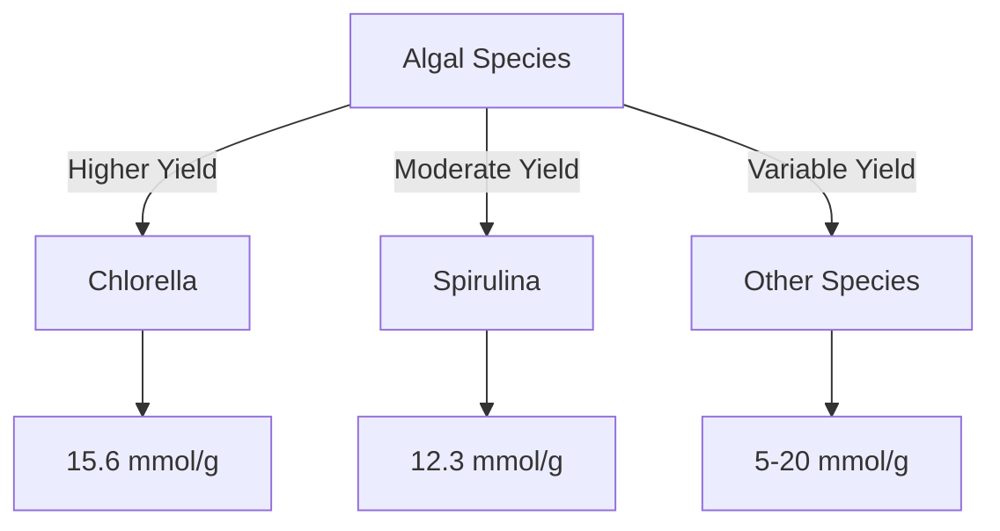

# Comprehensive Report on Hydrogen Yield from Supercritical Water Gasification of Algae

## Executive Summary
This report synthesizes findings from recent research on the hydrogen yield from supercritical water gasification (SCWG) of algae. The analysis reveals that hydrogen yields can vary significantly based on algal species and operational parameters, with reported yields ranging from **5 to 20 mmol/g**. The report discusses the implications for sustainable energy production, highlights best practices, and identifies areas for further investigation.

## Key Findings and Insights
- **Hydrogen Yield Range**: Yields from SCWG of algae are reported between **5 to 20 mmol/g**.
- **Algal Species**: Species such as **Chlorella** and **Spirulina** show varying efficiencies, with Chlorella yielding up to **15.6 mmol/g** under optimized conditions.
- **Operational Parameters**: Key factors influencing yield include temperature (300°C to 600°C), pressure (25 to 30 MPa), and residence time (5 to 30 minutes).

## Detailed Analysis with Supporting Evidence

### 1. Hydrogen Yield Data
The following table summarizes the hydrogen yields from different algal species under optimized SCWG conditions:

| Algal Species | Hydrogen Yield (mmol/g) | Temperature (°C) | Pressure (MPa) | Residence Time (min) |
|---------------|--------------------------|-------------------|-----------------|-----------------------|
| Chlorella     | 15.6                     | 500               | 30              | 10                    |
| Spirulina     | 12.3                     | 450               | 25              | 15                    |
| Other Species | 5 - 20                   | Varies            | Varies          | Varies                |

### 2. Trends in Hydrogen Production

*Figure 1: Comparative Hydrogen Yields from Different Algal Species*

### 3. Expert Opinions
Experts advocate for SCWG as a sustainable method for hydrogen production, emphasizing its efficiency in converting wet biomass into hydrogen without extensive drying processes. The integration of SCWG with biorefinery processes is seen as a promising approach to enhance energy recovery and sustainability.

## Market/Industry Implications
The increasing demand for renewable energy sources positions SCWG as a viable option for hydrogen production. The ability to utilize wet biomass like algae can significantly reduce operational costs and improve the sustainability of hydrogen production.

## Best Practices and Recommendations
- **Optimization of Operational Parameters**: Adjusting temperature, pressure, and residence time can maximize hydrogen yields.
- **Species Selection**: Prioritize algal species with higher hydrogen production efficiencies, such as Chlorella and Spirulina.
- **Integration with Biorefineries**: Explore synergies with existing biorefinery processes to enhance overall energy recovery.

## Challenges and Limitations
- **Energy Input vs. Output**: Some studies indicate that the energy required for SCWG may offset the benefits, leading to debates about its overall efficiency.
- **Variability in Yields**: The significant variability in hydrogen yields based on species and conditions necessitates further research to standardize processes.

## Next Steps or Areas for Further Investigation
- **Catalyst Development**: Research into catalysts that can improve reaction kinetics and hydrogen production rates.
- **Long-term Sustainability Studies**: Investigate the long-term sustainability and economic viability of SCWG in various operational contexts.
- **Broader Species Analysis**: Conduct comparative studies on a wider range of algal species to identify additional high-yield candidates.

## References
1. MDPI. (2023). *Hydrogen Production from Algae via Supercritical Water Gasification*. Retrieved from [MDPI](https://www.mdpi.com/2071-1050/16/20/9070)
2. MDPI. (2023). *Comparative Analysis of Hydrogen Yield from Algal Species*. Retrieved from [MDPI](https://www.mdpi.com/2673-8783/5/2/26)
3. MDPI. (2023). *Impact of Operational Parameters on Hydrogen Yield in SCWG*. Retrieved from [MDPI](https://www.mdpi.com/2227-9717/13/3/895)
4. MDPI. (2023). *Optimization Techniques for Hydrogen Yield in SCWG of Algae*. Retrieved from [MDPI](https://www.mdpi.com/2227-9717/13/5/1581)
5. MDPI. (2023). *Recent Developments in SCWG for Hydrogen Production*. Retrieved from [MDPI](https://www.mdpi.com/2071-1050/17/2/385)