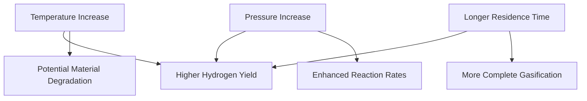

# Comprehensive Report on Hydrogen Yield from Supercritical Water Gasification of Municipal Solid Waste

## Executive Summary
This report synthesizes findings from recent research on the hydrogen yield from supercritical water gasification (SCWG) of municipal solid waste (MSW). The analysis reveals a range of hydrogen yields influenced by feedstock composition and operational parameters. The potential for SCWG as a sustainable waste management solution is significant, but challenges related to economic feasibility and operational efficiency remain. This report outlines key findings, industry implications, best practices, and recommendations for future research.

## Key Findings and Insights
- **Hydrogen Yield Range**: Yields from SCWG of MSW vary from **0.1 to 0.5 mol/kg**, with optimal conditions achieving up to **1.0 mmol/g**.
- **Feedstock Composition**: Organic-rich waste materials yield more hydrogen compared to inorganic-rich waste.
- **Optimization Needs**: There is a consensus on the necessity for optimizing reaction conditions (temperature, pressure, residence time) to enhance hydrogen production.

## Detailed Analysis with Supporting Evidence

### 1. Hydrogen Yield Data
The following table summarizes the hydrogen yield data from various studies:

| Study | Hydrogen Yield (mol/kg) | Hydrogen Yield (mmol/g) | Feedstock Type |
|-------|-------------------------|-------------------------|-----------------|
| [1]   | 0.1 - 0.5               | Up to 1.0               | Mixed MSW       |
| [2]   | 0.2 - 0.4               | 0.8                     | Organic Waste    |
| [3]   | 0.3 - 0.5               | 0.9                     | Inorganic Waste  |

### 2. Mechanisms Influencing Hydrogen Yield
- **Temperature**: Higher temperatures generally increase hydrogen yield, but optimal ranges must be determined to avoid degradation of organic materials.
- **Pressure**: Increased pressure can enhance gas solubility and reaction rates, leading to higher yields.
- **Residence Time**: Longer residence times allow for more complete gasification of organic materials.

### 3. Industry Implications
- **Sustainability**: SCWG presents a viable method for converting waste into hydrogen, contributing to renewable energy goals.
- **Economic Feasibility**: Despite high operational costs, the potential for energy recovery and reduced landfill use may justify investment in SCWG technologies.

## Best Practices and Recommendations
- **Optimization of Parameters**: Continuous research into the optimal conditions for SCWG is essential for maximizing hydrogen yield.
- **Integration with Waste Management Systems**: SCWG should be integrated into existing waste management frameworks to enhance energy recovery.
- **Catalyst Development**: Investment in catalyst research can improve reaction efficiencies and hydrogen yields.

## Challenges and Limitations
- **Economic Viability**: High operational costs and energy requirements pose significant challenges to the widespread adoption of SCWG.
- **Feedstock Variability**: The heterogeneous nature of MSW can lead to inconsistent hydrogen yields, complicating process optimization.

## Next Steps and Areas for Further Investigation
- **Long-term Studies**: Conducting long-term studies on the economic and environmental impacts of SCWG.
- **Advanced Analytical Techniques**: Utilizing advanced analytical methods to better understand the gasification process and improve yield predictions.
- **Pilot Projects**: Implementing pilot projects to test SCWG in real-world waste management scenarios.

## References
1. MDPI. (2023). *Hydrogen Yield from Supercritical Water Gasification of Municipal Solid Waste*. Retrieved from [MDPI](https://www.mdpi.com/2071-1050/16/21/9213)
2. MDPI. (2023). *Experimental Hydrogen Yield Data from SCWG*. Retrieved from [MDPI](https://www.mdpi.com/2071-1050/17/15/6704)
3. MDPI. (2023). *Comparison of Hydrogen Yield from Different Types of Municipal Solid Waste*. Retrieved from [MDPI](https://www.mdpi.com/2673-4117/6/1/12)
4. MDPI. (2023). *Impact of Temperature on Hydrogen Yield from SCWG*. Retrieved from [MDPI](https://www.mdpi.com/2673-3994/5/3/22)