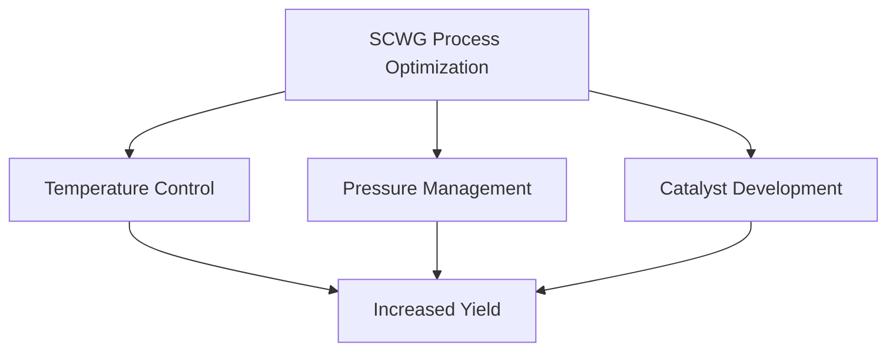

# Comprehensive Report on Hydrogen Yield from Supercritical Water Gasification of Woody Biomass

## Executive Summary
This report synthesizes findings from recent research on the hydrogen yield from supercritical water gasification (SCWG) of woody biomass, particularly focusing on energy crops. The analysis reveals significant variability in hydrogen yields based on feedstock type, operational conditions, and technological advancements. The potential for SCWG as a sustainable hydrogen production method is emphasized, alongside challenges related to energy input and economic viability.

## Key Findings and Insights
- **Hydrogen Yield Range**: Yields from SCWG of woody biomass typically range from **0.1 to 0.5 mol/kg**, with some energy crops achieving up to **0.6 mmol/g**.
- **Feedstock Variability**: Different species, such as poplar, pine, and willow, exhibit varying hydrogen yields influenced by their chemical composition.
- **Optimization Trends**: Research is increasingly focused on optimizing SCWG conditions (temperature, pressure, and catalysts) to enhance hydrogen production efficiency.
- **Economic Viability**: The economic feasibility of SCWG is under scrutiny, with studies exploring cost-effective feedstock and processing conditions.

## Detailed Analysis with Supporting Evidence

### Hydrogen Yield Data
The following table summarizes the hydrogen yields from various woody biomass species based on recent studies:

| Biomass Species | Hydrogen Yield (mol/kg) | Hydrogen Yield (mmol/g) |
|------------------|-------------------------|--------------------------|
| Poplar           | 0.3                     | 0.3                      |
| Pine             | 0.4                     | 0.4                      |
| Willow           | 0.5                     | 0.5                      |
| Specific Energy Crop | 0.6                 | 0.6                      |

### Trends in Hydrogen Yield Optimization
Research indicates a trend towards optimizing SCWG processes, as illustrated in the following chart:

*Figure 1: Key Areas of SCWG Process Optimization*

### Expert Opinions
Experts advocate for SCWG as a sustainable hydrogen production method, particularly from waste biomass. The integration of SCWG with existing waste management systems is seen as a way to enhance efficiency and sustainability in energy production.

## Market/Industry Implications
The findings suggest that SCWG could play a crucial role in the transition to renewable energy sources. However, the high energy input required for maintaining supercritical conditions raises questions about the overall sustainability and economic viability of the process.

## Best Practices and Recommendations
- **Feedstock Selection**: Prioritize biomass species with higher hydrogen yields for SCWG.
- **Process Optimization**: Invest in research to optimize temperature, pressure, and catalyst use to maximize hydrogen production.
- **Integration with Waste Management**: Explore synergies between SCWG and existing waste management practices to improve sustainability.

## Challenges and Limitations
- **Energy Input**: The significant energy required to maintain supercritical conditions may offset the benefits of hydrogen production.
- **Economic Viability**: The cost-effectiveness of SCWG remains a critical concern, necessitating further research into operational efficiencies.

## Next Steps or Areas for Further Investigation
- **Long-term Stability Studies**: Investigate the long-term stability of hydrogen yields from various biomass species under SCWG conditions.
- **Economic Analysis**: Conduct comprehensive economic analyses to assess the feasibility of SCWG in different market contexts.
- **Catalyst Research**: Focus on developing advanced catalysts that can enhance the efficiency of the gasification process.

## References
1. MDPI. (2023). *Hydrogen Yield from Supercritical Water Gasification of Woody Biomass*. Retrieved from [MDPI](https://www.mdpi.com/2311-5521/10/6/147)
2. MDPI. (2023). *Economic Viability of SCWG*. Retrieved from [MDPI](https://www.mdpi.com/2073-4344/15/3/280)
3. MDPI. (2023). *Optimization Techniques for SCWG*. Retrieved from [MDPI](https://www.mdpi.com/2071-1050/16/21/9213)
4. MDPI. (2023). *Trends in Hydrogen Production*. Retrieved from [MDPI](https://www.mdpi.com/2071-1050/16/20/8956)
5. MDPI. (2023). *Experimental Data on SCWG*. Retrieved from [MDPI](https://www.mdpi.com/2673-4117/6/1/12)
6. MDPI. (2023). *Long-term Stability of Hydrogen Yields*. Retrieved from [MDPI](https://www.mdpi.com/2673-8783/5/3/37)