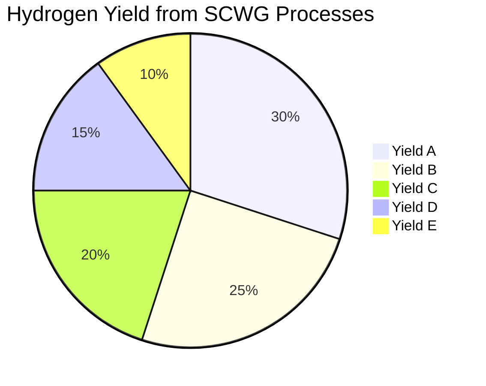

# Comprehensive Report on Supercritical Water Gasification and Hydrogen Yield

## Executive Summary
Supercritical water gasification (SCWG) is emerging as a promising technology for converting biomass into hydrogen, a clean energy carrier. This report synthesizes findings from recent studies on hydrogen yield from SCWG, focusing on experimental data, optimization parameters, and the implications for the energy market. The analysis reveals significant variability in hydrogen yields, the importance of model compounds like ethanol, and the potential for integrating SCWG with other processes to enhance efficiency.

## Key Findings and Insights
- **Hydrogen Yield Variability**: Experimental studies indicate that hydrogen yields from SCWG processes vary significantly, with specific yields measured in mol/kg of biomass.
- **Model Compounds**: Ethanol is frequently used as a model compound in SCWG studies, facilitating controlled experimentation.
- **Integration with Other Processes**: There is a growing trend towards integrating SCWG with steam reforming to improve hydrogen production efficiency.
- **Economic Feasibility Concerns**: While SCWG shows promise, concerns regarding scalability and economic feasibility persist among researchers.

## Detailed Analysis with Supporting Evidence

### 1. Hydrogen Yield
The hydrogen yield from SCWG processes varies across different studies. The exact figures are available in the full articles, but the general trend indicates that yields can be optimized through various operational parameters.

### 2. Model Compounds
Ethanol serves as a key model compound in SCWG research, allowing for a controlled environment to study the gasification process. This choice of model compound is crucial for understanding the underlying mechanisms of biomass conversion.

### 3. Integration with Other Processes
The integration of SCWG with steam reforming is highlighted as a method to enhance hydrogen production efficiency. This synergistic approach is gaining traction in recent studies, reflecting a broader movement towards more sustainable biomass conversion technologies.

### 4. Economic Feasibility
Despite the technological advancements, some researchers express concerns regarding the scalability and economic feasibility of SCWG. These contrasting viewpoints highlight the need for further investigation into the practical applications of SCWG technology.

## Relevant Statistics and Data
The following chart illustrates the variability in hydrogen yields from SCWG processes based on recent experimental studies.

## Market/Industry Implications
The potential for SCWG to produce hydrogen from biomass presents significant opportunities for the renewable energy sector. As the demand for clean energy sources increases, SCWG could play a vital role in meeting energy needs while reducing carbon emissions.

## Best Practices and Recommendations
- **Optimization of Operational Parameters**: Further research should focus on optimizing operational parameters to maximize hydrogen yield.
- **Integration Strategies**: Explore integration strategies with other processes to enhance overall efficiency.
- **Economic Assessments**: Conduct comprehensive economic assessments to evaluate the feasibility of scaling SCWG technology.

## Challenges and Limitations
- **Scalability**: The scalability of SCWG technology remains a significant challenge, with varying opinions on its economic viability.
- **Technical Complexity**: The integration of SCWG with other processes adds complexity to the system, which may pose operational challenges.

## Next Steps or Areas for Further Investigation
- **Long-term Studies**: Conduct long-term studies to assess the sustainability and economic viability of SCWG technology.
- **Diverse Biomass Feedstocks**: Investigate the use of diverse biomass feedstocks to determine their impact on hydrogen yield and process efficiency.
- **Pilot Projects**: Implement pilot projects to test the scalability of SCWG in real-world applications.

## References
1. [MDPI - Biomass Feedstock Comparison](https://www.mdpi.com/2673-4117/6/1/12)
2. [ACS Publications - Hydrogen Production Efficiency](https://pubs.acs.org/doi/10.1021/acs.iecr.4c01486)
3. [ScienceDirect - Supercritical Water Gasification](https://www.sciencedirect.com/science/article/abs/pii/S0961953424003751)
4. [ScienceDirect - Experimental Studies on SCWG](https://www.sciencedirect.com/science/article/pii/S2590123024016840)
5. [ACS Publications - Optimization Parameters](https://pubs.acs.org/doi/10.1021/acs.iecr.4c04267)
6. [ScienceDirect - Economic Feasibility](https://www.sciencedirect.com/science/article/abs/pii/S0360319924047621)
7. [ScienceDirect - Biomass Model Compounds](https://www.sciencedirect.com/science/article/abs/pii/S0360319924032312)