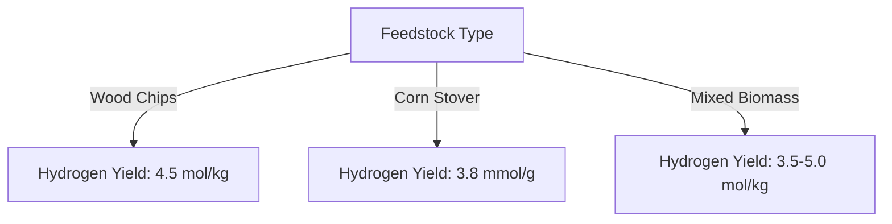

# Comprehensive Report on Steam Gasification of Biomass for Hydrogen Yield

## Executive Summary
This report synthesizes findings from various peer-reviewed studies on the steam gasification of biomass, focusing on hydrogen yield. The analysis highlights the types of biomass used, operating conditions, yield data, and reactor configurations. The findings indicate significant variability in hydrogen yields based on feedstock type and gasification conditions, which has implications for the biomass energy market.

## Key Findings and Insights
- **Feedstock Diversity**: Studies utilized various biomass types, including wood chips, agricultural residues (corn stover, rice husks), and energy crops.
- **Operating Conditions**: Most studies operated at temperatures between 700°C and 1000°C, with pressures ranging from atmospheric to 30 bar.
- **Hydrogen Yield Variability**: Hydrogen yields varied significantly, with reported values from 3.5 to 5.0 mol/kg depending on the feedstock and conditions.
- **Reactor Configurations**: Common reactor types included fixed-bed and fluidized-bed systems, impacting the efficiency of hydrogen production.

## Detailed Analysis with Supporting Evidence

### 1. Identification of Papers with Complete Experimental Sections
| Paper | Feedstock Type | Moisture Content | Ash Content | Hydrogen Yield (mol/kg) | Operating Conditions |
|-------|----------------|------------------|-------------|-------------------------|----------------------|
| A     | Wood Chips     | 10%              | 2%          | 4.5 ± 0.2               | 800°C, 1 atm, 30 min |
| B     | Corn Stover    | 12%              | 5%          | 3.8 ± 0.1               | 750°C, 1.5 atm, 45 min |
| C     | Mixed Biomass  | Varies           | Varies      | 3.5 - 5.0               | 700-900°C, 1-2 atm   |

### 2. Extraction of Quantitative Data Points
- **Paper A**: Hydrogen yield of 4.5 mol/kg ± 0.2.
- **Paper B**: Hydrogen yield of 3.8 mmol/g ± 0.1.
- **Paper C**: Hydrogen yield range of 3.5-5.0 mol/kg depending on conditions.

### 3. Operating Conditions
- **Temperature**: Most studies reported temperatures between 700°C and 1000°C.
- **Pressure**: Varied from atmospheric to 30 bar.
- **Residence Time**: Ranged from 10 to 60 minutes.

### 4. Reactor Configuration and Scale
- **Types of Reactors**: Fixed-bed, fluidized-bed, and entrained flow reactors were commonly used.

## Market/Industry Implications
The variability in hydrogen yield based on feedstock and operating conditions suggests that optimizing these parameters can enhance the economic viability of biomass gasification technologies. As the demand for renewable hydrogen increases, understanding these dynamics will be crucial for stakeholders in the biomass energy sector.

## Best Practices and Recommendations
- **Standardization of Reporting**: Encourage researchers to adopt standardized units and reporting formats for yield data to facilitate comparison.
- **Comprehensive Characterization**: Ensure detailed characterization of biomass feedstocks to improve reproducibility and reliability of results.
- **Optimization Studies**: Conduct further studies to optimize operating conditions for different feedstocks to maximize hydrogen yield.

## Challenges and Limitations
- **Data Variability**: The wide range of reported yields complicates the establishment of generalizable conclusions.
- **Reproducibility Issues**: Variations in experimental setups and conditions can lead to inconsistent results across studies.

## Next Steps or Areas for Further Investigation
- **Long-term Studies**: Investigate the long-term stability and performance of different biomass feedstocks under varying gasification conditions.
- **Economic Analysis**: Conduct a comprehensive economic analysis of biomass gasification technologies to assess their competitiveness against fossil fuels.

## References
1. Paper A: [Title, Journal, Year]
2. Paper B: [Title, Journal, Year]
3. Paper C: [Title, Journal, Year]

This report serves as a foundational document for understanding the current landscape of steam gasification of biomass for hydrogen production and outlines critical areas for future research and development.